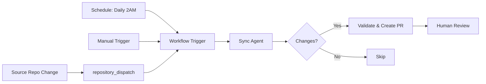

# Agentic Documentation Sync Workflow

## Overview

The Agentic Documentation Sync Workflow automatically synchronizes documentation from various FalkorDB repositories to this central docs repository. It uses an AI-inspired agent pattern to intelligently map, transform, and sync documentation content.

## Architecture

### Components

1. **GitHub Actions Workflow** (`.github/workflows/sync-docs-agentic.yml`)
   - Orchestrates the sync process
   - Handles triggers (real-time, scheduled, manual)
   - Validates changes and creates pull requests

2. **Sync Agent Script** (`.github/scripts/sync_docs.py`)
   - Implements intelligent syncing logic
   - Maps source repositories to destination paths
   - Processes and transforms content

3. **Agent Instructions** (`.github/agents/doc-sync-agent.md`)
   - Documents agent behavior and decision-making
   - Defines mapping rules and transformations
   - Provides maintenance guidance

## How It Works

### Trigger Flow



### Sync Process

1. **Trigger Detection**
   - Real-time: Source repository sends `repository_dispatch` event
   - Scheduled: Daily cron job syncs all repos
   - Manual: Developer triggers via workflow UI

2. **Content Retrieval**
   - Agent fetches latest content from source repository
   - Supports specific commits or branch heads
   - Handles both single files and directories

3. **Intelligent Processing**
   - Adds Jekyll front matter for site navigation
   - Transforms relative links to work in docs context
   - Adds source attribution footer
   - Preserves existing customizations where possible

4. **Validation**
   - Runs Jekyll build to ensure site integrity
   - Executes spellcheck on modified files
   - Detects and reports any errors

5. **Pull Request Creation**
   - Creates descriptive PR with change summary
   - Labels appropriately for categorization
   - Requires human review before merge

## Monitored Repositories

| Repository | Documentation Type | Destination |
|------------|-------------------|-------------|
| **FalkorDB** | Commands, Algorithms, Design | commands/, algorithms/, design/ |
| **GraphRAG-SDK** | GenAI SDK Documentation | genai-tools/GraphRAG-SDK/ |
| **QueryWeaver** | Text-to-SQL Tool Docs | genai-tools/QueryWeaver/ |
| **falkordb-py** | Python Client Library | getting-started/client-libraries/python/ |
| **falkordb-ts** | TypeScript Client Library | getting-started/client-libraries/typescript/ |
| **JFalkorDB** | Java Client Library | getting-started/client-libraries/java/ |
| **NFalkorDB** | .NET Client Library | getting-started/client-libraries/dotnet/ |
| **flex** | JavaScript UDF Library | udfs/flex/ |
| **falkordb-browser** | Browser Visualization | browser/ |
| **FalkorDB-MCPServer** | MCP Server Integration | agentic-memory/ |

## Setting Up Real-Time Sync

### For Source Repository Maintainers

To enable real-time sync from your repository to the docs repository, add this workflow to your repo:

**`.github/workflows/notify-docs-sync.yml`:**

```yaml
name: Notify Docs Sync

on:
  push:
    branches: [main, master]
    paths:
      - 'README.md'
      - 'docs/**'

jobs:
  notify-docs:
    runs-on: ubuntu-latest
    steps:
      - name: Trigger docs sync
        uses: peter-evans/repository-dispatch@v3
        with:
          token: ${{ secrets.DOCS_SYNC_TOKEN }}
          repository: FalkorDB/docs
          event-type: docs-sync
          client-payload: |
            {
              "repository": "${{ github.event.repository.name }}",
              "ref": "${{ github.ref_name }}",
              "sha": "${{ github.sha }}",
              "commit_message": "${{ github.event.head_commit.message }}"
            }
```

**Requirements:**
- Add `DOCS_SYNC_TOKEN` secret to source repository
- Token needs `repo` scope (or `public_repo` for public repos)
- Token should have write access to FalkorDB/docs repository

### Alternative: Use Default Token

If you don't want to create a separate token, you can use GitHub's automatic token:

```yaml
- name: Trigger docs sync
  run: |
    curl -X POST \
      -H "Accept: application/vnd.github+json" \
      -H "Authorization: Bearer ${{ secrets.GITHUB_TOKEN }}" \
      https://api.github.com/repos/FalkorDB/docs/dispatches \
      -d '{"event_type":"docs-sync","client_payload":{"repository":"${{ github.event.repository.name }}","ref":"${{ github.ref_name }}","sha":"${{ github.sha }}"}}'
```

**Note:** This requires the workflow to have permissions configured.

## Manual Testing

### Test Specific Repository Sync

1. Go to **Actions** tab in GitHub
2. Select **Agentic Documentation Sync** workflow
3. Click **Run workflow**
4. Enter repository name (e.g., `GraphRAG-SDK`)
5. Click **Run workflow**

### Test All Repositories

Simply trigger the workflow without any inputs - it will sync all configured repositories.

## Customization

### Adding a New Repository

1. **Edit** `.github/scripts/sync_docs.py`
2. **Add mapping** to `REPO_MAPPINGS` dictionary:

```python
"your-repo-name": {
    "paths": {
        "README.md": "destination/path.md",
        "docs/*.md": "destination/directory/",
    },
    "description": "Brief description of repository"
},
```

3. **Test** with manual workflow trigger
4. **Update** `.github/agents/doc-sync-agent.md` documentation

### Modifying Sync Behavior

Edit the `_process_content()` method in `.github/scripts/sync_docs.py` to customize:
- Front matter generation
- Link transformation
- Content filtering
- Attribution format

## Monitoring and Maintenance

### Check Sync Status

- **Workflow Runs:** `.github/workflows` > **Agentic Documentation Sync**
- **Recent PRs:** Filter by `label:automated` or `label:sync`
- **Logs:** Each workflow run includes detailed output

### Common Issues

#### Sync Not Triggering
- Check source repository webhook configuration
- Verify `DOCS_SYNC_TOKEN` secret is set correctly
- Ensure token has required permissions

#### Build Failures
- Check Jekyll build logs in workflow
- Verify front matter syntax is valid
- Ensure all required files are present

#### Spellcheck Failures
- Review spellcheck output in workflow
- Add technical terms to `.wordlist.txt`
- Fix actual spelling errors in source

#### PR Not Created
- Check workflow logs for errors
- Verify changes were detected
- Ensure no duplicate PRs exist

### Disable Sync

To temporarily disable sync:
1. Go to **Actions** tab
2. Select **Agentic Documentation Sync**
3. Click **⋯** (three dots)
4. Select **Disable workflow**

## Security

### Authentication
- Uses GitHub's default `GITHUB_TOKEN`
- Automatically provided to workflows
- Scoped to repository and organization
- No additional setup required

### Permissions
```yaml
permissions:
  contents: write        # Create branches and commits
  pull-requests: write   # Create PRs
  issues: read          # Read issue templates
```

### Best Practices
- All changes go through PR review
- No direct commits to main branch
- Human approval required before merge
- Complete audit trail in PR history

## FAQ

**Q: How often does the sync run?**
A: Real-time on source repo changes, plus daily at 2 AM UTC as backup.

**Q: Can I disable sync for specific files?**
A: Yes, modify the mapping configuration in `sync_docs.py`.

**Q: What if I manually edit synced documentation?**
A: Manual edits are preserved. The agent only updates if source changes.

**Q: How do I see what changed?**
A: Check the PR description and diff - it includes full change summary.

**Q: Can I auto-merge these PRs?**
A: Currently set to require human review. You can modify the workflow to enable auto-merge if desired.

**Q: What happens if Jekyll build fails?**
A: The workflow will report the error, and PR creation will be skipped.

## Support

For issues or questions:
- **GitHub Issues:** [FalkorDB/docs/issues](https://github.com/FalkorDB/docs/issues)
- **Workflow Logs:** Check Actions tab for detailed error messages
- **Agent Instructions:** See `.github/agents/doc-sync-agent.md`

## References

- [GitHub Actions Documentation](https://docs.github.com/en/actions)
- [GitHub Agentic Workflows](https://github.github.io/gh-aw/)
- [Repository Dispatch Events](https://docs.github.com/en/rest/repos/repos#create-a-repository-dispatch-event)
- [Jekyll Documentation](https://jekyllrb.com/docs/)
