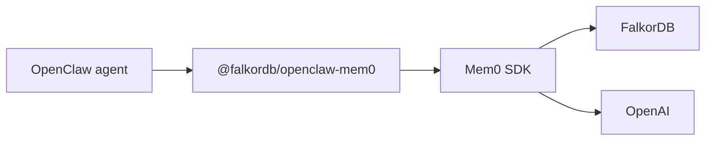

[OpenClaw](https://github.com/openclaw/openclaw) is a personal AI assistant runtime that talks to you over channels like WhatsApp, Telegram, Slack, and the CLI. Its built-in `memory-core` backend already keeps state on your own hardware, as `MEMORY.md` and `memory/*.md` files on disk, so memory does survive a restart.

What those files do not capture is **relationships**. `memory_search` chunks your notes and retrieves them by keyword, embedding, or a hybrid of both, which finds passages that *resemble* your query but never the edges between them. Ask which people connect two projects and there is no join to traverse — the pieces come back as separate, disconnected snippets.

Pointing OpenClaw's memory slot at a FalkorDB-backed plugin stores facts, preferences, and the links between them as nodes and edges, so your assistant can recall not just *what* you said but *how it all connects*. For background, see [Curing AI Amnesia](https://www.falkordb.com/blog/curing-ai-amnesia/).

## Why OpenClaw + FalkorDB?

### FalkorDB's Added Value

- **Graph-structured recall**: Answer relational questions that vector search alone cannot, such as which people connect two projects
- **Native multi-graph support**: Isolate a tenant in its own graph instead of filtering a shared table — Option A uses this to give every user their own graph, and Option B to give every agent's dataset one, subject to the [Per-Agent Graphs](#per-agent-graphs) caveats
- **Hybrid retrieval**: Combine vector similarity with graph traversal to pull in connected context
- **Fast traversals**: Keep memory injection inside the latency budget of a chat turn
- **Easy cleanup**: Where memory maps to a graph per tenant, as Option A does per user, forgetting someone is a graph drop rather than a cascade of deletes. Option B routes deletion through Cognee's own API instead, so it can clear derived knowledge alongside the raw data
- **Cloud and on-premises ready**: Run locally in Docker or on FalkorDB Cloud
- **Visual inspection**: Browse what your assistant actually remembers in the FalkorDB Browser

### Use Cases

- **Personal assistants**: Remember preferences, projects, and people across every session and channel
- **Multi-agent gateways**: Host several agents on one gateway, each with its own slice of memory. Option B gives every agent its own dataset and its own graph — see [Per-Agent Graphs](#per-agent-graphs) for what that does and does not guarantee
- **Team assistants**: Give each teammate their own memory graph with the Mem0 path, so one assistant serves everyone without mixing their contexts
- **Long-running projects**: Accumulate context over weeks without re-explaining it each turn

## Choosing an Integration Path

There are two supported ways to back OpenClaw memory with FalkorDB. Both are production-usable and, in the self-hosted configurations documented here, both store relationships in FalkorDB; they differ in the memory engine, the isolation model, and how much infrastructure you run. Option A also offers a [Platform Mode](#platform-mode) variant that keeps the graph in Mem0 Cloud rather than FalkorDB.

| | Option A: Mem0 plugin | Option B: Cognee integration |
|---|---|---|
| **OpenClaw plugin** | `@falkordb/openclaw-mem0` | `cognee-openclaw` |
| **Memory engine** | [Mem0](https://docs.mem0.ai) | [Cognee](https://www.cognee.ai) |
| **FalkorDB's role** | Graph store | Graph **and** vector store |
| **Vector store** | Separate, in-memory by default | FalkorDB, via the hybrid adapter |
| **Isolation model** | Per user, graph `mem0_<userId>` | Per agent, dataset `<prefix>-<agentId>` in its own graph |
| **What you run** | A Node plugin, plus FalkorDB | A Cognee service and FalkorDB, via Docker Compose |
| **Setup effort** | Install a plugin, edit one config file | Build a custom image, then configure |
| **Capture model** | Auto-recall and auto-capture per turn, plus five agent tools | Session cache flushed to Cognee, then processed into the graph |
| **Maintainer** | FalkorDB | Cognee community |
| **Pick it when** | You want the fastest path to persistent memory, or per-user memory | You want one store for vectors and graph, or Cognee's processing pipeline |

<Note>
The table describes the self-hosted deployments. Option A's [Platform Mode](#platform-mode) differs on every infrastructure row: you run only the Node plugin, Mem0 Cloud owns both the graph and the vector store, FalkorDB has no role, and isolation is whatever your Mem0 account provides. Option B's [Cloud variant](#using-falkordb-cloud-instead) keeps the same roles and swaps the local `falkordb` service for a managed instance. The two isolation models are not equally firm, either: Option A's per-user graph is a boundary you can rely on, while Option B's per-agent separation can still leak through a shared index on the current plugin release — [Per-Agent Graphs](#per-agent-graphs) explains when.
</Note>

<Tip>
Start with **Option A** if you are adding memory to OpenClaw for the first time. It is a single plugin install and one config block. Move to **Option B** when you want FalkorDB to serve vectors as well as the graph, or when you want Cognee's processing pipeline. Both give each tenant its own FalkorDB graph, but along different axes: Option A separates per user, Option B per agent. Read [Per-Agent Graphs](#per-agent-graphs) before treating either as a security boundary.
</Tip>

## Prerequisites

- [Node.js](https://nodejs.org/) 24.16 or later within the 24.x line, or 26.1 or later, as required by OpenClaw's `engines` range. Node 26 is recommended; Node 22, 23, and 25 are not supported
- [Docker](https://docs.docker.com/get-docker/), to run FalkorDB locally and, for Option B, the Cognee service. Not needed if you use FalkorDB Cloud with Option A, and not needed at all for [Platform Mode](#platform-mode)
- An LLM provider key, such as an OpenAI API key, for embeddings and entity extraction. [Platform Mode](#platform-mode) is the exception: Mem0 Cloud performs extraction server-side, so it needs a Mem0 API key instead
- `redis-cli`, optional, for inspecting graphs from the terminal

## Running FalkorDB

Both options need a FalkorDB instance, with one exception: Option A's [Platform Mode](#platform-mode) stores the graph in Mem0 Cloud, so skip this section if that is the variant you intend to use. Otherwise choose one.

### Option 1: Docker

```bash
docker run -d --name falkordb \
  -p 127.0.0.1:6379:6379 -p 127.0.0.1:3000:3000 \
  -v falkordb_data:/var/lib/falkordb/data \
  falkordb/falkordb:latest
```

Port `6379` serves the database and port `3000` serves the built-in [FalkorDB Browser](/browser). The named volume keeps the assistant's memory on disk, so removing or recreating the container does not discard the graph. FalkorDB stores its data in `/var/lib/falkordb/data`, so mounting a volume anywhere else leaves the graph in the container's writable layer, where it disappears with the container. Verify it is up:

```bash
redis-cli -h localhost -p 6379 ping
# PONG
```

<Warning>
FalkorDB runs without authentication by default, so the ports above are bound to `127.0.0.1` to keep the database off the network. If you need to reach it from another host, do not simply drop the prefix: enable authentication and restrict access with a firewall first. See [Configuration](/getting-started/configuration) for the available options.
</Warning>

### Option 2: FalkorDB Cloud

Sign up at [app.falkordb.cloud](https://app.falkordb.cloud), create an instance, and note its **host**, **port**, **username**, and **password**. Verify it is reachable:

```bash
redis-cli -h <host> -p <port> --user <username> --askpass PING
# PONG
```

<Note>
Add `--tls` to that command, and to every other `redis-cli` example on this page, if your instance has TLS enabled. Check the connection details in the Cloud console: an endpoint that expects TLS refuses a connection that does not use TLS, so a `PING` that hangs or resets rather than returning `PONG` is the usual symptom.
</Note>

<Note>
Use those values wherever a later example points at **FalkorDB** on `localhost`, such as `localhost:6379` or a `host` field in a plugin config. Leave other local endpoints alone: Option B reaches the Cognee API on `http://localhost:8000`, which stays local even with a Cloud database. Commands shown as `docker exec falkordb ...` are different again: they address a local container that does not exist in a Cloud setup, so each one below is paired with its Cloud equivalent rather than left for you to translate.
</Note>

<Warning>
The Cloud examples use `--askpass`, which prompts for the password on `STDIN`, rather than `--pass`. Passing a password as a command-line argument exposes it to any local user through the process list and writes it into your shell history. For non-interactive use, pass it through the `REDISCLI_AUTH` environment variable from your secret store instead of embedding it in the command:

```bash
REDISCLI_AUTH="$FALKORDB_PASSWORD" redis-cli -h <host> -p <port> --user <username> PING
```
</Warning>

## Option A: Mem0 Plugin

[`@falkordb/openclaw-mem0`](https://www.npmjs.com/package/@falkordb/openclaw-mem0) fills OpenClaw's memory slot with [Mem0](https://docs.mem0.ai), using FalkorDB as the graph store through the [`@falkordb/mem0`](https://www.npmjs.com/package/@falkordb/mem0) TypeScript library. A complete reference setup lives in [FalkorDB/openclaw-mem0-demo](https://github.com/FalkorDB/openclaw-mem0-demo).

### Architecture



| Component | Role |
|---|---|
| **OpenClaw** | The agent runtime and chat interface |
| **`@falkordb/openclaw-mem0`** | Memory-slot plugin: auto-recall, auto-capture, and five memory tools |
| **Mem0 SDK** | Extracts, stores, and retrieves facts |
| **`@falkordb/mem0`** | FalkorDB graph store for Mem0, bundled with the plugin |
| **FalkorDB** | Stores entity relationships as isolated per-user graphs |
| **OpenAI** | Embeddings for semantic search and an LLM for entity extraction |

On every turn the plugin **recalls** before the agent answers, injecting relevant memories, and **captures** afterwards, extracting new entities and relationships into the user's graph.

### Install OpenClaw and the Plugin

```bash
npm install -g openclaw@latest --allow-scripts=openclaw
openclaw plugins install @falkordb/openclaw-mem0
```

<Note>
`--allow-scripts=openclaw` is required on npm 12 and npm 11.16 or later, which block lifecycle scripts by default. Omit the flag on npm 11.15 and earlier. Without it the package installs but the `openclaw` command may not be created. See the [OpenClaw installation guide](https://docs.openclaw.ai/install) for the full lifecycle script contract.
</Note>

Confirm the plugin registered:

```bash
openclaw plugins list
# @falkordb/openclaw-mem0
```

### Configure the Plugin

Edit `~/.openclaw/openclaw.json` and merge the block below into your existing configuration. Setting `plugins.slots.memory` is what replaces OpenClaw's default `memory-core` with the FalkorDB-backed plugin.

```json
{
  "gateway": { "mode": "local" },
  "plugins": {
    "slots": { "memory": "openclaw-mem0" },
    "entries": {
      "openclaw-mem0": {
        "enabled": true,
        "config": {
          "mode": "open-source",
          "userId": "alice",
          "autoRecall": true,
          "autoCapture": true,
          "enableGraph": true,
          "topK": 5,
          "searchThreshold": 0.3,
          "oss": {
            "embedder": {
              "provider": "openai",
              "config": { "model": "text-embedding-3-small" }
            },
            "vectorStore": {
              "provider": "memory",
              "config": { "dimension": 1536 }
            },
            "graphStore": {
              "provider": "falkordb",
              "config": {
                "host": "localhost",
                "port": 6379,
                "graphName": "mem0"
              }
            },
            "llm": {
              "provider": "openai",
              "config": { "model": "gpt-4o-mini" }
            }
          }
        }
      }
    }
  }
}
```

Graph names follow the pattern `graphName` underscore `userId`, so the `mem0` and `alice` above produce the graph `mem0_alice`. The examples that follow use that name. If you change `userId`, substitute `mem0_<your-userId>` in every one of them.

<Warning>
The `memory` vector store above keeps embeddings in the gateway process, so they are **lost on every restart** and semantic recall has to re-embed from scratch. Your entities and relationships are safe either way, because those live in FalkorDB, but for anything beyond a trial set `oss.vectorStore.provider` to a persistent backend such as `qdrant` or `chroma` and give it `host`, `port`, and `collectionName` in `oss.vectorStore.config`.
</Warning>

To use FalkorDB Cloud, replace the `graphStore` config with your instance details:

```json
"graphStore": {
  "provider": "falkordb",
  "config": {
    "host": "your-instance.falkordb.cloud",
    "port": 6379,
    "username": "default",
    "password": "your-password",
    "graphName": "mem0"
  }
}
```

<Warning>
This works against an instance that does not require TLS. `@falkordb/mem0@0.2.0` builds its connection string as `redis://` and passes nothing else to the driver, so it exposes no way to request TLS and cannot reach a TLS-only endpoint. Option B has the same limitation, so if your instance requires TLS, use Option 1's local container until the clients gain a TLS option.
</Warning>

### Set Your API Key and Restart

The plugin needs an LLM key for embeddings and entity extraction:

```bash
export OPENAI_API_KEY="sk-your-key-here"
```

Add it to your shell profile, or to a `.env` file in your OpenClaw workspace, to make it permanent. Then restart the gateway:

```bash
openclaw gateway --port 18789 --verbose
```

If you run the gateway as a daemon, use `openclaw onboard --install-daemon` instead.

### Chat and Verify

```bash
openclaw agent --local --session-id demo --message "I'm a software engineer who loves Rust and hiking"
openclaw agent --local --session-id demo --message "Recommend me a weekend project"
```

The second response should draw on the first message. You can also query memory directly:

```bash
openclaw mem0 search "what languages does the user know"
openclaw mem0 stats
```

### Platform Mode

To use Mem0's managed cloud rather than self-hosting the memory engine, switch the plugin to platform mode. Sign up at [app.mem0.ai](https://app.mem0.ai), create an API key, and export it in the environment the gateway runs in:

```bash
export MEM0_API_KEY="your-mem0-api-key"
```

Then switch the plugin over. Keep `enableGraph` on so entity relationships are still built:

```json
{
  "plugins": {
    "slots": { "memory": "openclaw-mem0" },
    "entries": {
      "openclaw-mem0": {
        "enabled": true,
        "config": {
          "mode": "platform",
          "apiKey": "${MEM0_API_KEY}",
          "userId": "alice",
          "enableGraph": true
        }
      }
    }
  }
}
```

The slot assignment is repeated here deliberately. Platform mode changes only the `config` block; drop `plugins.slots.memory` and OpenClaw falls back to `memory-core` with the entry enabled but unused.

<Note>
Platform mode uses Mem0 Cloud's own graph layer, so it needs neither a FalkorDB instance nor your own LLM provider key — Mem0 performs extraction and embedding server-side. Use the open-source mode shown above when you want the relationships stored in your own FalkorDB instance.
</Note>

### Agent Memory Tools

Beyond automatic recall and capture, the plugin exposes five tools the agent can call during a conversation:

| Tool | Description |
|---|---|
| `memory_search` | Search memories with a natural language query |
| `memory_store` | Explicitly save a fact, session-scoped or long-term |
| `memory_list` | List all stored memories for a user |
| `memory_get` | Retrieve a specific memory by ID |
| `memory_forget` | Delete a memory by ID or by query |

### Memory Scopes

| Scope | Behavior |
|---|---|
| **Session, short-term** | Auto-captured during the current conversation |
| **User, long-term** | Persists across every session for that user |

Auto-recall searches both scopes and presents long-term memories first.

### Inspect the Graph

<Note>
This applies to open-source mode, where the graph lives in your FalkorDB instance. In [Platform Mode](#platform-mode) there is no `mem0_alice` graph to open, because memory is stored in Mem0 Cloud — browse it from the [Mem0 dashboard](https://app.mem0.ai) instead.
</Note>

For a local container, open the [FalkorDB Browser](/browser) at [http://localhost:3000](http://localhost:3000); for FalkorDB Cloud, use the Browser in [app.falkordb.cloud](https://app.falkordb.cloud). Select the graph `mem0_alice`, substituting your own `userId` if you changed it, and run:

```cypher
MATCH (a)-[r]->(b) RETURN a, r, b
```

You should see extracted entities such as people, technologies, and hobbies, joined by the relationships between them. The same check from the terminal, again with `mem0_alice` standing in for your own graph name — `GRAPH.LIST` prints the real one:

<CodeGroup>

```bash Local container
redis-cli -h localhost -p 6379

GRAPH.LIST
GRAPH.QUERY mem0_alice "MATCH (n) RETURN n.name LIMIT 10"
GRAPH.QUERY mem0_alice "MATCH (a)-[r]->(b) RETURN a.name, type(r), b.name"
```

```bash FalkorDB Cloud
redis-cli -h <host> -p <port> --user <username> --askpass

GRAPH.LIST
GRAPH.QUERY mem0_alice "MATCH (n) RETURN n.name LIMIT 10"
GRAPH.QUERY mem0_alice "MATCH (a)-[r]->(b) RETURN a.name, type(r), b.name"
```

</CodeGroup>

## Option B: Cognee Integration

The community [`cognee-falkor-setup` skill](https://github.com/topoteretes/cognee-integrations/blob/main/integrations/openclaw/skills/falkor/SKILL.md) runs [Cognee](/agentic-memory/cognee) as a service with FalkorDB as **both** its graph and vector store, then points OpenClaw's backend-agnostic `cognee-openclaw` plugin at it.

<Warning>
Follow the recipe on this page rather than that skill where the two disagree. As written, the skill mounts its `falkordb_data` volume at `/data`, but FalkorDB persists to `/var/lib/falkordb/data`, so the volume stays empty and the graph is lost whenever the container is recreated. The skill also states that setting `agentDatasetPrefix` with more than one agent auto-enables per-agent memory. The prefix does route each agent to its own dataset, but it does not turn on the plugin's `perAgentMemory` mode, which stays off and cannot be enabled on the current release. See [Per-Agent Graphs](#per-agent-graphs).
</Warning>

### Why a Custom Image Is Required

The stock `cognee/cognee` image does not ship the FalkorDB adapter, and no environment variable turns it on. Cognee's `falkor` provider only becomes resolvable once `cognee_community_hybrid_adapter_falkor.register` has been imported, which registers the graph and vector providers along with the per-dataset handlers.

The fix is to install the adapter and drop a `sitecustomize.py` on the image's `PYTHONPATH`. Python imports `sitecustomize` automatically at interpreter startup for every process, so `register` runs before any database engine is created, without patching Cognee's entrypoint.

### Create the Build Files

In a working directory, create these three files.

`sitecustomize.py`:

```python
import cognee_community_hybrid_adapter_falkor.register  # noqa: F401
```

`Dockerfile`:

```dockerfile
FROM cognee/cognee:1.1.0

COPY --from=ghcr.io/astral-sh/uv:latest /uv /usr/local/bin/uv
RUN uv pip install --python /app/.venv/bin/python --no-deps "cognee-community-hybrid-adapter-falkor==0.3.0" \
 && uv pip install --python /app/.venv/bin/python "falkordb>=1.0.9,<2.0.0"

COPY sitecustomize.py /app/sitecustomize.py

ENV GRAPH_DATABASE_PROVIDER=falkor \
    GRAPH_DATABASE_URL=falkordb \
    GRAPH_DATABASE_PORT=6379 \
    VECTOR_DB_PROVIDER=falkor \
    VECTOR_DB_URL=falkordb \
    VECTOR_DB_PORT=6379 \
    GRAPH_DATASET_DATABASE_HANDLER=falkor_graph_local \
    VECTOR_DATASET_DATABASE_HANDLER=falkor_vector_local \
    ENABLE_BACKEND_ACCESS_CONTROL=True
```

`docker-compose.yaml`:

```yaml
services:
  falkordb:
    image: falkordb/falkordb:latest
    container_name: falkordb
    ports:
      - "127.0.0.1:6379:6379"
      - "127.0.0.1:3001:3000"
    volumes:
      - falkordb_data:/var/lib/falkordb/data
    restart: unless-stopped
    healthcheck:
      test: [ "CMD", "redis-cli", "ping" ]
      interval: 10s
      timeout: 5s
      retries: 5

  cognee:
    build:
      context: .
      dockerfile: Dockerfile
    image: cognee-falkor:1.1.0
    container_name: cognee
    depends_on:
      falkordb:
        condition: service_healthy
    ports:
      - "127.0.0.1:8000:8000"
    environment:
      - LLM_API_KEY=${LLM_API_KEY}
      - AUTO_FEEDBACK=true
    volumes:
      - cognee_data:/app/cognee/.cognee_system
    restart: unless-stopped
    healthcheck:
      test: [ "CMD", "curl", "-f", "http://localhost:8000/health" ]
      interval: 30s
      timeout: 10s
      retries: 3
      start_period: 60s

volumes:
  falkordb_data:
  cognee_data:
```

The Browser is published on host port **3001** here, not 3000, so it does not collide with the standalone container's UI. Open it at [http://localhost:3001](http://localhost:3001). Cognee's API is on `8000`. Only the Browser port differs: this stack still uses `container_name: falkordb` and host port `6379`, so it cannot run at the same time as the standalone container from [Option 1](#option-1-docker). [Build and Run](#build-and-run) covers removing that container first.

<Warning>
Keep the version pins. The adapter is pinned to `0.3.0` against base image `cognee/cognee:1.1.0`. If the adapter install fails, check PyPI for a version compatible with your Cognee base tag and bump both together, rather than dropping the pin.
</Warning>

### Using FalkorDB Cloud Instead

The `Dockerfile` above bakes in the local Compose service name `falkordb` and no credentials, which is all a local stack needs. To target a FalkorDB Cloud instance, override the connection settings on the `cognee` service and drop the `falkordb` service entirely. Cognee reads these as environment variables, and the adapter passes the username and password through to the FalkorDB driver:

```yaml
  cognee:
    build:
      context: .
      dockerfile: Dockerfile
    image: cognee-falkor:1.1.0
    container_name: cognee
    ports:
      - "127.0.0.1:8000:8000"
    environment:
      - LLM_API_KEY=${LLM_API_KEY}
      - AUTO_FEEDBACK=true
      - GRAPH_DATABASE_URL=your-instance.falkordb.cloud
      - GRAPH_DATABASE_PORT=6379
      - GRAPH_DATABASE_USERNAME=default
      - GRAPH_DATABASE_PASSWORD=${FALKORDB_PASSWORD}
      - VECTOR_DB_URL=your-instance.falkordb.cloud
      - VECTOR_DB_PORT=6379
      - VECTOR_DB_USERNAME=default
      - VECTOR_DB_PASSWORD=${FALKORDB_PASSWORD}
    volumes:
      - cognee_data:/app/cognee/.cognee_system
    restart: unless-stopped
    healthcheck:
      test: [ "CMD", "curl", "-f", "http://localhost:8000/health" ]
      interval: 30s
      timeout: 10s
      retries: 3
      start_period: 60s
```

Remove the `depends_on` block, the `falkordb` service, and the now-unused `falkordb_data` volume, since there is no local database to wait for, and set `FALKORDB_PASSWORD` in your `.env` file next to `LLM_API_KEY`. Keep the `cognee_data` volume, `restart`, and `healthcheck` as shown: only the database moves to Cloud, and Cognee still keeps its dataset metadata under `/app/cognee/.cognee_system`. Without the volume that metadata lives only in the container's writable layer, so recreating the container discards it; with the volume in place it survives a plain `docker compose down` and is lost only if you remove the volume, for example with `down -v`. Both the graph and vector settings must point at the same instance, because this adapter uses FalkorDB for both.

<Warning>
As with the Mem0 plugin, this targets an instance that does not require TLS. Adapter `0.3.0` calls `FalkorDB(host, port, username, password)` with no `ssl` argument and exposes no environment variable for one, so it cannot reach a TLS-only endpoint. Keep the local `falkordb` service if your instance requires TLS.
</Warning>

### Build and Run

<Note>
This applies to the local Compose stack only. It starts its own FalkorDB service, named `falkordb` on port `6379`, which clashes with a standalone container from [Running FalkorDB](#running-falkordb) on both the container name and the port. Stop and remove that container first with `docker stop falkordb && docker rm falkordb`. Its data is safe: the `falkordb_data` volume outlives the container. Compose does create its own project-scoped volume rather than reusing that one, so the stack starts from an empty graph while the earlier memories stay in the standalone volume. If you followed [Using FalkorDB Cloud Instead](#using-falkordb-cloud-instead), there is no local database service and nothing to remove.
</Note>

```bash
export LLM_API_KEY="sk-your-key-here"
docker compose up -d --build
docker compose ps
```

Both the `falkordb` and `cognee` containers should be present. If you followed [Using FalkorDB Cloud Instead](#using-falkordb-cloud-instead), expect only `cognee`, since there is no local database service.

### Verify the Adapter Registered

This check separates a working FalkorDB backend from a silently broken one. Do not skip it.

```bash
until curl -fsS http://localhost:8000/health >/dev/null; do sleep 3; done; echo "health OK"

docker exec cognee /app/.venv/bin/python -c "import sitecustomize; \
from cognee.infrastructure.databases.graph.supported_databases import supported_databases as g; \
from cognee.infrastructure.databases.vector.supported_databases import supported_databases as v; \
from cognee.infrastructure.databases.dataset_database_handler.supported_dataset_database_handlers import supported_dataset_database_handlers as h; \
print('graph falkor:', 'falkor' in g); print('vector falkor:', 'falkor' in v); \
print('handlers:', [k for k in h if 'falkor' in k])"
```

Expect `graph falkor: True`, `vector falkor: True`, and handlers `falkor_graph_local` and `falkor_vector_local`. Then confirm the database itself answers:

<CodeGroup>

```bash Local Compose
docker exec falkordb redis-cli PING
# PONG
```

```bash FalkorDB Cloud
redis-cli -h <host> -p <port> --user <username> --askpass PING
# PONG
```

</CodeGroup>

<Warning>
Do not continue unless **all four** checks pass: `graph falkor: True`, `vector falkor: True`, both handlers present, and `PONG`. Graph support can register while vector support does not, and that combination breaks hybrid memory later with no error at setup time, so treating `graph falkor: True` alone as success is what makes this failure hard to diagnose. If any check fails, confirm `/app/sitecustomize.py` exists in the container and that the adapter install succeeded in the build logs, then rebuild.
</Warning>

### Point OpenClaw at Cognee

Install the Cognee memory plugin, which is published under the `@cognee` scope. The first line installs the OpenClaw gateway itself, so this sequence works whether or not you followed Option A:

```bash
npm install -g openclaw@latest --allow-scripts=openclaw
openclaw plugins install @cognee/cognee-openclaw
openclaw plugins list
```

Drop `--allow-scripts=openclaw` on npm 11.15 and earlier, as explained under [Install OpenClaw and the Plugin](#install-openclaw-and-the-plugin). If you already have the gateway, skip that line.

The plugin is backend-agnostic, so it only needs the API URL. Configure it in `~/.openclaw/openclaw.json`:

```json
{
  "plugins": {
    "slots": { "memory": "cognee-openclaw" },
    "entries": {
      "cognee-openclaw": {
        "enabled": true,
        "hooks": {
          "allowConversationAccess": true,
          "allowPromptInjection": true
        },
        "config": {
          "baseUrl": "http://localhost:8000",
          "agentDatasetPrefix": "openclaw-cognee-agent",
          "recallScopes": ["agent"],
          "defaultWriteScope": "agent"
        }
      }
    }
  }
}
```

<Warning>
Both `hooks` keys are required, because they gate different hook groups. `allowConversationAccess` unblocks the conversation hooks used to capture sessions; without it capture is **silently skipped**, leaving only a warning in gateway diagnostics. `allowPromptInjection` gates the prompt-injection hook the plugin uses to inject recalled memories. Restart the gateway after changing either flag. Running `openclaw cognee setup` writes both for you.
</Warning>

Note that the plugin entry is keyed by its short name, `cognee-openclaw`, even though the package is installed as `@cognee/cognee-openclaw`.

### Per-Agent Graphs

The configuration above sets `agentDatasetPrefix`, which switches the plugin into multi-scope mode. In that mode each agent reads and writes its own Cognee dataset, named from the prefix and the agent's runtime ID: an agent called `alice` gets `openclaw-cognee-agent-alice`. The plugin's default `agent_sessions` dataset applies only when no scope prefix or template is configured at all, so it is not the dataset this page's configuration uses.

Separation reaches FalkorDB as well. The Dockerfile above sets `ENABLE_BACKEND_ACCESS_CONTROL=True` with `GRAPH_DATASET_DATABASE_HANDLER=falkor_graph_local`, and Cognee gives every dataset its own database when backend access control is on. The adapter's handler names that database after the dataset's UUID, so each agent ends up in its own FalkorDB graph and `GRAPH.LIST` returns one UUID-named graph per dataset. Without those two settings the adapter would instead put every dataset in a single `cognee_graph`.

<Warning>
**Do not treat per-agent datasets as a security boundary on this release.** The plugin's full per-agent mode is gated behind `perAgentMemory: true`, and that key is missing from the published `openclaw.plugin.json` in `@cognee/cognee-openclaw@2026.9.2`, whose schema sets `additionalProperties: false` — so OpenClaw rejects the plugin entry as soon as you add it. Two things follow from leaving it out. Agent IDs are not lowercased before the dataset name is built, so a mixed-case ID in config and the lowercased ID the gateway passes at runtime split into two datasets. And the agent scope keeps one shared local index, so when a dataset name cannot be resolved to an ID, recall falls back to that shared entry and can read another agent's dataset.

Because the install above tracks the latest release, confirm this still holds for the version you actually received rather than trusting the version number here. Ask OpenClaw what it installed, then let it validate the config:

```bash
openclaw plugins inspect cognee-openclaw
```

Then add `"perAgentMemory": true` to the entry and restart the gateway. If OpenClaw rejects the plugin entry on startup, the manifest still omits the key and the limitation above applies — remove it again. If the gateway starts cleanly, the key has landed and you get lowercased IDs and per-agent indexes as well. This check is behavioral, so it stays correct across releases.

The plugin's release notes record the same manifest defect for `improveOnSessionEnd`, which was fixed by declaring the key, so expect this to be resolved the same way — check a newer release before assuming the flag is still unavailable.
</Warning>

Once the manifest exposes the flag, setting it alongside `agentDatasetPrefix` adds the lowercasing and the per-agent indexes, so the dataset becomes `<prefix>-<lowercased-agent-id>`, such as `openclaw-cognee-agent-support`, and a mixed-case ID can no longer split one agent across two datasets. `agentDatasetTemplate`, for example `"{agentId}"`, gives full control over dataset names. Give every agent its own `workspace` in `agents.list`, and seed a one-line `MEMORY.md` in each so its dataset is created when the gateway starts.

### Verify End to End

Restart the gateway, then confirm datasets and graphs appear as agents become active:

```bash
openclaw gateway stop && openclaw gateway start
```

Then list the graphs:

<CodeGroup>

```bash Local Compose
docker exec falkordb redis-cli GRAPH.LIST
```

```bash FalkorDB Cloud
redis-cli -h <host> -p <port> --user <username> --askpass GRAPH.LIST
```

</CodeGroup>

You can also list datasets through the Cognee API by authenticating against `/api/v1/auth/login` with your Cognee credentials and calling `/api/v1/datasets`. That listing is how you match a graph to an agent, since each graph is named for its dataset's UUID rather than for the agent. To inspect the graph visually, open the [FalkorDB Browser](/browser) at [http://localhost:3001](http://localhost:3001) on the local stack, or through [app.falkordb.cloud](https://app.falkordb.cloud) if you took the [Cloud variant](#using-falkordb-cloud-instead).

Chat-derived memory reaches the graph only after the session cache is bridged into Cognee, which happens on `session_end`. Force it with:

```bash
openclaw cognee improve --dataset <name>
```

Treat this last step as a capture and processing check rather than proof of isolation: tell agent A something, end its session, then ask agent B. Agent B not knowing it confirms both the bridge and the routing worked. If agent B does know it, that is the shared agent-scope index described above rather than a mistake you made, so check which dataset each agent resolved before changing your configuration. Do not use this check to certify a tenant boundary.

### Operations and Cleanup

```bash
docker compose logs -f cognee
docker compose restart cognee
docker compose down
```

`docker compose down` stops the stack but keeps the data.

<Warning>
Adding `-v` deletes the stack's volumes. Run it only when you intend to destroy the memory, which is why it is not part of the routine block above:

```bash
docker compose down -v
```

On the local stack that wipes both the Cognee and FalkorDB volumes, taking the assistant's entire graph with them.

On the [Cloud](#using-falkordb-cloud-instead) variant there is no `falkordb_data` volume, so `-v` removes only the Cognee volume and leaves the remote graph in place. Clear the remote graph **before** tearing the stack down, while the Cognee API is still reachable:

```bash
openclaw cognee forget --everything --confirm
docker compose down -v
```

`openclaw cognee forget` talks to the `cognee` service, so running it afterwards fails — the container is already gone. If you have torn down first, either bring it back with `docker compose up -d cognee` and then run the command, or clear the graph from the FalkorDB Cloud console.
</Warning>

To clear memory without destroying the containers, wipe through the API and then reset the plugin's local state:

```bash
openclaw cognee forget --everything --confirm
rm -f ~/.openclaw/memory/cognee/*.json
```

The plugin describes deletion as removing a document's raw data along with the graph knowledge derived from it, so this should leave nothing behind. Confirm it rather than assume it, and drop anything that survives:

<CodeGroup>

```bash Local Compose
docker exec falkordb redis-cli GRAPH.LIST
docker exec falkordb redis-cli GRAPH.QUERY <graph> "MATCH (n) RETURN count(n)"
docker exec falkordb redis-cli GRAPH.DELETE <graph>
```

```bash FalkorDB Cloud
redis-cli -h <host> -p <port> --user <username> --askpass GRAPH.LIST
redis-cli -h <host> -p <port> --user <username> --askpass GRAPH.QUERY <graph> "MATCH (n) RETURN count(n)"
redis-cli -h <host> -p <port> --user <username> --askpass GRAPH.DELETE <graph>
```

</CodeGroup>

Add `--tls` to the Cloud commands if the instance has TLS enabled. Each graph is named for its dataset's UUID, so expect one per dataset rather than a single well-known name.

## Troubleshooting

### Both Options

- **Cannot reach FalkorDB**: for a local container run `redis-cli -h localhost -p 6379 ping`; for FalkorDB Cloud run `redis-cli -h <host> -p <port> --user <username> --askpass ping`, adding `--tls` if the instance has TLS enabled. Either should return `PONG`. Check the host, port, and credentials in your configuration. Does not apply to [Platform Mode](#platform-mode), which uses no FalkorDB instance.
- **`redis-cli` works but the plugin cannot connect to Cloud**: neither integration can negotiate TLS today. `@falkordb/mem0@0.2.0` builds a `redis://` URL with no TLS option, and the Cognee adapter calls `FalkorDB(...)` without an `ssl` argument. If `redis-cli --tls` succeeds where the plugin fails, a TLS-only endpoint is the likely cause; use a local container until the clients gain the option.
- **Nothing is being remembered**: check the key in the right place, which differs by option. Option A extracts entities in the gateway process, so `OPENAI_API_KEY` must be exported where the gateway runs. Option B extracts inside the Cognee container, so `LLM_API_KEY` must reach that container through Compose. Platform mode needs `MEM0_API_KEY` in the gateway instead. Extraction fails silently in every case.
- **Graph stays empty**: on the self-hosted paths, list graphs with `GRAPH.LIST` to confirm the expected name. Under Option A the graph is keyed by `userId`, so a changed identifier means a new, empty graph. Option B names each graph after its dataset's UUID rather than after the agent, so match a graph to an agent through the Cognee `/api/v1/datasets` listing rather than by reading the name. An empty graph there usually means the session cache has not been bridged into Cognee yet, which only happens on `session_end` or when you run `openclaw cognee improve --dataset <name>`, so expect it to stay empty until one of those runs. In [Platform Mode](#platform-mode) there is no local graph to list — check the [Mem0 dashboard](https://app.mem0.ai) instead.

### Option A: Mem0 Plugin

- **Plugin not loading**: run `openclaw plugins list` and confirm `plugins.slots.memory` is set to `openclaw-mem0`. Without the slot assignment OpenClaw keeps using the default `memory-core`.
- **Recall returns nothing**: check `openclaw mem0 stats` first. If memories exist, try lowering `searchThreshold` or raising `topK`.
- **Wrong graph**: memories land in `graphName` underscore `userId`, so confirm both values in your config.

### Option B: Cognee Integration

- **Environment variables alone do not work**: the stock image has no FalkorDB adapter, so `GRAPH_DATABASE_PROVIDER=falkor` fails when the engine is created. The registration check above catches this.
- **Memory is silently never captured**: check that both `allowConversationAccess` and `allowPromptInjection` are `true` in the plugin's `hooks` block. Missing `allowConversationAccess` blocks conversation capture with no error beyond a gateway diagnostics warning.
- **Agents can see each other's memories**: with `agentDatasetPrefix` set, each agent should resolve its own `<prefix>-<agentId>` dataset. Cross-agent reads usually mean the name did not resolve to a dataset ID and recall fell back to the shared agent-scope index, or that the same agent is reaching Cognee under two differently-cased IDs. Both are consequences of `perAgentMemory` being unavailable on `@cognee/cognee-openclaw@2026.9.2`. See [Per-Agent Graphs](#per-agent-graphs).
- **Plugin entry rejected on startup**: the manifest sets `additionalProperties: false`, so any config key it does not declare fails validation. Remove unrecognized keys and check them against `openclaw.plugin.json` in the installed package.
- **Plugin not found**: the package is installed as `@cognee/cognee-openclaw` but keyed as `cognee-openclaw` in `plugins.entries` and `plugins.slots.memory`. Confirm it appears in `openclaw plugins list`.
- **`GRAPH_DATABASE_URL` must resolve to the FalkorDB host**: on the local stack that is the Compose service name `falkordb`, not `localhost`. On the [Cloud](#using-falkordb-cloud-instead) variant it is your instance hostname, so leave it pointing at the remote host.
- **Stale plugin state**: if datasets look empty or chat lands in the wrong graph after recreating the server, remove `~/.openclaw/memory/cognee/*.json` and restart the gateway so it rebuilds against the fresh server.
- **Keep credentials stable**: dataset ownership is per user, so changing the plugin's `apiKey` or `username` orphans existing datasets.
- **Version drift**: bump the base image tag and the adapter pin together when moving Cognee versions.

## Resources

- 📝 [Curing AI Amnesia](https://www.falkordb.com/blog/curing-ai-amnesia/)
- 💻 [OpenClaw + Mem0 + FalkorDB demo](https://github.com/FalkorDB/openclaw-mem0-demo)
- 📦 [`@falkordb/openclaw-mem0` on npm](https://www.npmjs.com/package/@falkordb/openclaw-mem0)
- 📦 [`@falkordb/mem0` on npm](https://www.npmjs.com/package/@falkordb/mem0)
- 🔌 [Cognee FalkorDB skill for OpenClaw](https://github.com/topoteretes/cognee-integrations/blob/main/integrations/openclaw/skills/falkor/SKILL.md)
- 📦 [`@cognee/cognee-openclaw` on npm](https://www.npmjs.com/package/@cognee/cognee-openclaw)
- 🤖 [OpenClaw](https://github.com/openclaw/openclaw)
- 📚 [Mem0 Documentation](https://docs.mem0.ai)
- 🔗 [FalkorDB Cloud](https://app.falkordb.cloud)

## Next Steps

- Read the [Mem0](/agentic-memory/mem0) page to use the same graph memory from Python
- Explore [Cognee](/agentic-memory/cognee) for its processing pipeline and search types
- Add memory to other AI clients with the [Graphiti MCP Server](/agentic-memory/graphiti-mcp-server)
- Review [Cypher Query Language](/cypher) to query memory graphs directly

## Frequently Asked Questions

<AccordionGroup>
  <Accordion title="Should I use the Mem0 plugin or the Cognee integration with OpenClaw?">
    Use the **Mem0 plugin** for the fastest path: install `@falkordb/openclaw-mem0`, edit one config block, and you have per-user graph memory. Use the **Cognee integration** when you want FalkorDB to serve both vectors and the graph, or need Cognee's processing pipeline. If you need memory kept separate per user, pick Mem0, which gives each user their own graph. The Cognee plugin separates per agent instead, giving each agent a dataset and each dataset its own graph — see [Per-Agent Graphs](#per-agent-graphs).
  </Accordion>
  <Accordion title="How does OpenClaw memory stay isolated between users or agents?">
    The two paths draw the boundary in different places, but both land on FalkorDB's **native multi-graph support**. The Mem0 plugin writes each user to their own graph named `graphName` followed by the user ID, such as `mem0_alice`, so forgetting someone is a single graph drop. The Cognee integration separates per agent instead: each agent gets its own Cognee dataset, and because the recipe here runs with backend access control and the per-dataset handler, each dataset gets its own FalkorDB graph named after the dataset's UUID. See [Per-Agent Graphs](#per-agent-graphs) for the caveats before relying on it. Option A's platform mode is different again: memory lives in Mem0 Cloud, so isolation is whatever Mem0 provides for your account rather than a FalkorDB graph boundary.
  </Accordion>
  <Accordion title="Do I need a Mem0 Cloud account to use OpenClaw with FalkorDB?">
    No. The plugin's open-source mode is fully self-hosted: FalkorDB stores the graph and you supply an LLM provider for embeddings and entity extraction. Platform mode is optional and routes memory through Mem0 Cloud instead.
  </Accordion>
  <Accordion title="Why does the Cognee integration need a custom Docker image?">
    The stock `cognee/cognee` image does not include the FalkorDB adapter, and no environment variable enables it. The `falkor` provider is only resolvable after `cognee_community_hybrid_adapter_falkor.register` is imported. The custom image installs the adapter and adds a `sitecustomize.py` that Python imports at startup, so registration happens before any database engine is created.
  </Accordion>
  <Accordion title="Can I use FalkorDB Cloud instead of running FalkorDB locally?">
    Yes. Create an instance at [app.falkordb.cloud](https://app.falkordb.cloud) and use its host, port, username, and password in place of `localhost`. For the Mem0 plugin, put those values in the `graphStore` config. For the Cognee integration, the `Dockerfile` defaults target the local Compose service, so override the graph and vector connection settings on the `cognee` service as shown in [Using FalkorDB Cloud Instead](#using-falkordb-cloud-instead) and drop the local `falkordb` service. One limitation applies to both: the current clients offer no TLS option, so a TLS-only instance needs a local container instead.
  </Accordion>
  <Accordion title="How do I see what my assistant has remembered?">
    Open the [FalkorDB Browser](/browser), select the memory graph, and run `MATCH (a)-[r]->(b) RETURN a, r, b` to visualize stored entities and relationships. From the terminal, `GRAPH.LIST` shows every graph and `GRAPH.QUERY` runs Cypher against one. With the Mem0 plugin you can also run `openclaw mem0 search` and `openclaw mem0 stats`. The exception is [Platform Mode](#platform-mode), where memory lives in Mem0 Cloud rather than a graph of yours — inspect that from the [Mem0 dashboard](https://app.mem0.ai).
  </Accordion>
</AccordionGroup>
