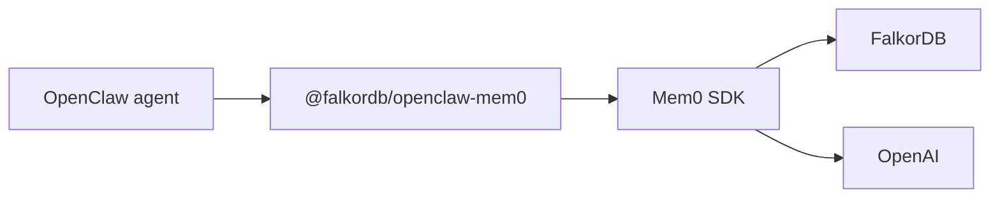

[OpenClaw](https://github.com/openclaw/openclaw) is a personal AI assistant runtime that talks to you over channels like WhatsApp, Telegram, Slack, and the CLI. Its built-in `memory-core` backend already keeps state on your own hardware, as `MEMORY.md` and `memory/*.md` files on disk, so memory does survive a restart.

What those files do not capture is **relationships**. `memory_search` chunks your notes and retrieves them by keyword, embedding, or a hybrid of both, which finds passages that *resemble* your query but never the edges between them. Ask which people connect two projects and there is no join to traverse — the pieces come back as separate, disconnected snippets.

Pointing OpenClaw's memory slot at a FalkorDB-backed plugin stores facts, preferences, and the links between them as nodes and edges, so your assistant can recall not just *what* you said but *how it all connects*. For background, see [Curing AI Amnesia](https://www.falkordb.com/blog/curing-ai-amnesia/).

## Why OpenClaw + FalkorDB?

### FalkorDB's Added Value

- **Graph-structured recall**: Answer relational questions that vector search alone cannot, such as which people connect two projects
- **Native multi-graph support**: Give every user or agent its own isolated graph instead of filtering a shared table
- **Hybrid retrieval**: Combine vector similarity with graph traversal to pull in connected context
- **Fast traversals**: Keep memory injection inside the latency budget of a chat turn
- **Easy cleanup**: Forgetting a user or an agent is a graph drop, not a cascade of deletes
- **Cloud and on-premises ready**: Run locally in Docker or on FalkorDB Cloud
- **Visual inspection**: Browse what your assistant actually remembers in the FalkorDB Browser

### Use Cases

- **Personal assistants**: Remember preferences, projects, and people across every session and channel
- **Multi-agent gateways**: Host several agents on one gateway, each with its own private memory graph
- **Team assistants**: Share an organizational memory while keeping per-user boundaries
- **Long-running projects**: Accumulate context over weeks without re-explaining it each turn

## Choosing an Integration Path

There are two supported ways to back OpenClaw memory with FalkorDB. Both are production-usable and both store relationships in FalkorDB; they differ in the memory engine, the isolation model, and how much infrastructure you run.

| | Option A: Mem0 plugin | Option B: Cognee integration |
|---|---|---|
| **OpenClaw plugin** | `@falkordb/openclaw-mem0` | `cognee-openclaw` |
| **Memory engine** | [Mem0](https://docs.mem0.ai) | [Cognee](https://www.cognee.ai) |
| **FalkorDB's role** | Graph store | Graph **and** vector store |
| **Vector store** | Separate, in-memory by default | FalkorDB, via the hybrid adapter |
| **Isolation model** | Per user, graph `mem0_alice` | Per agent, one graph per Cognee dataset |
| **What you run** | A Node plugin, plus FalkorDB | A Cognee service and FalkorDB, via Docker Compose |
| **Setup effort** | Install a plugin, edit one config file | Build a custom image, then configure |
| **Capture model** | Auto-recall and auto-capture per turn, plus five agent tools | Session cache flushed to Cognee, then processed into the graph |
| **Maintainer** | FalkorDB | Cognee community |
| **Pick it when** | You want the fastest path to persistent memory, or per-user memory | You want one store for vectors and graph, Cognee's processing pipeline, or per-agent isolation |

<Tip>
Start with **Option A** if you are adding memory to OpenClaw for the first time. It is a single plugin install and one config block. Move to **Option B** when you want FalkorDB to serve vectors as well as the graph, or when you host multiple agents that each need their own memory.
</Tip>

## Prerequisites

- [Node.js](https://nodejs.org/) 24.16 or later within the 24.x line, or 26.1 or later, as required by OpenClaw's `engines` range. Node 26 is recommended; Node 22, 23, and 25 are not supported
- [Docker](https://docs.docker.com/get-docker/), to run FalkorDB and, for Option B, Cognee
- An OpenAI API key, or another supported LLM provider, for embeddings and entity extraction
- `redis-cli`, optional, for inspecting graphs from the terminal

## Running FalkorDB

Both options need a FalkorDB instance. Choose one.

### Option 1: Docker

```bash
docker run -d --name falkordb \
  -p 127.0.0.1:6379:6379 -p 127.0.0.1:3000:3000 \
  -v falkordb_data:/var/lib/falkordb/data \
  falkordb/falkordb:latest
```

Port `6379` serves the database and port `3000` serves the built-in [FalkorDB Browser](/browser). The named volume keeps the assistant's memory on disk, so removing or recreating the container does not discard the graph. FalkorDB stores its data in `/var/lib/falkordb/data`, so mounting a volume anywhere else leaves the graph in the container's writable layer, where it disappears with the container. Verify it is up:

```bash
redis-cli -h localhost -p 6379 ping
# PONG
```

<Warning>
FalkorDB runs without authentication by default, so the ports above are bound to `127.0.0.1` to keep the database off the network. If you need to reach it from another host, do not simply drop the prefix: enable authentication and restrict access with a firewall first. See [Configuration](/getting-started/configuration) for the available options.
</Warning>

### Option 2: FalkorDB Cloud

Sign up at [app.falkordb.cloud](https://app.falkordb.cloud), create an instance, and note its **host**, **port**, **username**, and **password**. Verify it is reachable:

```bash
redis-cli -h <host> -p <port> --user <username> --pass <password> PING
# PONG
```

<Note>
Use those values wherever an example below connects to `localhost`. Commands shown as `docker exec falkordb ...` are different: they address a local container that does not exist in a Cloud setup, so each one below is paired with its Cloud equivalent rather than left for you to translate.
</Note>

## Option A: Mem0 Plugin

[`@falkordb/openclaw-mem0`](https://www.npmjs.com/package/@falkordb/openclaw-mem0) fills OpenClaw's memory slot with [Mem0](https://docs.mem0.ai), using FalkorDB as the graph store through the [`@falkordb/mem0`](https://www.npmjs.com/package/@falkordb/mem0) TypeScript library. A complete reference setup lives in [FalkorDB/openclaw-mem0-demo](https://github.com/FalkorDB/openclaw-mem0-demo).

### Architecture



| Component | Role |
|---|---|
| **OpenClaw** | The agent runtime and chat interface |
| **`@falkordb/openclaw-mem0`** | Memory-slot plugin: auto-recall, auto-capture, and five memory tools |
| **Mem0 SDK** | Extracts, stores, and retrieves facts |
| **`@falkordb/mem0`** | FalkorDB graph store for Mem0, bundled with the plugin |
| **FalkorDB** | Stores entity relationships as isolated per-user graphs |
| **OpenAI** | Embeddings for semantic search and an LLM for entity extraction |

On every turn the plugin **recalls** before the agent answers, injecting relevant memories, and **captures** afterwards, extracting new entities and relationships into the user's graph.

### Install OpenClaw and the Plugin

```bash
npm install -g openclaw@latest --allow-scripts=openclaw
openclaw plugins install @falkordb/openclaw-mem0
```

<Note>
`--allow-scripts=openclaw` is required on npm 12 and npm 11.16 or later, which block lifecycle scripts by default. Omit the flag on npm 11.15 and earlier. Without it the package installs but the `openclaw` command may not be created. See the [OpenClaw installation guide](https://docs.openclaw.ai/install) for the full lifecycle script contract.
</Note>

Confirm the plugin registered:

```bash
openclaw plugins list
# @falkordb/openclaw-mem0
```

### Configure the Plugin

Edit `~/.openclaw/openclaw.json` and merge the block below into your existing configuration. Setting `plugins.slots.memory` is what replaces OpenClaw's default `memory-core` with the FalkorDB-backed plugin.

```json
{
  "gateway": { "mode": "local" },
  "plugins": {
    "slots": { "memory": "openclaw-mem0" },
    "entries": {
      "openclaw-mem0": {
        "enabled": true,
        "config": {
          "mode": "open-source",
          "userId": "alice",
          "autoRecall": true,
          "autoCapture": true,
          "enableGraph": true,
          "topK": 5,
          "searchThreshold": 0.3,
          "oss": {
            "embedder": {
              "provider": "openai",
              "config": { "model": "text-embedding-3-small" }
            },
            "vectorStore": {
              "provider": "memory",
              "config": { "dimension": 1536 }
            },
            "graphStore": {
              "provider": "falkordb",
              "config": {
                "host": "localhost",
                "port": 6379,
                "graphName": "mem0"
              }
            },
            "llm": {
              "provider": "openai",
              "config": { "model": "gpt-4o-mini" }
            }
          }
        }
      }
    }
  }
}
```

Change `userId` to your own identifier. Memories are written to the graph `mem0_alice`, following the pattern `graphName` underscore `userId`.

<Warning>
The `memory` vector store above keeps embeddings in the gateway process, so they are **lost on every restart** and semantic recall has to re-embed from scratch. Your entities and relationships are safe either way, because those live in FalkorDB, but for anything beyond a trial set `oss.vectorStore.provider` to a persistent backend such as `qdrant` or `chroma` and give it `host`, `port`, and `collectionName` in `oss.vectorStore.config`.
</Warning>

To use FalkorDB Cloud, replace the `graphStore` config with your instance details:

```json
"graphStore": {
  "provider": "falkordb",
  "config": {
    "host": "your-instance.falkordb.cloud",
    "port": 6379,
    "username": "default",
    "password": "your-password",
    "graphName": "mem0"
  }
}
```

### Set Your API Key and Restart

The plugin needs an LLM key for embeddings and entity extraction:

```bash
export OPENAI_API_KEY="sk-your-key-here"
```

Add it to your shell profile, or to a `.env` file in your OpenClaw workspace, to make it permanent. Then restart the gateway:

```bash
openclaw gateway --port 18789 --verbose
```

If you run the gateway as a daemon, use `openclaw onboard --install-daemon` instead.

### Chat and Verify

```bash
openclaw agent --local --session-id demo --message "I'm a software engineer who loves Rust and hiking"
openclaw agent --local --session-id demo --message "Recommend me a weekend project"
```

The second response should draw on the first message. You can also query memory directly:

```bash
openclaw mem0 search "what languages does the user know"
openclaw mem0 stats
```

### Platform Mode

To use Mem0's managed cloud rather than self-hosting the memory engine, switch the plugin to platform mode. Keep `enableGraph` on so entity relationships are still built:

```json
{
  "plugins": {
    "entries": {
      "openclaw-mem0": {
        "enabled": true,
        "config": {
          "mode": "platform",
          "apiKey": "${MEM0_API_KEY}",
          "userId": "alice",
          "enableGraph": true
        }
      }
    }
  }
}
```

<Note>
Platform mode uses Mem0 Cloud's own graph layer. Use the open-source mode shown above when you want the relationships stored in your own FalkorDB instance.
</Note>

### Agent Memory Tools

Beyond automatic recall and capture, the plugin exposes five tools the agent can call during a conversation:

| Tool | Description |
|---|---|
| `memory_search` | Search memories with a natural language query |
| `memory_store` | Explicitly save a fact, session-scoped or long-term |
| `memory_list` | List all stored memories for a user |
| `memory_get` | Retrieve a specific memory by ID |
| `memory_forget` | Delete a memory by ID or by query |

### Memory Scopes

| Scope | Behavior |
|---|---|
| **Session, short-term** | Auto-captured during the current conversation |
| **User, long-term** | Persists across every session for that user |

Auto-recall searches both scopes and presents long-term memories first.

### Inspect the Graph

For a local container, open the [FalkorDB Browser](/browser) at [http://localhost:3000](http://localhost:3000); for FalkorDB Cloud, use the Browser in [app.falkordb.cloud](https://app.falkordb.cloud). Select the graph `mem0_alice`, and run:

```cypher
MATCH (a)-[r]->(b) RETURN a, r, b
```

You should see extracted entities such as people, technologies, and hobbies, joined by the relationships between them. The same check from the terminal:

<CodeGroup>

```bash Local container
redis-cli -h localhost -p 6379

GRAPH.LIST
GRAPH.QUERY mem0_alice "MATCH (n) RETURN n.name LIMIT 10"
GRAPH.QUERY mem0_alice "MATCH (a)-[r]->(b) RETURN a.name, type(r), b.name"
```

```bash FalkorDB Cloud
redis-cli -h <host> -p <port> --user <username> --pass <password>

GRAPH.LIST
GRAPH.QUERY mem0_alice "MATCH (n) RETURN n.name LIMIT 10"
GRAPH.QUERY mem0_alice "MATCH (a)-[r]->(b) RETURN a.name, type(r), b.name"
```

</CodeGroup>

## Option B: Cognee Integration

The community [`cognee-falkor-setup` skill](https://github.com/topoteretes/cognee-integrations/blob/main/integrations/openclaw/skills/falkor/SKILL.md) runs [Cognee](/agentic-memory/cognee) as a service with FalkorDB as **both** its graph and vector store, then points OpenClaw's backend-agnostic `cognee-openclaw` plugin at it.

### Why a Custom Image Is Required

The stock `cognee/cognee` image does not ship the FalkorDB adapter, and no environment variable turns it on. Cognee's `falkor` provider only becomes resolvable once `cognee_community_hybrid_adapter_falkor.register` has been imported, which registers the graph and vector providers along with the per-dataset handlers.

The fix is to install the adapter and drop a `sitecustomize.py` on the image's `PYTHONPATH`. Python imports `sitecustomize` automatically at interpreter startup for every process, so `register` runs before any database engine is created, without patching Cognee's entrypoint.

### Create the Build Files

In a working directory, create these three files.

`sitecustomize.py`:

```python
import cognee_community_hybrid_adapter_falkor.register  # noqa: F401
```

`Dockerfile`:

```dockerfile
FROM cognee/cognee:1.1.0

COPY --from=ghcr.io/astral-sh/uv:latest /uv /usr/local/bin/uv
RUN uv pip install --python /app/.venv/bin/python --no-deps "cognee-community-hybrid-adapter-falkor==0.3.0" \
 && uv pip install --python /app/.venv/bin/python "falkordb>=1.0.9,<2.0.0"

COPY sitecustomize.py /app/sitecustomize.py

ENV GRAPH_DATABASE_PROVIDER=falkor \
    GRAPH_DATABASE_URL=falkordb \
    GRAPH_DATABASE_PORT=6379 \
    VECTOR_DB_PROVIDER=falkor \
    VECTOR_DB_URL=falkordb \
    VECTOR_DB_PORT=6379 \
    GRAPH_DATASET_DATABASE_HANDLER=falkor_graph_local \
    VECTOR_DATASET_DATABASE_HANDLER=falkor_vector_local \
    ENABLE_BACKEND_ACCESS_CONTROL=True
```

`docker-compose.yaml`:

```yaml
services:
  falkordb:
    image: falkordb/falkordb:latest
    container_name: falkordb
    ports:
      - "127.0.0.1:6379:6379"
      - "127.0.0.1:3001:3000"
    volumes:
      - falkordb_data:/var/lib/falkordb/data
    restart: unless-stopped
    healthcheck:
      test: [ "CMD", "redis-cli", "ping" ]
      interval: 10s
      timeout: 5s
      retries: 5

  cognee:
    build:
      context: .
      dockerfile: Dockerfile
    image: cognee-falkor:1.1.0
    container_name: cognee
    depends_on:
      falkordb:
        condition: service_healthy
    ports:
      - "127.0.0.1:8000:8000"
    environment:
      - LLM_API_KEY=${LLM_API_KEY}
      - AUTO_FEEDBACK=true
    volumes:
      - cognee_data:/app/cognee/.cognee_system
    restart: unless-stopped
    healthcheck:
      test: [ "CMD", "curl", "-f", "http://localhost:8000/health" ]
      interval: 30s
      timeout: 10s
      retries: 3
      start_period: 60s

volumes:
  falkordb_data:
  cognee_data:
```

<Warning>
Keep the version pins. The adapter is pinned to `0.3.0` against base image `cognee/cognee:1.1.0`. If the adapter install fails, check PyPI for a version compatible with your Cognee base tag and bump both together, rather than dropping the pin.
</Warning>

### Using FalkorDB Cloud Instead

The `Dockerfile` above bakes in the local Compose service name `falkordb` and no credentials, which is all a local stack needs. To target a FalkorDB Cloud instance, override the connection settings on the `cognee` service and drop the `falkordb` service entirely. Cognee reads these as environment variables, and the adapter passes the username and password through to the FalkorDB driver:

```yaml
  cognee:
    build:
      context: .
      dockerfile: Dockerfile
    image: cognee-falkor:1.1.0
    container_name: cognee
    ports:
      - "127.0.0.1:8000:8000"
    environment:
      - LLM_API_KEY=${LLM_API_KEY}
      - AUTO_FEEDBACK=true
      - GRAPH_DATABASE_URL=your-instance.falkordb.cloud
      - GRAPH_DATABASE_PORT=6379
      - GRAPH_DATABASE_USERNAME=default
      - GRAPH_DATABASE_PASSWORD=${FALKORDB_PASSWORD}
      - VECTOR_DB_URL=your-instance.falkordb.cloud
      - VECTOR_DB_PORT=6379
      - VECTOR_DB_USERNAME=default
      - VECTOR_DB_PASSWORD=${FALKORDB_PASSWORD}
    volumes:
      - cognee_data:/app/cognee/.cognee_system
    restart: unless-stopped
    healthcheck:
      test: [ "CMD", "curl", "-f", "http://localhost:8000/health" ]
      interval: 30s
      timeout: 10s
      retries: 3
      start_period: 60s
```

Remove the `depends_on` block, the `falkordb` service, and the now-unused `falkordb_data` volume, since there is no local database to wait for, and set `FALKORDB_PASSWORD` in your `.env` file next to `LLM_API_KEY`. Keep the `cognee_data` volume, `restart`, and `healthcheck` as shown: only the database moves to Cloud, and dropping the volume would stop persisting Cognee's dataset metadata under `/app/cognee/.cognee_system`, so a `docker compose down` or a rebuild would lose it. Both the graph and vector settings must point at the same instance, because this adapter uses FalkorDB for both.

### Build and Run

<Note>
This applies to the local Compose stack only. It starts its own FalkorDB service, named `falkordb` on port `6379`, which clashes with a standalone container from [Running FalkorDB](#running-falkordb) on both the container name and the port. Stop and remove that container first with `docker stop falkordb && docker rm falkordb`. Its data is safe: the `falkordb_data` volume outlives the container. Compose does create its own project-scoped volume rather than reusing that one, so the stack starts from an empty graph while the earlier memories stay in the standalone volume. If you followed [Using FalkorDB Cloud Instead](#using-falkordb-cloud-instead), there is no local database service and nothing to remove.
</Note>

```bash
export LLM_API_KEY="sk-your-key-here"
docker compose up -d --build
docker compose ps
```

Both the `falkordb` and `cognee` containers should be present. If you followed [Using FalkorDB Cloud Instead](#using-falkordb-cloud-instead), expect only `cognee`, since there is no local database service.

### Verify the Adapter Registered

This check separates a working FalkorDB backend from a silently broken one. Do not skip it.

```bash
until curl -fsS http://localhost:8000/health >/dev/null; do sleep 3; done; echo "health OK"

docker exec cognee /app/.venv/bin/python -c "import sitecustomize; \
from cognee.infrastructure.databases.graph.supported_databases import supported_databases as g; \
from cognee.infrastructure.databases.vector.supported_databases import supported_databases as v; \
from cognee.infrastructure.databases.dataset_database_handler.supported_dataset_database_handlers import supported_dataset_database_handlers as h; \
print('graph falkor:', 'falkor' in g); print('vector falkor:', 'falkor' in v); \
print('handlers:', [k for k in h if 'falkor' in k])"
```

Expect `graph falkor: True`, `vector falkor: True`, and handlers `falkor_graph_local` and `falkor_vector_local`. Then confirm the database itself answers:

<CodeGroup>

```bash Local Compose
docker exec falkordb redis-cli PING
# PONG
```

```bash FalkorDB Cloud
redis-cli -h <host> -p <port> --user <username> --pass <password> PING
# PONG
```

</CodeGroup>

<Warning>
Do not continue unless **all four** checks pass: `graph falkor: True`, `vector falkor: True`, both handlers present, and `PONG`. Graph support can register while vector support does not, and that combination breaks hybrid memory later with no error at setup time, so treating `graph falkor: True` alone as success is what makes this failure hard to diagnose. If any check fails, confirm `/app/sitecustomize.py` exists in the container and that the adapter install succeeded in the build logs, then rebuild.
</Warning>

### Point OpenClaw at Cognee

Install the Cognee memory plugin, which is published under the `@cognee` scope:

```bash
openclaw plugins install @cognee/cognee-openclaw
openclaw plugins list
```

The plugin is backend-agnostic, so it only needs the API URL. Configure it in `~/.openclaw/openclaw.json`:

```json
{
  "plugins": {
    "slots": { "memory": "cognee-openclaw" },
    "entries": {
      "cognee-openclaw": {
        "enabled": true,
        "hooks": {
          "allowConversationAccess": true,
          "allowPromptInjection": true
        },
        "config": {
          "baseUrl": "http://localhost:8000",
          "agentDatasetPrefix": "openclaw-cognee-agent",
          "recallScopes": ["agent"],
          "defaultWriteScope": "agent"
        }
      }
    }
  }
}
```

<Warning>
Both `hooks` keys are required, because they gate different hook groups. `allowConversationAccess` unblocks the conversation hooks used to capture sessions; without it capture is **silently skipped**, leaving only a warning in gateway diagnostics. `allowPromptInjection` gates the prompt-injection hook the plugin uses to inject recalled memories. Restart the gateway after changing either flag. Running `openclaw cognee setup` writes both for you.
</Warning>

Note that the plugin entry is keyed by its short name, `cognee-openclaw`, even though the package is installed as `@cognee/cognee-openclaw`.

### Per-Agent Graphs

When the gateway hosts more than one agent, the plugin enables per-agent memory automatically. Each agent's files and chat route to a dataset named `agentDatasetPrefix` followed by a lowercased agent ID, and each dataset gets its own FalkorDB graph. Give every agent its own `workspace` in `agents.list`, and seed a one-line `MEMORY.md` in each so its dataset is created when the gateway starts. Set `perAgentMemory` to `true` or `false` to force the mode.

### Verify End to End

Restart the gateway, then confirm datasets and graphs appear as agents become active:

```bash
openclaw gateway stop && openclaw gateway start
```

Then list the graphs:

<CodeGroup>

```bash Local Compose
docker exec falkordb redis-cli GRAPH.LIST
```

```bash FalkorDB Cloud
redis-cli -h <host> -p <port> --user <username> --pass <password> GRAPH.LIST
```

</CodeGroup>

You can also list datasets through the Cognee API by authenticating against `/api/v1/auth/login` with your Cognee credentials and calling `/api/v1/datasets`.

Chat-derived memory reaches the graph only after the session cache is bridged into Cognee, which happens on `session_end`. Force it with:

```bash
openclaw cognee improve --dataset <name>
```

For a quick isolation check, tell agent A something, end its session, then ask agent B. Agent B should not know it.

### Operations and Cleanup

```bash
docker compose logs -f cognee
docker compose restart cognee
docker compose down
docker compose down -v
```

`docker compose down` stops the stack but keeps the data; adding `-v` also wipes the Cognee and FalkorDB volumes. To clear memory without destroying the containers, wipe through the API and then reset the plugin's local state:

```bash
openclaw cognee forget --everything --confirm
rm -f ~/.openclaw/memory/cognee/*.json
```

## Troubleshooting

### Both Options

- **Cannot reach FalkorDB**: for a local container run `redis-cli -h localhost -p 6379 ping`; for FalkorDB Cloud run `redis-cli -h <host> -p <port> --user <username> --pass <password> ping`. Either should return `PONG`. Check the host, port, and credentials in your configuration.
- **Nothing is being remembered**: verify your LLM API key is exported in the environment the gateway runs in. Entity extraction fails silently without it.
- **Graph stays empty**: list graphs with `GRAPH.LIST` to confirm the expected name. Memory is written under the user or agent identifier, so a changed identifier means a new, empty graph.

### Option A: Mem0 Plugin

- **Plugin not loading**: run `openclaw plugins list` and confirm `plugins.slots.memory` is set to `openclaw-mem0`. Without the slot assignment OpenClaw keeps using the default `memory-core`.
- **Recall returns nothing**: check `openclaw mem0 stats` first. If memories exist, try lowering `searchThreshold` or raising `topK`.
- **Wrong graph**: memories land in `graphName` underscore `userId`, so confirm both values in your config.

### Option B: Cognee Integration

- **Environment variables alone do not work**: the stock image has no FalkorDB adapter, so `GRAPH_DATABASE_PROVIDER=falkor` fails when the engine is created. The registration check above catches this.
- **Memory is silently never captured**: check that both `allowConversationAccess` and `allowPromptInjection` are `true` in the plugin's `hooks` block. Missing `allowConversationAccess` blocks conversation capture with no error beyond a gateway diagnostics warning.
- **Plugin not found**: the package is installed as `@cognee/cognee-openclaw` but keyed as `cognee-openclaw` in `plugins.entries` and `plugins.slots.memory`. Confirm it appears in `openclaw plugins list`.
- **`GRAPH_DATABASE_URL` must resolve to the FalkorDB host**: under the Compose file above that is the service name `falkordb`, not `localhost`.
- **Stale plugin state**: if datasets look empty or chat lands in the wrong graph after recreating the server, remove `~/.openclaw/memory/cognee/*.json` and restart the gateway so it rebuilds against the fresh server.
- **Keep credentials stable**: dataset ownership is per user, so changing the plugin's `apiKey` or `username` orphans existing datasets.
- **Version drift**: bump the base image tag and the adapter pin together when moving Cognee versions.

## Resources

- 📝 [Curing AI Amnesia](https://www.falkordb.com/blog/curing-ai-amnesia/)
- 💻 [OpenClaw + Mem0 + FalkorDB demo](https://github.com/FalkorDB/openclaw-mem0-demo)
- 📦 [`@falkordb/openclaw-mem0` on npm](https://www.npmjs.com/package/@falkordb/openclaw-mem0)
- 📦 [`@falkordb/mem0` on npm](https://www.npmjs.com/package/@falkordb/mem0)
- 🔌 [Cognee FalkorDB skill for OpenClaw](https://github.com/topoteretes/cognee-integrations/blob/main/integrations/openclaw/skills/falkor/SKILL.md)
- 📦 [`@cognee/cognee-openclaw` on npm](https://www.npmjs.com/package/@cognee/cognee-openclaw)
- 🤖 [OpenClaw](https://github.com/openclaw/openclaw)
- 📚 [Mem0 Documentation](https://docs.mem0.ai)
- 🔗 [FalkorDB Cloud](https://app.falkordb.cloud)

## Next Steps

- Read the [Mem0](/agentic-memory/mem0) page to use the same graph memory from Python
- Explore [Cognee](/agentic-memory/cognee) for its processing pipeline and search types
- Add memory to other AI clients with the [Graphiti MCP Server](/agentic-memory/graphiti-mcp-server)
- Review [Cypher Query Language](/cypher) to query memory graphs directly

## Frequently Asked Questions

<AccordionGroup>
  <Accordion title="Should I use the Mem0 plugin or the Cognee integration with OpenClaw?">
    Use the **Mem0 plugin** for the fastest path: install `@falkordb/openclaw-mem0`, edit one config block, and you have per-user graph memory. Use the **Cognee integration** when you want FalkorDB to serve both vectors and the graph, need Cognee's processing pipeline, or host multiple agents that each require their own isolated memory.
  </Accordion>
  <Accordion title="How does OpenClaw memory stay isolated between users or agents?">
    Both paths rely on FalkorDB's **native multi-graph support**. The Mem0 plugin writes each user to their own graph, named `graphName` followed by the user ID, such as `mem0_alice`. The Cognee integration gives each agent its own dataset, and each dataset maps to its own FalkorDB graph. No user ID filtering is needed in queries, and forgetting someone is a single graph drop.
  </Accordion>
  <Accordion title="Do I need a Mem0 Cloud account to use OpenClaw with FalkorDB?">
    No. The plugin's open-source mode is fully self-hosted: FalkorDB stores the graph and you supply an LLM provider for embeddings and entity extraction. Platform mode is optional and routes memory through Mem0 Cloud instead.
  </Accordion>
  <Accordion title="Why does the Cognee integration need a custom Docker image?">
    The stock `cognee/cognee` image does not include the FalkorDB adapter, and no environment variable enables it. The `falkor` provider is only resolvable after `cognee_community_hybrid_adapter_falkor.register` is imported. The custom image installs the adapter and adds a `sitecustomize.py` that Python imports at startup, so registration happens before any database engine is created.
  </Accordion>
  <Accordion title="Can I use FalkorDB Cloud instead of running FalkorDB locally?">
    Yes. Create an instance at [app.falkordb.cloud](https://app.falkordb.cloud) and use its host, port, username, and password in place of `localhost`. For the Mem0 plugin, put those values in the `graphStore` config. For the Cognee integration, the `Dockerfile` defaults target the local Compose service, so override the graph and vector connection settings on the `cognee` service as shown in [Using FalkorDB Cloud Instead](#using-falkordb-cloud-instead) and drop the local `falkordb` service.
  </Accordion>
  <Accordion title="How do I see what my assistant has remembered?">
    Open the [FalkorDB Browser](/browser), select the memory graph, and run `MATCH (a)-[r]->(b) RETURN a, r, b` to visualize stored entities and relationships. From the terminal, `GRAPH.LIST` shows every graph and `GRAPH.QUERY` runs Cypher against one. With the Mem0 plugin you can also run `openclaw mem0 search` and `openclaw mem0 stats`.
  </Accordion>
</AccordionGroup>
