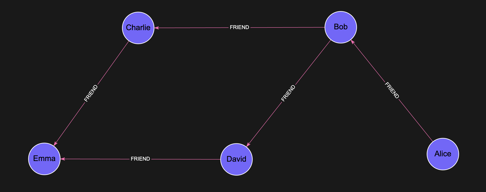

# Betweenness Centrality

## Introduction

Betweenness Centrality is a graph algorithm that quantifies the importance of a node based on the number of shortest paths that pass through it. Nodes that frequently occur on shortest paths between other nodes have higher betweenness centrality scores. This makes the algorithm useful for identifying **key connectors** or **brokers** within a network.

## Algorithm Overview

The core idea of Betweenness Centrality is that a node is more important if it lies on many of the shortest paths connecting other nodes. It’s particularly useful in understanding information flow or communication efficiency in a graph.

> For example, in a social network, a person who frequently connects otherwise unconnected groups would have high betweenness centrality.

## Syntax

The procedure accepts an optional configuration map:

```cypher
CALL algo.betweenness({
  nodeLabels: [<node_label>],
  relationshipTypes: [<relationship_type>],
  samplingSize: <int>,
  samplingSeed: <int>
})
YIELD node, score
```

### Parameters

| Name                | Type    | Description | Default |
|---------------------|---------|-------------|---------|
| `nodeLabels`        | Array   | *(Optional)* List of node labels to include in the computation. | `[]` (all labels) |
| `relationshipTypes` | Array   | *(Optional)* List of relationship types to traverse. | `[]` (all relationship types) |
| `samplingSize`      | Integer | *(Optional)* Number of randomly sampled **source nodes** used to approximate betweenness centrality. Larger values improve accuracy but increase runtime. For similar accuracy across different graph sizes, keep `samplingSize` proportional to the number of input nodes (i.e., sample a similar fraction of nodes). If `samplingSize` is larger than the number of eligible nodes, all eligible nodes are used. | `32` |
| `samplingSeed`      | Integer | *(Optional)* Random seed used when sampling source nodes. Use a fixed value for reproducible results. If omitted (or set to `0`), a time-based seed is used and results may vary between runs. | time-based |

### Yield

| Name    | Type  | Description                                   |
|---------|-------|-----------------------------------------------|
| `node`  | Node  | The node being evaluated                      |
| `score` | Float | The betweenness centrality score for the node |

## Example

Let's take this Social Graph as an example:


### Create the Graph

```cypher
CREATE 
  (a:Person {name: 'Alice'}),
  (b:Person {name: 'Bob'}),
  (c:Person {name: 'Charlie'}),
  (d:Person {name: 'David'}),
  (e:Person {name: 'Emma'}),
  (a)-[:FRIEND]->(b),
  (b)-[:FRIEND]->(c),
  (b)-[:FRIEND]->(d),
  (c)-[:FRIEND]->(e),
  (d)-[:FRIEND]->(e)
```

### Run Betweenness Centrality - Sort Persons by importance based on FRIEND relationship

```cypher
CALL algo.betweenness({
    'nodeLabels': ['Person'], 
    'relationshipTypes': ['FRIEND']
    })
YIELD node, score
RETURN node.name AS person, score
ORDER BY score DESC
```

Expected result:

| person    | score |
|-----------|--------|
| `Bob`     | 6      |
| `Charlie` | 2      |
| `David`   | 2      |
| `Alice`   | 0      |
| `Emma`    | 0      |

## Usage Notes

- Scores are based on **all shortest paths** between node pairs.
- Nodes that serve as bridges between clusters tend to score higher.
- Betweenness Centrality can be computationally expensive on large, dense graphs.
- Use `samplingSize` to trade accuracy for performance (larger samples are slower but usually more accurate).
- Set `samplingSeed` to a fixed value to make runs reproducible; if you omit it, results may vary between runs due to random sampling.
