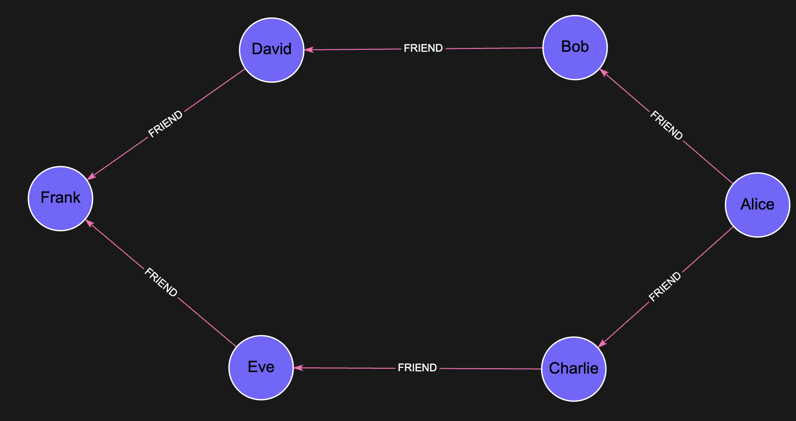

# BFS

## Overview

The Breadth-First Search (BFS) procedure allows you to perform a breadth-first traversal of a graph starting from a specific node.
BFS explores all the nodes at the present depth before moving on to nodes at the next depth level.
This is particularly useful for finding the shortest path between two nodes or exploring a graph layer by layer.

## Syntax

```cypher
CALL algo.bfs(start_node, max_depth, relationship)
YIELD nodes, edges
```

## Arguments

| Name         | Type           | Description                                                                 | Default    |
|--------------|----------------|-----------------------------------------------------------------------------|------------|
| start_node   | Node           | Starting node for the BFS traversal                                         | (Required) |
| max_depth    | Integer        | Maximum depth to traverse                                                   | (Required) |
| relationship | String or null | The relationship type to traverse. If null, all relationship types are used | null       |

## Returns

| Name  | Type | Description                                  |
|-------|------|----------------------------------------------|
| nodes | List | List of visited nodes in breadth-first order |
| edges | List | List of edges traversed during the BFS       |

## Examples

### Social Network Friend Recommendations

This example demonstrates how to use BFS to find potential friend recommendations in a social network.
By exploring friends of friends, BFS uncovers second-degree connections—people you may know through mutual friends—which are often strong candidates for relevant and meaningful recommendations.

#### Create the Graph

```cypher
CREATE 
  (alice:Person {name: 'Alice', age: 28, city: 'New York'}),
  (bob:Person {name: 'Bob', age: 32, city: 'Boston'}),
  (charlie:Person {name: 'Charlie', age: 35, city: 'Chicago'}),
  (david:Person {name: 'David', age: 29, city: 'Denver'}),
  (eve:Person {name: 'Eve', age: 31, city: 'San Francisco'}),
  (frank:Person {name: 'Frank', age: 27, city: 'Miami'}),

  (alice)-[:FRIEND]->(bob),
  (alice)-[:FRIEND]->(charlie),
  (bob)-[:FRIEND]->(david),
  (charlie)-[:FRIEND]->(eve),
  (david)-[:FRIEND]->(frank),
  (eve)-[:FRIEND]->(frank)
```



#### Find Friends of Friends (Potential Recommendations)

```cypher
// Find Alice's friends-of-friends (potential recommendations)
MATCH (alice:Person {name: 'Alice'})
CALL algo.bfs(alice, 2, 'FRIEND')
YIELD nodes

// Process results to get only depth 2 connections (friends of friends)
WHERE size(nodes) >= 3
WITH alice, nodes[2] AS potential_friend
WHERE NOT (alice)-[:FRIEND]->(potential_friend)
RETURN potential_friend
```

In this social network example, the BFS algorithm helps find potential friend recommendations by identifying people who are connected to Alice's existing friends but not directly connected to Alice yet.

## Performance Considerations

* **Indexing:** Ensure properties used for finding your starting node are indexed for optimal performance
* **Maximum Depth:** Choose an appropriate max_depth value based on your graph's connectivity; large depths in highly connected graphs can result in exponential growth of traversed nodes
* **Relationship Filtering:** When applicable, specify the relationship type to limit the traversal scope
* **Memory Management:** Be aware that the procedure stores visited nodes in memory to avoid cycles, which may require significant resources in large, densely connected graphs

## Error Handling

Common errors that may occur:

* **Null Starting Node:** If the start_node parameter is null, the procedure will raise an error; ensure your MATCH clause successfully finds the starting node
* **Invalid Relationship Type:** If you specify a relationship type that doesn't exist in your graph, the traversal will only include the starting node
* **Memory Limitations:** For large graphs with high connectivity, an out-of-memory error may occur if too many nodes are visited
* **Result Size:** If the BFS traversal returns too many nodes, query execution may be slow or time out; in such cases, try reducing the max_depth or filtering by relationship types
