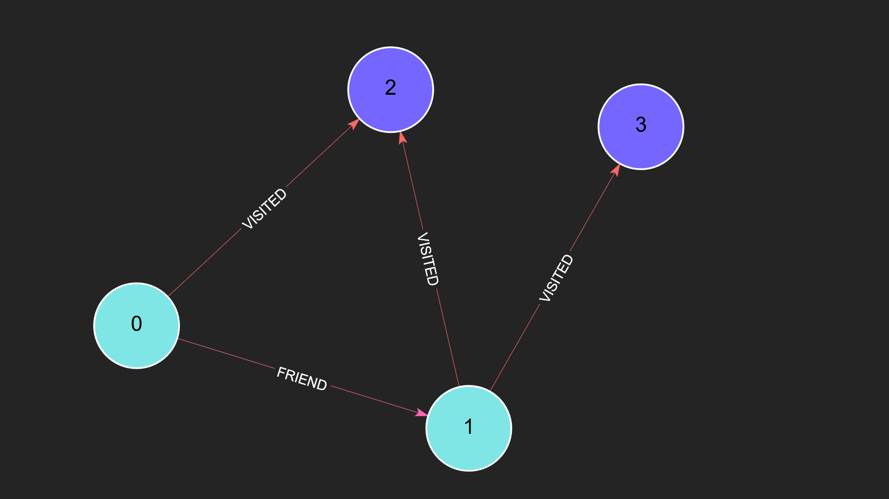

# Degree Procedure Documentation

## Introduction

The **Degree Procedure** calculates the degree of nodes in a graph based on the specified parameters.
This allows users to analyze the connectivity of nodes in terms of incoming or outgoing edges, filtered by node labels and relationship types.

---

## Use Cases

Here are some practical scenarios where the **Degree Procedure** can be applied:

1. **Social Network Analysis**: Identify influencers or highly connected individuals by calculating the degree of `Person` nodes in a social graph.
2. **Infrastructure Planning**: Determine bottlenecks in a transportation network by analyzing nodes with high incoming or outgoing connections.
3. **E-commerce Recommendations**: Identify popular products or categories by computing the degree of `Product` or `Category` nodes based on customer interactions.
4. **Fraud Detection**: Spot suspicious activities by analyzing nodes with unusually high degrees in financial transaction graphs.

---

## Syntax

The procedure has the following call signature:
```procedure input:
CALL algo.dgree({
	'srcLabels':      		[<label>, ...],
	'dir':         	  		'incoming' / 'outgoing' / 'both',
	'relationshipTypes':    [<type>, ...],
	'destLabels':     		[<label>, ...],
})
```

### Parameters

| Name                | Type                  | Description                                | Default   |
|---------------------|-----------------------|--------------------------------------------|-----------|
| `srcLabels`      	  | [optional] [string[]] | type of nodes for which degree is computed | All Nodes |
| `dir`         	  | [optional] [string]   | 'incoming', 'outgoing', or 'both'          | outgoing  |
| `relationshipTypes` | [optional] [string[]] | the type of edges to consider              | All edges |
| `destLabels` 		  | [optional] [string[]] | type of reachable nodes                    | All Nodes |

---

## Output

The procedure returns a result set where each row corresponds to a node and includes the following fields:

| Field    | Type | Description                      |
| -------- | ---- | -------------------------------- |
| `node`   | Node | The Node object.                 |
| `degree` | Int  | The computed degree of the node. |

---

## Setting Up the Graph

To run the examples below, create the following graph structure:

### Nodes:

| ID | Label  |
| -- | ------ |
| 1  | Person |
| 2  | Person |
| 3  | City   |
| 4  | City   |

### Relationships:

| Source | Target | Type    |
| ------ | ------ | ------- |
| 1      | 2      | FRIEND  |
| 1      | 3      | VISITED |
| 2      | 3      | VISITED |
| 2      | 4      | VISITED |

Create this graph using the following commands:

```plaintext
CREATE (:Person {id: 1})
CREATE (:Person {id: 2})
CREATE (:City {id: 3})
CREATE (:City {id: 4})
CREATE (p1:Person {id: 1})-[:FRIEND]->(p2:Person {id: 2})
CREATE (p1)-[:VISITED]->(c1:City {id: 3})
CREATE (p2)-[:VISITED]->(c1)
CREATE (p2)-[:VISITED]->(c2:City {id: 4})
```


---

## Examples and Results

### Example 1: Compute the outgoing degree for all nodes

```plaintext
CALL algo.degree()
```

#### Result:

| Node | Degree |
| ---- | ------ |
| 1    | 2      |
| 2    | 3      |
| 3    | 0      |
| 4    | 0      |

---

### Example 2: Compute the outgoing degree for specific node types

```plaintext
CALL algo.degree({srcLabels: ['Person']})
```

#### Result:

| Node | Degree |
| ---- | ------ |
| 1    | 2      |
| 2    | 3      |

---

### Example 3: Compute the total degree for a specific relationship type

```plaintext
CALL algo.degree({srcLabels: ['Person'], relationshipTypes: ['FRIEND'], dir: 'total'})
```

#### Result:

| Node | Degree |
| ---- | ------ |
| 1    | 1      |
| 2    | 1      |

---

### Example 4: Compute the incoming degree for reachable nodes of a specific type

```plaintext
CALL algo.degree({srcLabels: ['Person'], relationshipTypes: ['VISITED'], dir: 'incoming', destLabels: ['City']})
```

#### Result:

| Node | Degree |
| ---- | ------ |
| 3    | 2      |
| 4    | 1      |

## Usage Notes

- When `both` is specified, the in and out degrees of the node are summed. So if 
    (a)-[:R]->(b) and (b)-[:R]->(a) then (a) would have a degree of 2 when 
    `both` is specified.
- When multiple labels are specified, the nodes' degrees accross each of those 
    labels are summed together.
- This algorithm counts multi-edges and self-edges towards the degree.
- Computationally cheapest when computing the outdegree, especially on 
    undirected graphs.
