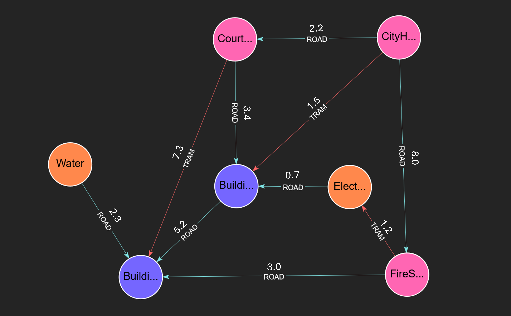

# Minimum Spanning Forest (MSF)

## Overview

The Minimum Spanning Forest (MSF) identifies the minimum weight acyclic graph (tree) spanning every node in each connected component in the graph, disregarding edge directions. Any nodes that shared a weakly connected component still share that component in the MSF subgraph.

MSF serves as a common algorithm in scenarios such as:
- Designing a cost-effective road network connecting several cities.
- Identifying core connections in a social network.
- Optimizing the layout of power grids to minimize cable length.

## Algorithm Details

MSF initializes by assigning each node to its own component. It iteratively scans for the minimum edges linking nodes across different components and merges them, ignoring the directionality of edges throughout the process. The algorithm terminates when no further merges occur, producing a collection of trees.

## Syntax

```cypher
CALL algo.msf([config])
```

### Parameters

The procedure accepts an optional configuration `Map` with the following parameters:

| Name                | Type   | Default                | Description                                                                |
|---------------------|--------|------------------------|----------------------------------------------------------------------------|
| `nodeLabels`        | Array  | All labels             | Array of node labels to filter which nodes are included in the computation |
| `relationshipTypes` | Array  | All relationship types | Array of relationship types to define which edges are traversed            |
| `objective`         | string | 'minimum'              | 'minimum' or 'maximum' What to optimize in the spanning tree               |
| `weightAttribute`   | string | Unweighted             | The atrribute to use as the tree weight.                                   |

### Return Values
The procedure returns a stream of records with the following fields:

| Name     | Type   | Description                                   |
|----------|--------|-----------------------------------------------|
| `edge`   | Edge   | An Edge entity which is part of the MSF graph |
| `weight` | Double | The weight of the Edge                        |

## Examples:

Lets take this City as an example:




### Create the Graph

```cypher
CREATE 
  (CityHall:GOV),
  (CourtHouse:GOV),
  (FireStation:GOV),
  (Electricity:UTIL),
  (Water:UTIL),
  (Building_A:RES),
  (Building_B:RES),
  (CityHall)-[rA:ROAD {cost: 2.2}]->(CourtHouse),
  (CityHall)-[rB:ROAD {cost: 8.0}]->(FireStation),
  (CourtHouse)-[rC:ROAD {cost: 3.4}]->(Building_A),
  (FireStation)-[rD:ROAD {cost: 3.0}]->(Building_B),
  (Building_A)-[rF:ROAD {cost: 5.2}]->(Building_B),
  (Electricity)-[rG:ROAD {cost: 0.7}]->(Building_A),
  (Water)-[rH:ROAD {cost: 2.3}]->(Building_B),
  (CityHall)-[tA:TRAM {cost: 1.5}]->(Building_A),
  (CourtHouse)-[tB:TRAM {cost: 7.3}]->(Building_B),
  (FireStation)-[tC:TRAM {cost: 1.2}]->(Electricity)
```
### Example: Find cheapest road network:
```cypher
CALL algo.MSF() YIELD edge, weight
```

#### Expected Results
| Edge      | weight |
|-----------|--------|
| `[:ROAD]` | 0.7    |
| `[:TRAM]` | 1.2    |
| `[:TRAM]` | 1.5    |
| `[:ROAD]` | 2.2    |
| `[:ROAD]` | 2.3    |
| `[:ROAD]` | 3.0    |
