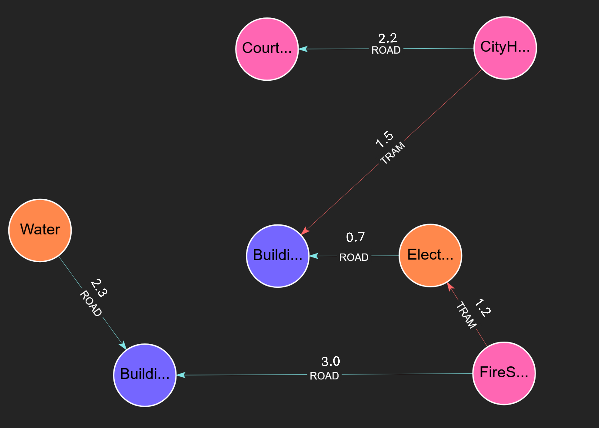

title: "MSF"
description: "Minimum Spanning Forest Algorithm"
parent: "Algorithms"
nav_order: 9

# Minimum Spanning Forest (MSF)

The Minimum Spanning Forest algorithm computes the minimum spanning forest of a
graph. A minimum spanning forest is a collection of minimum spanning trees, one
for each connected component in the graph.


## What is a Minimum Spanning Forest?
- For a **connected graph**, the MSF is a single minimum spanning tree (MST) that connects all nodes with the minimum total edge weight
- For a **disconnected graph**, the MSF consists of multiple MSTs, one for each connected component
- The forest contains no cycles and has exactly `N - C` edges, where `N` is the number of nodes and `C` is the number of connected components
- The sum of the weights of the edges in the forest is minimized

## Use Cases

- **Network Design**: Minimize cable/pipeline costs when connecting multiple locations
- **Clustering**: Identify natural groupings in data by analyzing the forest structure
- **Image Segmentation**: Group similar pixels using edge weights as similarity measures
- **Road Networks**: Optimize road construction to connect all cities with minimum cost

## Syntax

```cypher
CALL algo.MSF(
    config: MAP
) YIELD edges, nodes
```

### Parameters

The procedure accepts an optional configuration `Map` with the following optional parameters:

| Name                | Type   | Default                | Description                                                                |
|---------------------|--------|------------------------|----------------------------------------------------------------------------|
| `nodeLabels`        | Array  | All labels             | Array of node labels to filter which nodes are included in the computation |
| `relationshipTypes` | Array  | All relationship types | Array of relationship types to define which edges are traversed            |
| `objective`         | string | 'minimize'             | 'minimize' or 'maximize' what to optimize in the spanning tree             |
| `weightAttribute`   | string | Unweighted             | the attribute to use as the tree weight.                                   |

### Return Values
The procedure returns a stream of records corresponding to each tree in the forest with the following fields:

| Name    | Type | Description                      |
|---------|------|----------------------------------|
| `edges` | List | The edges that connect each tree |
| `nodes` | List | The nodes in the tree            |

### Create the Graph

```cypher
CREATE 
  (CityHall:GOV),
  (CourtHouse:GOV),
  (FireStation:GOV),
  (Electricity:UTIL),
  (Water:UTIL),
  (Building_A:RES),
  (Building_B:RES),
  (CityHall)-[rA:ROAD {cost: 2.2}]->(CourtHouse),
  (CityHall)-[rB:ROAD {cost: 8.0}]->(FireStation),
  (CourtHouse)-[rC:ROAD {cost: 3.4}]->(Building_A),
  (FireStation)-[rD:ROAD {cost: 3.0}]->(Building_B),
  (Building_A)-[rF:ROAD {cost: 5.2}]->(Building_B),
  (Electricity)-[rG:ROAD {cost: 0.7}]->(Building_A),
  (Water)-[rH:ROAD {cost: 2.3}]->(Building_B),
  (CityHall)-[tA:TRAM {cost: 1.5}]->(Building_A),
  (CourtHouse)-[tB:TRAM {cost: 7.3}]->(Building_B),
  (FireStation)-[tC:TRAM {cost: 1.2}]->(Electricity)
RETURN *
```

## Examples:

Suppose you are an urban planner tasked with designing a new transportation network for a town. There are several vital buildings that must be connected by this new network. A cost estimator has already provided you with the estimated cost for some of the potential routes between these buildings.

Your goal is to connect every major building with the lowest total cost, even if travel between some buildings requires multiple stops and different modes of transport. The Minimum Spanning Forest algorithm helps you achieve this by identifying the most cost-effective network.


```cypher
CALL algo.MSF({weightAttribute: 'cost'}) YIELD edge, weight
```

#### Expected Results
The algorithm would yield a single tree containing the following edge and node objects:



## Algorithm Details

FalkorDB's MSF implementation uses an efficient matrix-based approach optimized for graph databases:

1. **Connected Components**: First identifies all connected components in the graph
2. **MST per Component**: Computes a minimum spanning tree for each component using a variant of Kruskal's or Prim's algorithm
3. **Edge Selection**: Selects edges in order of increasing weight, avoiding cycles

### Performance Characteristics

- **Time Complexity**: O(E log V) where E is the number of edges and V is the number of vertices
- **Space Complexity**: O(V + E)
- **Optimized**: Uses sparse matrix representation for efficient computation

## Best Practices

1. **Weight Properties**: Ensure weight properties are numeric (integers or floats)
2. **Missing Weights**: Edges without the specified weight property will only be included in the tree if there are no other edges that could be used to connect the connected component
4. **Directed vs Undirected**: The algorithm treats all relationships as undirected for spanning forest purposes

## Related Algorithms

- **[WCC (Weakly Connected Components)](./wcc.md)**: Identify connected components before running MSF
- **[BFS](./bfs.md)**: Traverse the resulting spanning forest
- **[SPpath](./sppath.md)**: Find shortest paths using the spanning forest structure

## See Also

- [Cypher Procedures](../cypher/procedures.md)
- [Graph Algorithms Overview](./index.md)
