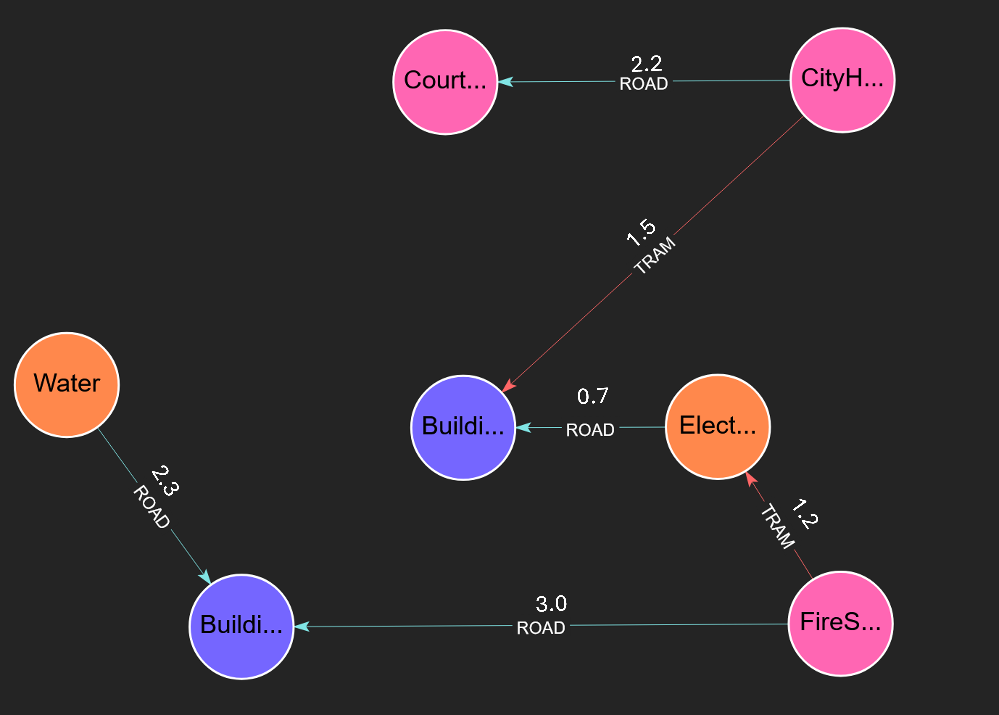

# Minimum Spanning Tree (MST)

## Overview

The Minimum Spanning Tree (MST) finds the relationships with minimum weights such that any weakly connected component in the graph stays connected. It treats all edges as bi-directional and ensures that any pair of nodes that previously shared a path will still share a unique path in the MST subgraph. 

MST serves as a common algorithm in scenarios such as:
- Designing a cost-effective road network connecting several cities.
- Power Grid / Utility cost optimization.
- Identifying redundancies in networks.

## Algorithm Details

MST first assigns each node to its own component. It iteratively scans for the minimum edges linking nodes across different components and merges them, ignoring the direction of edges throughout the process. The algorithm terminates when no further merges occur, producing a collection of trees.

The procedure finds a minimum or maximum weight spanning tree based on the specified `objective` and optimizes for the given `weightAttribute`. If no attribute is given, MST returns any collection of spanning trees. If any specified edges do not have the given weight attribute, or the value of the attribute is non-numeric, then they are treated as if they had infinite weight. Such an edge would only be included in the minimum spanning tree if no other edges with a valid weight attribute bridge the components it connects.

## Syntax

```cypher
CALL algo.mst([config])
```

### Parameters

The procedure accepts an optional configuration `Map` with the following optional parameters:

| Name                | Type   | Default                | Description                                                                |
|---------------------|--------|------------------------|----------------------------------------------------------------------------|
| `nodeLabels`        | Array  | All labels             | Array of node labels to filter which nodes are included in the computation |
| `relationshipTypes` | Array  | All relationship types | Array of relationship types to define which edges are traversed            |
| `objective`         | string | 'minimize'             | 'minimize' or 'maximize' what to optimize in the spanning tree             |
| `weightAttribute`   | string | Unweighted             | the attribute to use as the tree weight.                                   |

### Return Values
The procedure returns a stream of records with the following fields:

| Name     | Type   | Description                                   |
|----------|--------|-----------------------------------------------|
| `edge`   | Edge   | An edge entity which is part of the MST graph |
| `weight` | Double | The weight of the Edge                        |


### Create the Graph

```cypher
CREATE 
  (CityHall:GOV),
  (CourtHouse:GOV),
  (FireStation:GOV),
  (Electricity:UTIL),
  (Water:UTIL),
  (Building_A:RES),
  (Building_B:RES),
  (CityHall)-[rA:ROAD {cost: 2.2}]->(CourtHouse),
  (CityHall)-[rB:ROAD {cost: 8.0}]->(FireStation),
  (CourtHouse)-[rC:ROAD {cost: 3.4}]->(Building_A),
  (FireStation)-[rD:ROAD {cost: 3.0}]->(Building_B),
  (Building_A)-[rF:ROAD {cost: 5.2}]->(Building_B),
  (Electricity)-[rG:ROAD {cost: 0.7}]->(Building_A),
  (Water)-[rH:ROAD {cost: 2.3}]->(Building_B),
  (CityHall)-[tA:TRAM {cost: 1.5}]->(Building_A),
  (CourtHouse)-[tB:TRAM {cost: 7.3}]->(Building_B),
  (FireStation)-[tC:TRAM {cost: 1.2}]->(Electricity)
RETURN *
```

## Examples:

Suppose you are an urban planner tasked with designing a new transportation network for a town. There are several vital buildings that must be connected by this new network. A cost estimator has already provided you with the estimated cost for some of the potential routes between these buildings.

Your goal is to connect every major building with the lowest total cost, even if travel between some buildings requires multiple stops and different modes of transport. The Minimum Spanning Tree algorithm helps you achieve this by identifying the most cost-effective network.


```cypher
CALL algo.mst({weightAttribute: 'cost'}) YIELD edge, weight
```

#### Expected Results
The algorithm would yeild the following edge objects and their weights:

