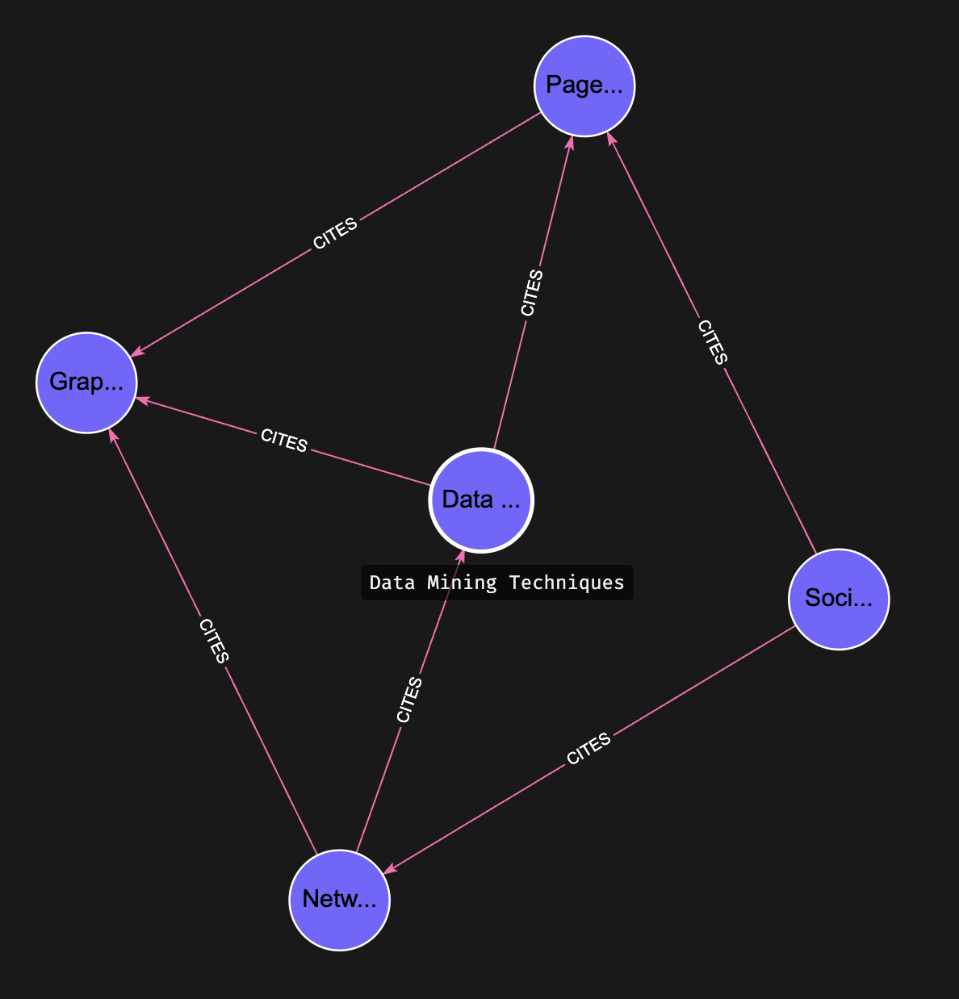

# PageRank

## Introduction

PageRank is an algorithm that measures the importance of each node within the graph based on the number of incoming relationships and the importance of the corresponding source nodes.
The algorithm was originally developed by Google's founders Larry Page and Sergey Brin during their time at Stanford University.

## Algorithm Overview

PageRank works by counting the number and quality of relationships to a node to determine a rough estimate of how important that node is.
The underlying assumption is that more important nodes are likely to receive more connections from other nodes.

The algorithm assigns each node a score, where higher scores indicate greater importance.
The score for a node is derived recursively from the scores of the nodes that link to it, with a damping factor typically applied to prevent rank sinks.

## Syntax

The PageRank procedure has the following call signature:

```cypher
CALL pagerank.stream(
    [label],
    [relationship]
)
YIELD node, score
```

### Parameters

| Name           | Type   | Default | Description                                                                  |
|----------------|--------|---------|------------------------------------------------------------------------------|
| `label`        | String | null    | The label of nodes to run the algorithm on. If null, all nodes are used.     |
| `relationship` | String | null    | The relationship type to traverse. If null, all relationship types are used. |

### Yield

| Name    | Type  | Description                          |
|---------|-------|--------------------------------------|
| `node`  | Node  | The node processed by the algorithm. |
| `score` | Float | The PageRank score for the node.     |

## Examples

### Unweighted PageRank

First, let's create a sample graph representing a citation network between scientific papers:

```cypher
CREATE 
  (paper1:Paper {title: 'Graph Algorithms in Database Systems'}),
  (paper2:Paper {title: 'PageRank Applications'}),
  (paper3:Paper {title: 'Data Mining Techniques'}),
  (paper4:Paper {title: 'Network Analysis Methods'}),
  (paper5:Paper {title: 'Social Network Graph Theory'}),
  
  (paper2)-[:CITES]->(paper1),
  (paper3)-[:CITES]->(paper1),
  (paper3)-[:CITES]->(paper2),
  (paper4)-[:CITES]->(paper1),
  (paper4)-[:CITES]->(paper3),
  (paper5)-[:CITES]->(paper2),
  (paper5)-[:CITES]->(paper4)
```



Now we can run the PageRank algorithm on this citation network:

```cypher
CALL pagerank.stream('Paper', 'CITES')
YIELD node, score
RETURN node.title AS paper, score
ORDER BY score DESC
```

Expected results:

| paper                                | score |
|--------------------------------------|-------|
| Graph Algorithms in Database Systems | 0.43  |
| Data Mining Techniques               | 0.21  |
| PageRank Applications                | 0.19  |
| Network Analysis Methods             | 0.14  |
| Social Network Graph Theory          | 0.03  |


## Usage Notes

**Interpreting scores**:
   - PageRank scores are relative, not absolute measures
   - The sum of all scores in a graph equals 1.0
   - Scores typically follow a power-law distribution
