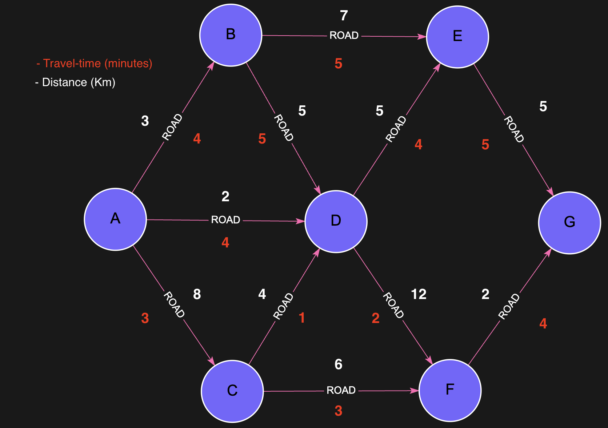

# `algo.SPpaths` - Shortest Path (Single Pair)

The `algo.SPpaths` procedure finds the shortest paths between a **source** and a **target** node, optionally constrained by cost, path length, and the number of paths to return.

It is designed for efficient and scalable computation of paths in large graphs, using properties like distance, time, or price as weights. 
For example, it can be used to find the fastest driving route between two cities, the cheapest shipping option in a logistics network, or the shortest communication path in a computer network.

## Syntax

```cypher
CALL algo.SPpaths({
  sourceNode: <node>,
  targetNode: <node>,
  relTypes: [<relationship_type>],
  weightProp: <property>,
  costProp: <property>,         // optional
  maxCost: <int>,               // optional
  maxLen: <int>,                // optional
  relDirection: "outgoing",    // or "incoming", "both"
  pathCount: <int>              // 0 = all, 1 = single (default), n > 1 = up to n
})
YIELD path, pathWeight, pathCost
```

## Parameters

| Name            | Type     | Description |
|-----------------|----------|-------------|
| `sourceNode`    | Node     | Starting node |
| `targetNode`    | Node     | Destination node |
| `relTypes`      | Array    | List of relationship types to follow |
| `weightProp`    | String   | Property to minimize along the path (e.g., `dist`, `time`) |
| `costProp`      | String   | Property to constrain the total value (optional) |
| `maxCost`       | Integer  | Upper bound on total cost (optional) |
| `maxLen`        | Integer  | Max number of relationships in the path (optional) |
| `relDirection`  | String   | Traversal direction (`outgoing`, `incoming`, `both`) |
| `pathCount`     | Integer  | Number of paths to return (0 = all shortest, 1 = default, n = max number of results) |

## Returns

| Name         | Type    | Description |
|--------------|---------|-------------|
| `path`       | Path    | Discovered path from source to target |
| `pathWeight` | Integer | Sum of the weightProp across the path |
| `pathCost`   | Integer | Sum of the costProp across the path (if used) |


## Examples:
Lets take this Road Network Graph as an example:



### Example: Shortest Path by Distance from City A to City G:

```cypher
MATCH (a:City{name:'A'}), (g:City{name:'G'})
CALL algo.SPpaths({
  sourceNode: a,
  targetNode: g,
  relTypes: ['Road'],
  weightProp: 'dist'
})
YIELD path, pathWeight
RETURN pathWeight, [n in nodes(path) | n.name] AS pathNodes
```

#### Expected Result:
| pathWeight | pathNodes     |
|------------|---------------|
| `12`       | [A, D, E G]   | 


### Example: Bounded Cost Path from City A to City G:

```cypher
MATCH (a:City{name:'A'}), (g:City{name:'G'})
CALL algo.SPpaths({
  sourceNode: a,
  targetNode: g,
  relTypes: ['Road'],
  weightProp: 'dist',
  costProp: 'time',
  maxCost: 12,
  pathCount: 2
})
YIELD path, pathWeight, pathCost
RETURN pathWeight, pathCost, [n in nodes(path) | n.name] AS pathNodes
```

#### Expected Result:
| pathWeight | pathCost | pathNodes       |   
|------------|----------| --------------- |
| `16`       |  `10`    | [A, D, F G]     | 
| `14`       |  `12`    | [A, D, C F, G]  | 

---
