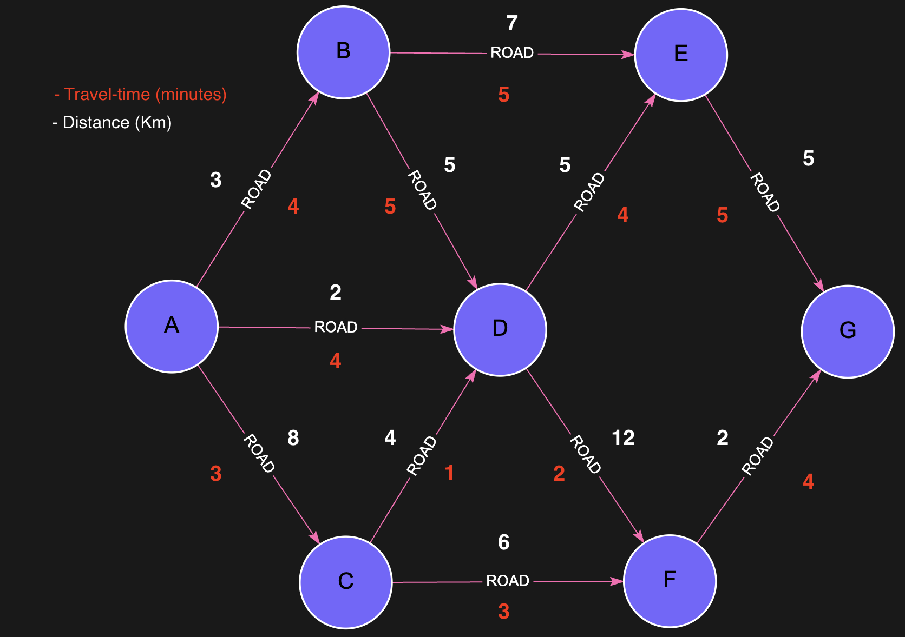

# `algo.SSpaths` - Single Source Paths

The `algo.SSpaths` procedure returns all shortest paths from a **source node** to multiple reachable nodes, subject to constraints like cost, path length, and number of paths to return.

## Syntax

```cypher
CALL algo.SSpaths({
  sourceNode: <node>,
  relTypes: [<relationship_type>],
  weightProp: <property>,         // optional
  costProp: <property>,           // optional
  maxCost: <int>,                 // optional
  maxLen: <int>,                  // optional
  relDirection: "outgoing",      // or "incoming", "both"
  pathCount: <int>
})
YIELD path, pathWeight, pathCost
```

## Parameters

Same as [`algo.SPpaths`](./sppath.md), except `targetNode` is omitted.

## Examples:
Lets take this Road Network Graph as an example:




### Example: All Shortest Paths by Distance (up to 10 km)

```cypher
MATCH (a:City{name:'A'})
CALL algo.SSpaths({
  sourceNode: a,
  relTypes: ['Road'],
  costProp: 'dist',
  maxCost: 10,
  pathCount: 1000
})
YIELD path, pathCost
RETURN pathCost, [n in nodes(path) | n.name] AS pathNodes
ORDER BY pathCost
```

#### Expected Result:
| pathCost |  pathNodes |   
|----------| ---------- |
| `2`      |  [A, D]    | 
| `3`      |  [A, B]    | 
| `6`      |  [A, D, C] | 
| `7`      |  [A, D, E] | 
| `8`      |  [A, B, D] | 
| `8`      |  [A, C]    | 
| `10`     |  [A, B, E] | 

---

### Example: Top 5 Shortest Paths from A by Distance

```cypher
MATCH (a:City{name:'A'})
CALL algo.SSpaths({
  sourceNode: a,
  relTypes: ['Road'],
  weightProp: 'dist',
  pathCount: 5
})
YIELD path, pathWeight, pathCost
RETURN pathWeight, pathCost, [n in nodes(path) | n.name] AS pathNodes
ORDER BY pathWeight
```

#### Expected Result:
| pathWeight | pathCost |  pathNodes |   
| -----------|----------| ---------- |
| `2`        | `1`      |  [A, D]    | 
| `3`        | `1`      |  [A, B]    | 
| `6`        | `2`      |  [A, D, C] | 
| `7`        | `2`      |  [A, D, E] | 
| `8`        | `1`      |  [A, C]    | 

