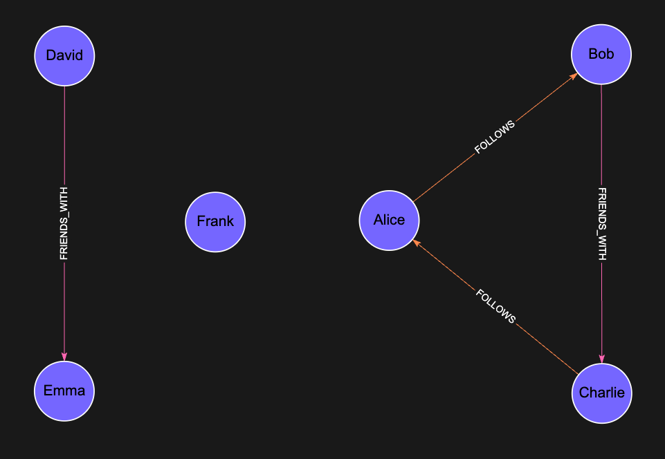

# Weakly Connected Components (WCC)

## Overview

The Weakly Connected Components (WCC) algorithm identifies groups of nodes connected through any path, disregarding edge directions. In a weakly connected component, every node is reachable from any other node when treating all edges as undirected.

WCC serves as a common algorithm in scenarios such as:
- Community detection
- Data cleaning and preprocessing
- Large-scale network analysis
- Detecting isolated or loosely connected subgraphs

## Algorithm Details

WCC initializes by assigning each node to its own component. It iteratively scans for edges linking nodes across different components and merges them, ignoring the directionality of edges throughout the process. The algorithm terminates when no further merges occur, producing a collection of disjoint connected components.

### Performance

WCC operates with a time complexity of **O(|V| + |E|)**, where:
- **|V|** represents the total number of nodes
- **|E|** represents the total number of edges

This linear complexity makes WCC efficient for large graphs.

## Syntax

```cypher
CALL algo.wcc([config])
```

### Parameters

The procedure accepts an optional configuration `Map` with the following parameters:

| Name                | Type  | Default                | Description                                                                      |
|---------------------|-------|------------------------|----------------------------------------------------------------------------------|
| `nodeLabels`        | Array | All labels             | Array of node labels to filter which nodes are included in the computation       |
| `relationshipTypes` | Array | All relationship types | Array of relationship types to define which edges are traversed                  |

### Return Values
The procedure returns a stream of records with the following fields:

| Name          | Type    | Description                                                         |
|---------------|---------|---------------------------------------------------------------------|
| `node`        | Node    | The node entity included in the component                           |
| `componentId` | Integer | Identifier of the weakly connected component the node belongs to    |

## Examples

Lets take this Social Graph as an example:



There are 3 different communities in this graph:
- Alice, Bob, Charlie
- David, Emma
- Frank 

### Example: Analyzing Social Networks

Find isolated communities in a social network
```cypher

CALL algo.wcc({
  nodeLabels: ["User"],
  relationshipTypes: ["FOLLOWS", "FRIENDS_WITH"],
})
YIELD componentId

// Get community sizes
RETURN componentId AS communityId, count(*) AS communitySize
ORDER BY communitySize DESC
```
