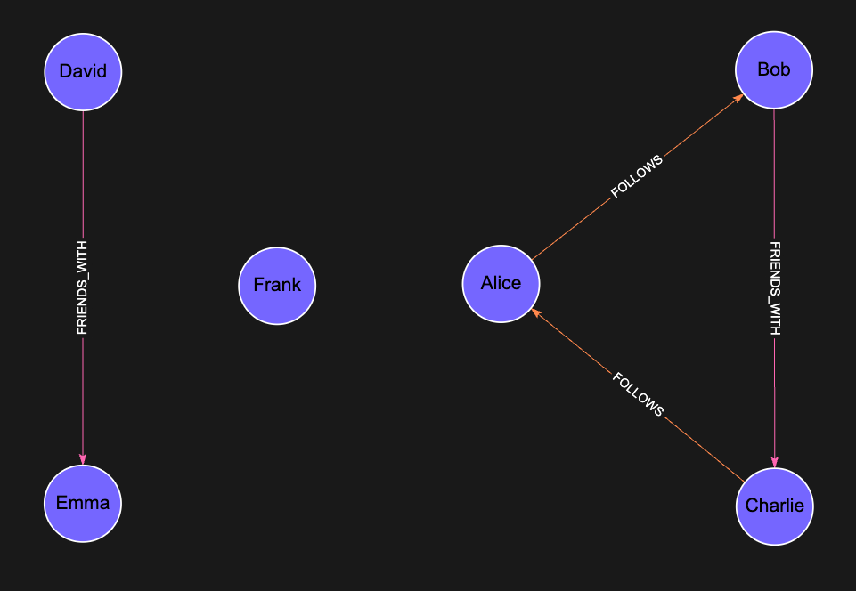

# Weakly Connected Components (WCC)

## Overview

The Weakly Connected Components (WCC) algorithm identifies groups of nodes connected through any path, disregarding edge directions. In a weakly connected component, every node is reachable from any other node when treating all edges as undirected.

WCC serves as a common algorithm in scenarios such as:
- Community detection
- Data cleaning and preprocessing
- Large-scale network analysis
- Detecting isolated or loosely connected subgraphs

## Algorithm Details

WCC initializes by assigning each node to its own component. It iteratively scans for edges linking nodes across different components and merges them, ignoring the directionality of edges throughout the process. The algorithm terminates when no further merges occur, producing a collection of disjoint connected components.

### Performance

WCC operates with a time complexity of **O(\|V\| + \|E\|)**, where:
- **\|V\|** represents the total number of nodes
- **\|E\|** represents the total number of edges
This linear complexity makes WCC efficient for large graphs.

## Syntax

```cypher
CALL algo.wcc([config])
```

### Parameters

The procedure accepts an optional configuration `Map` with the following parameters:

| Name                | Type  | Default                | Description                                                                      |
|---------------------|-------|------------------------|----------------------------------------------------------------------------------|
| `nodeLabels`        | Array | All labels             | Array of node labels to filter which nodes are included in the computation       |
| `relationshipTypes` | Array | All relationship types | Array of relationship types to define which edges are traversed                  |

### Return Values

The procedure returns a stream of records with the following fields:

| Name          | Type    | Description                                                         |
|---------------|---------|---------------------------------------------------------------------|
| `node`        | Node    | The node entity included in the component                           |
| `componentId` | Integer | Identifier of the weakly connected component the node belongs to    |

## Examples

Let's take this Social Graph as an example:



There are 3 different communities in this graph:
- Alice, Bob, Charlie
- David, Emma
- Frank 

### Create the Graph

```cypher
CREATE 
  (alice:User {name: 'Alice'}),
  (bob:User {name: 'Bob'}),
  (charlie:User {name: 'Charlie'}),
  
  (david:User {name: 'David'}),
  (emma:User {name: 'Emma'}),
  
  (frank:User {name: 'Frank'}),

  (alice)-[:FOLLOWS]->(bob),
  (bob)-[:FRIENDS_WITH]->(charlie),
  (charlie)-[:FOLLOWS]->(alice),
  
  (david)-[:FRIENDS_WITH]->(emma)
```

### Example: Find isolated communities in a social network

```cypher
CALL algo.WCC(null) yield node, componentId
```

#### Expected Results

| node                           | componentId |
|--------------------------------|-------------|
| `(:User {name: "Alice"})`      | 0           |
| `(:User {name: "Bob"})`        | 0           |
| `(:User {name: "Charlie"})`    | 0           |
| `(:User {name: "David"})`      | 3           |
| `(:User {name: "Emma"})`       | 3           |
| `(:User {name: "Frank"})`      | 5           |

### Example: Group Communities together into a single list

```cypher
CALL algo.WCC(null) yield node, componentId return collect(node.name), componentId
```

#### Expected Results

| collect(node.name)         | componentId |
|----------------------------|-------------|
| `[David, Emma]`            | 3           |
| `[Frank]`                  | 5           |
| `[Alice, Bob, Charlie]`    | 0           |

{% include faq_accordion.html
  title="Frequently Asked Questions"
  q1="What is the syntax for calling WCC?"
  a1="Use `CALL algo.WCC(null) YIELD node, componentId` or pass a configuration map like `CALL algo.WCC({nodeLabels: ['User']}) YIELD node, componentId`."
  q2="Does WCC consider edge direction?"
  a2="No. WCC treats all relationships as **undirected** — it finds components where nodes are reachable through any path regardless of edge direction."
  q3="How can I count the number of connected components?"
  a3="Run `CALL algo.WCC(null) YIELD node, componentId RETURN count(DISTINCT componentId) AS numComponents`."
  q4="When should I use WCC vs CDLP?"
  a4="Use **WCC** to find *disconnected* subgraphs (nodes with no path between them). Use **[CDLP](./cdlp.md)** to detect *densely connected communities* within a connected graph."
  q5="What is the performance of WCC?"
  a5="WCC runs in **O(V + E)** linear time, making it very efficient even on large graphs with millions of nodes and edges."
%}

