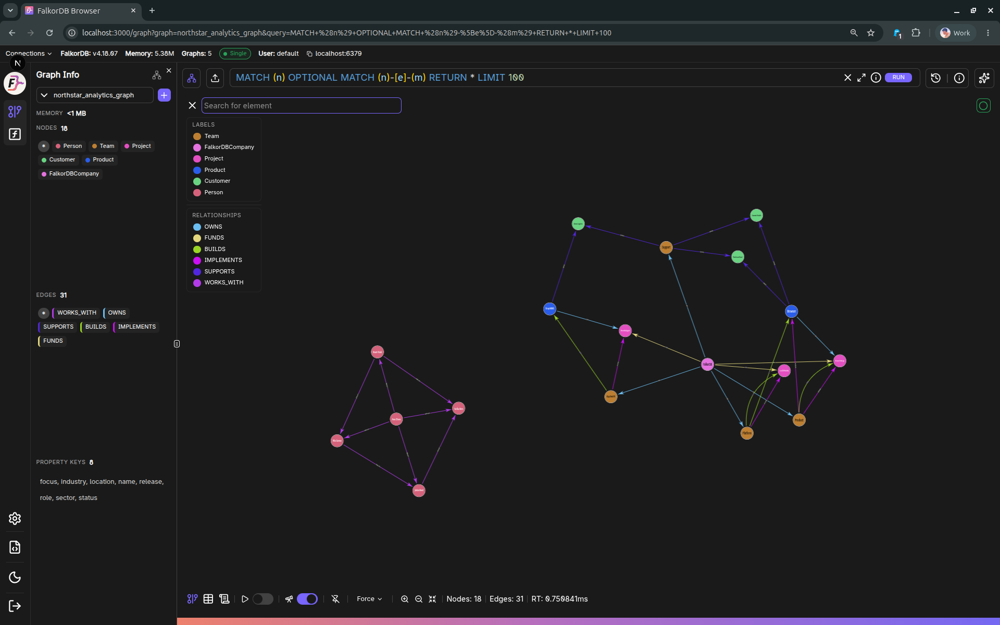

# FalkorDB Graph Visualization Tool (Browser)

FalkorDB's Browser provides a web UI for exploring, querying, and managing FalkorDB graphs. It allows developers to interact with graphs loaded to FalkorDB, explore how specific queries behave, and review the current data model. FalkorDB Browser integrates within the main FalkorDB Docker container and through the Cloud service.

The screenshots in this section use a realistic demo graph so the UI reads like a working product environment instead of a toy fixture.

---

## UI elements
For detailed documentation of each major UI element (login, settings, graph canvas, panels, query editor/history, table view, etc.), see:
- [UI Elements](./ui/)
- [Upload Data dialog](./ui/upload-data.md)
- [UDF Libraries page](./ui/udf-libraries.md)

## Canvas Component
FalkorDB Canvas is the standalone web component that powers the graph visualization in FalkorDB Browser. It can also be used independently in any web application.
- [Canvas](./canvas)

---

## Main Features
Use these focused pages for detailed coverage without duplication:

| Area | Documentation |
| :--- | :--- |
| Graph workspace (canvas, panels, querying, history, and results) | [UI Elements](./ui/) |
| Graph lifecycle actions (create/delete/duplicate/export/upload) | [Graphs Manager](./ui/graph-management.md) |
| Built-in REST API docs (`/docs`) | [API Docs (Swagger)](./ui/api-documentation.md) |
| Authentication and role-based permissions | [Roles & Access](./ui/auth-access-control.md) |
| Upload workflows | [Upload Data dialog](./ui/upload-data.md) |
| UDF library workflows | [UDF Libraries page](./ui/udf-libraries.md) |

{% include faq_accordion.html
  title="Frequently Asked Questions"
  q1="How do I access FalkorDB Browser?"
  a1="FalkorDB Browser is a web UI accessible at **port 3000** by default. It is included in the main FalkorDB Docker container and is also available through the Cloud service."
  q2="What connection URLs does FalkorDB Browser support?"
  a2="The Browser supports `falkor://`, `falkors://`, `redis://`, and `rediss://` URL formats for connecting to a FalkorDB server."
  q3="Can I export my graph data from the Browser?"
  a3="Yes. Navigate to graph management, select a graph, and click **Export Data** to download a `.dump` file via the `/api/graph/:graph/export` endpoint."
  q4="What query language does FalkorDB Browser use?"
  a4="FalkorDB Browser uses **Cypher** as its query language. The built-in Monaco editor provides keyword autocompletion and syntax highlighting."
  q5="Is there an API documentation page built into the Browser?"
  a5="Yes. A built-in Swagger UI is available at `/docs` which loads the OpenAPI spec from `/api/swagger` and supports interactive 'Try it out' requests."
%}