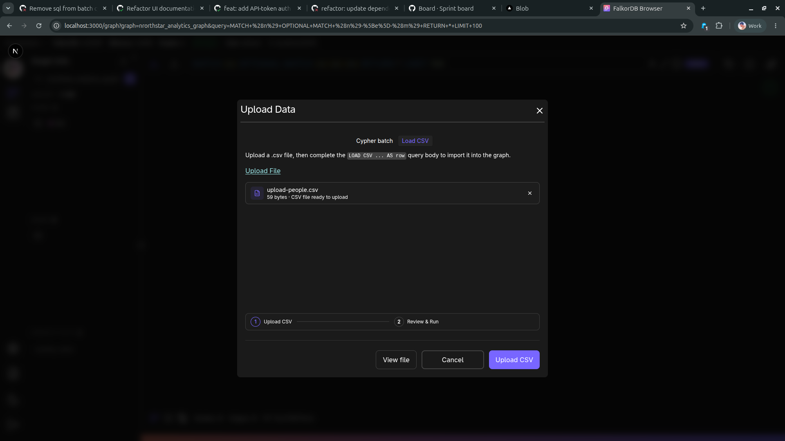
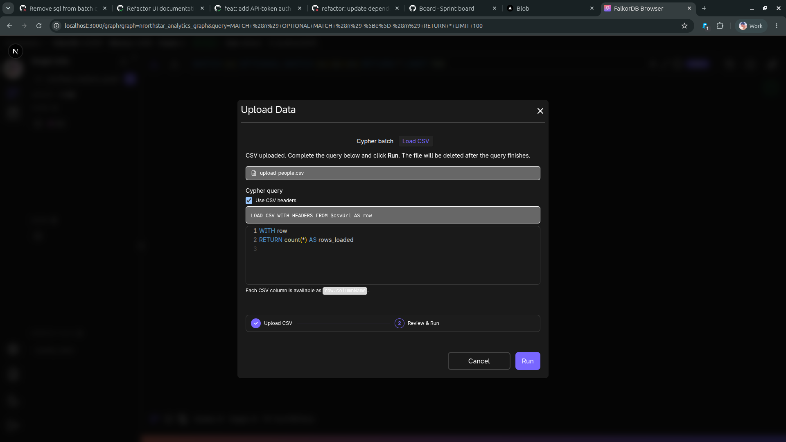
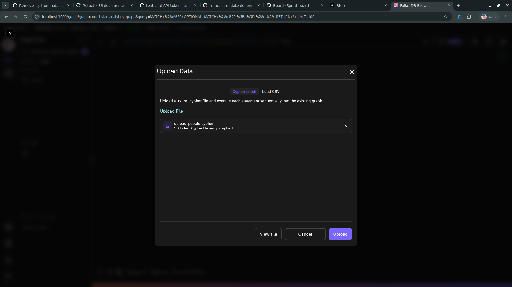

# Upload Data
The Upload Data dialog imports data into the currently selected graph using either Load CSV or Cypher batch mode.

## Load CSV flow

### Step 1: Upload the CSV file
Choose **Load CSV**, then select your CSV file.

### Step 2: Review and run
After upload, review the generated `LOAD CSV` query, adjust it if needed, then click **Run**.

Notes:
- **Use CSV headers** can be toggled to map columns by header name.
- Each CSV column is available as `row.columnName` in the query body.
- The uploaded CSV file is temporary and removed after query execution finishes.

## Cypher batch flow
Switch to **Cypher batch** to upload a `.cypher` or `.txt` file containing one or more statements.

When you click **Upload**, statements execute sequentially in the active graph.

## When to use each mode
- **Load CSV**: Use this for tabular source data where you need explicit row-to-graph mapping logic.
- **Cypher batch**: Use this when you already have graph mutations prepared as Cypher statements.

{% include faq_accordion.html
  title="Frequently Asked Questions"
  q1="What file types can I use in Upload Data?"
  a1="Use `.csv` with Load CSV, or `.cypher` / `.txt` with Cypher batch."
  q2="Does Upload Data run on the selected graph only?"
  a2="Yes. The import runs against the currently selected graph in the Graph page."
  q3="Can I edit the generated LOAD CSV query before running?"
  a3="Yes. After uploading a CSV, review and edit the query in step 2 before clicking Run."
  q4="What is the difference between Load CSV and Cypher batch?"
  a4="Load CSV uploads tabular data and builds a query around `LOAD CSV`. Cypher batch executes statements from an uploaded script file sequentially."
%}
