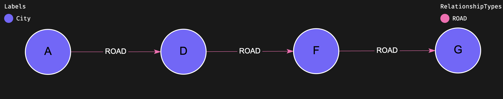

# Functions

This section contains information on all supported functions from the Cypher query language.

* [Predicate functions](#predicate-functions)
* [Scalar functions](#scalar-functions)
* [Aggregating functions](#aggregating-functions)
* [List functions](#list-functions)
* [Mathematical operators](#mathematical-operators)
* [Mathematical functions](#mathematical-functions)
* [Trigonometric functions](#trigonometric-functions)
* [String functions](#string-functions)
* [Point functions](#point-functions)
* [Type conversion functions](#type-conversion-functions)
* [Node functions](#node-functions)
* [Path functions](#path-functions)
* [Vector functions](#vector-functions)

## Predicate functions

| Function                                                                          | Description|
| --------------------------------------------------------------------------------- | :----------|
| [all(_var_ IN _list_ WHERE _predicate_)](#existential-comprehension-functions)    | Returns true when _predicate_ holds true for all elements in _list_         |
| [any(_var_ IN _list_ WHERE _predicate_)](#existential-comprehension-functions)    | Returns true when _predicate_ holds true for at least one element in _list_ |
| exists(_pattern_)                                                                 | Returns true when at least one match for _pattern_ exists                   |
| isEmpty(_list_&#124;_map_&#124;_string_)                                          | Returns true if the input list or map contains no elements or if the input string contains no characters <br> Returns null when the input evaluates to null |
| [none(_var_ IN _list_ WHERE _predicate_)](#existential-comprehension-functions)   | Returns true when _predicate_ holds false for all elements in _list_        |
| [single(_var_ IN _list_ WHERE _predicate_)](#existential-comprehension-functions) | Returns true when _predicate_ holds true for exactly one element in _list_  |

## Scalar functions

| Function                          | Description|
| --------------------------------- | :----------|
| coalesce(_expr_[, expr...])       | Returns the evaluation of the first argument that evaluates to a non-null value <br> Returns null when all arguments evaluate to null       |
| endNode(_relationship_)           | Returns the destination node of a relationship <br> Returns null when _relationship_ evaluates to null                                      |
| hasLabels(_node_, _labelsList_) * | Returns true when _node_ contains all labels in _labelsList_, otherwise false <br> Return true when _labelsList_ evaluates to an empty list |
| id(_node_&#124;_relationship_)    | Returns the internal ID of a node or relationship (which is not immutable)                                                                  |
| labels(_node_)                    | Returns a list of strings: all labels of _node_ <br> Returns null when _node_ evaluates to null                                             |
| properties(_expr_)                | When _expr_ is a node or relationship: Returns a map containing all the properties of the given node or relationship <br> When _expr_ evaluates to a map: Returns _expr_ unchanged <br> Returns null when _expr_ evaluates to null |
| randomUUID()                      | Returns a random UUID (Universal Unique IDentifier)                                                                                         |
| startNode(_relationship_)         | Returns the source node of a relationship <br> Returns null when _relationship_ evaluates to null                                           |
| timestamp()                       | Returns the current system timestamp (milliseconds since epoch)                                                                             |
| type(_relationship_)              | Returns a string: the type of _relationship_ <br> Returns null when _relationship_ evaluates to null                                        |
| typeOf(_expr_) *                  | Returns a string: the type of a literal, an expression's evaluation, an alias, a node's property, or a relationship's property <br> Return value is one of `Map`, `String`, `Integer`, `Boolean`, `Float`, `Node`, `Edge`, `List`, `Path`, `Point`, or `Null` |
| prev(_expr_) *                    | Stores the previous value and returns it on the next call; returns `null` on the first call. Useful for variable-length traversal filtering of edges based on the prior value. |

&#42; FalkorDB-specific extensions to Cypher

## Aggregating functions

|Function                             | Description|
| ----------------------------------- |:-----------|
|avg(_expr_)                          | Returns the average of a set of numeric values. null values are ignored <br> Returns null when _expr_ has no evaluations                                                   |
|collect(_expr_)                      | Returns a list containing all non-null elements which evaluated from a given expression                                                                                   |
|count(_expr_&#124;&#42;)             | When argument is _expr_: returns the number of non-null evaluations of _expr_ <br> When argument is `*`: returns the total number of evaluations (including nulls)     |
|max(_expr_)                          | Returns the maximum value in a set of values (taking into account type ordering). null values are ignored <br> Returns null when _expr_ has no evaluations                |
|min(_expr_)                          | Returns the minimum value in a set of values (taking into account type ordering). null values are ignored <br> Returns null when _expr_ has no evaluations                |
|percentileCont(_expr_, _percentile_) | Returns a linear-interpolated percentile (between 0.0 and 1.0) over a set of numeric values. null values are ignored <br> Returns null when _expr_ has no evaluations    |
|percentileDisc(_expr_, _percentile_) | Returns a nearest-value percentile (between 0.0 and 1.0) over a set of numeric values. null values are ignored <br> Returns null when _expr_ has no evaluations         |
|stDev(_expr_)                        | Returns the sample standard deviation over a set of numeric values. null values are ignored <br> Returns null when _expr_ has no evaluations                       |
|stDevP(_expr_)                       | Returns the population standard deviation over a set of numeric values. null values are ignored <br> Returns null when _expr_ has no evaluations                       |
|sum(_expr_)                          | Returns the sum of a set of numeric values. null values are ignored <br> Returns 0 when _expr_ has no evaluations                                                         |

## List functions

| Function                             | Description|
| ------------------------------------ | :----------|
| head(_expr_)                         | Returns the first element of a list <br> Returns null when _expr_ evaluates to null or an empty list                                                                                                    |
| keys(_expr_)                         | Returns a list of strings: all key names for given map or all property names for a given node or edge <br> Returns null when _expr_ evaluates to null                                                |
| last(_expr_)                         | Returns the last element of a list <br> Returns null when _expr_ evaluates to null or an empty list
| list.dedup(_list_) *                                               | Given a list, returns a similar list after removing duplicate elements <br> Order is preserved, duplicates are removed from the end of the list <br> Returns null when _list_ evaluates to null <br> Emit an error when _list_ does not evaluate to a list or to null |
| list.insert(_list_, _idx_, _val_[, _dups_ = TRUE]) *               | Given a list, returns a list after inserting a given value at a given index <br> _idx_ is 0-based when non-negative, or from the end of the list when negative <br> Returns null when _list_ evaluates to null <br> Returns _list_ when _val_ evaluates to null <br> Returns _list_ when _idx_ evaluates to an integer not in [-NumItems-1 .. NumItems] <br> When _dups_ evaluates to FALSE: returns _list_ when _val_ evaluates to a value that is already an element of _list_  <br> Emit an error when _list_ does not evaluate to a list or to null <br> Emit an error when _idx_ does not evaluate to an integer <br> Emit an error when _dups_, if specified, does not evaluate to a Boolean |
| list.insertListElements(_list_, _list2_, _idx_[, _dups_ = TRUE]) * | Given a list, returns a list after inserting the elements of a second list at a given index <br> _idx_ is 0-based when non-negative, or from the end of the list when negative <br> Returns null when _list_ evaluates to null <br> Returns _list_ when _list2_ evaluates to null <br> Returns _list_ when _idx_ evaluates to an integer not in [-NumItems-1 .. NumItems] <br> When _dups_ evaluates to FALSE: If an element of _list2_ evaluates to an element of _list_ it would be skipped; If multiple elements of _list2_ evaluate to the same value - this value would be inserted at most once to _list_ <br> Emit an error when _list_ does not evaluate to a list or to null <br> Emit an error when _list2_ does not evaluate to a list or to null <br> Emit an error when _idx_ does not evaluate to an integer <br> Emit an error when _dups_, if specified, does not evaluate to a Boolean |
| list.remove(_list_, _idx_[, _count_ = 1]) *                        | Given a list, returns a list after removing a given number of consecutive elements (or less, if the end of the list has been reached). starting at a given index. <br> _idx_ is 0-based when non-negative, or from the end of the list when negative <br> Returns _null_ when _list_ evaluates to null <br> Returns _list_ when _idx_ evaluates to an integer not in [-NumItems .. NumItems-1] <br> Returns _list_ when _count_ evaluates to a non-positive integer <br> Emit an error when _list_ does not evaluate to a list or to null <br> Emit an error when _idx_ does not evaluate to an integer <br> Emit an error when _count_, if specified, does not evaluate to an integer |
| list.sort(_list_[, _ascending_ = TRUE]) *                          | Given a list, returns a list with similar elements, but sorted (inversely-sorted if _ascending_ is evaluated to FALSE) <br> Returns null when _list_ evaluates to null <br> Emit an error when _list_ does not evaluate to a list or to null <br> Emit an error when _ascending_, if specified, does not evaluate to a Boolean |
| range(_first_, _last_[, _step_ = 1]) | Returns a list of integers in the range of [start, end]. _step_, an optional integer argument, is the increment between consecutive elements                                                         |
| size(_expr_)                         | Returns the number of elements in a list <br> Returns null with _expr_ evaluates to null                                                                                                                |
| tail(_expr_)                         | Returns a sublist of a list, which contains all its elements except the first <br> Returns an empty list when _expr_ contains less than 2 elements. <br> Returns null when _expr_ evaluates to null |
| [reduce(...)](#reduce)               | Returns a scalar produced by evaluating an expression against each list member |

&#42; FalkorDB-specific extensions to Cypher

## Mathematical operators

|Function     | Description|
| ----------- |:-----------|
| +           | Add two values                                           |
| -           | Subtract second value from first                         |
| *           | Multiply two values                                      |
| /           | Divide first value by the second                         |
| ^           | Raise the first value to the power of the second         |
| %           | Perform modulo division of the first value by the second |

## Mathematical functions

|Function                   | Description|
| ------------------------- |:-----------|
| abs(_expr_)               | Returns the absolute value of a numeric value <br> Returns null when _expr_ evaluates to null |
| ceil(_expr_) **           | When _expr_ evaluates to an integer: returns its evaluation <br> When _expr_ evaluates to floating point: returns a floating point equals to the smallest integer greater than or equal to _expr_ <br> Returns null when _expr_ evaluates to null |
| e()                       | Returns the constant _e_, the base of the natural logarithm |
| exp(_expr_)               | Returns _e_^_expr_, where _e_ is the base of the natural logarithm <br> Returns null when _expr_ evaluates to null |
| floor(_expr_) **          | When _expr_ evaluates to an integer: returns its evaluation <br> When _expr_ evaluates to a floating point: returns a floating point equals to the greatest integer less than or equal to _expr_ <br> Returns null when _expr_ evaluates to null |
| log(_expr_)               | Returns the natural logarithm of a numeric value <br> Returns nan when _expr_ evaluates to a negative numeric value, -inf when _expr_ evaluates to 0, and null when _expr_ evaluates to null |
| log10(_expr_)             | Returns the base-10 logarithm of a numeric value <br> Returns nan when _expr_ evaluates to a negative numeric value, -inf when _expr_ evaluates to 0, and null when _expr_ evaluates to null |
| pow(_base_, _exponent_) * | Returns _base_ raised to the power of _exponent_ (equivalent to _base_^_exponent_) <br> Returns null when either evaluates to null |
| rand()                    | Returns a random floating point in the range [0,1] |
| round(_expr_) ** ***      | When _expr_ evaluates to an integer: returns its evaluation <br> When _expr_ evaluates to a floating point: returns a floating point equals to the integer closest to _expr_ <br> Returns null when _expr_ evaluates to null |
| sign(_expr_)              | Returns the signum of a numeric value: 0 when _expr_ evaluates to 0, -1 when _expr_ evaluates to a negative numeric value, and 1 when _expr_ evaluates to a positive numeric value <br> Returns null when _expr_ evaluates to null |
| sqrt(_expr_)              | Returns the square root of a numeric value <br> Returns nan when _expr_ evaluates to a negative value and null when _expr_ evaluates to null |

&#42; FalkorDB-specific extensions to Cypher

&#42;&#42; FalkorDB-specific behavior: to avoid possible loss of precision, when _expr_ evaluates to an integer - the result is an integer as well

&#42;&#42;&#42; FalkorDB-specific behavior: tie-breaking method is "half away from zero"

## Trigonometric functions

|Function               | Description|
| --------------------- |:-----------|
| acos(_expr_)          | Returns the arccosine, in radians, of a numeric value <br> Returns nan when _expr_ evaluates to a numeric value not in [-1, 1] and null when _expr_ evaluates to null |
| asin(_expr_)          | Returns the arcsine, in radians, of a numeric value <br> Returns nan when _expr_ evaluates to a numeric value not in [-1, 1] and null when _expr_ evaluates to null |
| atan(_expr_)          | Returns the arctangent, in radians, of a numeric value <br> Returns null when _expr_ evaluates to null                          |
| atan2(_expr_, _expr_) | Returns the 2-argument arctangent, in radians, of a pair of numeric values (Cartesian coordinates) <br> Returns 0 when both expressions evaluate to 0 <br> Returns null when either expression evaluates to null |
| cos(_expr_)           | Returns the cosine of a numeric value that represents an angle in radians <br> Returns null when _expr_ evaluates to null       |
| cot(_expr_)           | Returns the cotangent of a numeric value that represents an angle in radians <br> Returns inf when _expr_ evaluates to 0 and null when _expr_ evaluates to null |
| degrees(_expr_)       | Converts a numeric value from radians to degrees <br> Returns null when _expr_ evaluates to null                                |
| haversin(_expr_)      | Returns half the versine of a numeric value that represents an angle in radians <br> Returns null when _expr_ evaluates to null |
| pi()                  | Returns the mathematical constant _pi_                                                                                          |
| radians(_expr_)       | Converts a numeric value from degrees to radians <br> Returns null when _expr_ evaluates to null                                |
| sin(_expr_)           | Returns the sine of a numeric value that represents an angle in radians <br> Returns null when _expr_ evaluates to null         |
| tan(_expr_)           | Returns the tangent of a numeric value that represents an angle in radians <br> Returns null when _expr_ evaluates to null      |

## String functions

| Function                            | Description|
| ----------------------------------- | :----------|
| left(_str_, _len_)                  | Returns a string containing the _len_ leftmost characters of _str_ <br> Returns null when _str_ evaluates to null, otherwise emit an error if _len_ evaluates to null |
| lTrim(_str_)                        | Returns _str_ with leading whitespace removed <br> Returns null when _str_ evaluates to null                                                                     |
| replace(_str_, _search_, _replace_) | Returns _str_ with all occurrences of _search_ replaced with _replace_ <br> Returns null when any argument evaluates to null                                     |
| reverse(_str_)                      | Returns a string in which the order of all characters in _str_ are reversed <br> Returns null when _str_ evaluates to null                                       |
| right(_str_, _len_)                 | Returns a string containing the _len_ rightmost characters of _str_ <br> Returns null when _str_ evaluates to null, otherwise emit an error if _len_ evaluates to null |
| rTrim(_str_)                        | Returns _str_ with trailing whitespace removed <br> Returns null when _str_ evaluates to null                                                                   |
| split(_str_, _delimiter_)           | Returns a list of strings from splitting _str_ by _delimiter_ <br> Returns null when any argument evaluates to null                                             |
| string.join(_strList_[, _delimiter_ = '']) *         | Returns a concatenation of a list of strings using a given delimiter <br> Returns null when _strList_ evaluates to null <br> Returns null when _delimiter_, if specified, evaluates to null <br> Emit an error when _strList_ does not evaluate to a list or to null <br> Emit an error when an element of _strList_ does not evaluate to a string <br> Emit an error when _delimiter_, if specified, does not evaluate to a string or to null |
| string.matchRegEx(_str_, _regex_) *                  | Given a string and a regular expression, returns a list of all matches and matching regions <br> Returns an empty list when _str_ evaluates to null <br> Returns an empty list when _regex_ evaluates to null <br> Emit an error when _str_ does not evaluate to a string or to null <br> Emit an error when _regex_ does not evaluate to a valid regex string or to null |
| string.replaceRegEx(_str_, _regex_, _replacement_) * | Given a string and a regular expression, returns a string after replacing each regex match with a given replacement <br> Returns null when _str_ evaluates to null <br> Returns null when _regex_ evaluates to null <br> Returns null when _replacement_ evaluates to null <br> Emit an error when _str_ does not evaluate to a string or to null <br> Emit an error when _regex_ does not evaluate to a valid regex string or to null <br> Emit an error when _replacement_ does not evaluate to a string or to null |
| substring(_str_, _start_[, _len_])  | When _len_ is specified: returns a substring of _str_ beginning with a 0-based index _start_ and with length _len_ <br> When _len_ is not specified: returns a substring of _str_ beginning with a 0-based index _start_ and extending to the end of _str_ <br> Returns null when _str_ evaluates to null <br> Emit an error when _start_ or _len_ evaluate to null |
| toLower(_str_)                      | Returns _str_ in lowercase <br> Returns null when _str_ evaluates to null                                 |
| toJSON(_expr_) *                    | Returns a [JSON representation](#json-format) of a value <br> Returns null when _expr_ evaluates to null  |
| toUpper(_str_)                      | Returns _str_ in uppercase <br> Returns null when _str_ evaluates to null                                 |
| trim(_str_)                         | Returns _str_ with leading and trailing whitespace removed <br> Returns null when _str_ evaluates to null |
| size(_str_)                         | Returns the number of characters in _str_ <br> Returns null when _str_ evaluates to null                  |
| [intern(_str_)](#intern)            | Returns a deduplicated, memory-efficient representation of _str_ <br> Returns null when _str_ evaluates to null |

## Point functions

| Function                     | Description|
| ---------------------------- | :----------|
| [point(_map_)](#point)       | Returns a Point representing a lat/lon coordinates                                                          |
| distance(_point1_, _point2_) | Returns the distance in meters between the two given points <br> Returns null when either evaluates to null |

## Type conversion functions

|Function                     | Description|
| --------------------------- |:-----------|
| toBoolean(_expr_)           | Returns a Boolean when _expr_ evaluates to a Boolean <br> Converts a string to Boolean (`"true"` (case insensitive) to true, `"false"` (case insensitive) to false, any other value to null) <br> Converts an integer to Boolean (0 to `false`, any other values to `true`) <br> Returns null when _expr_ evaluates to null <br> Emit an error on other types |
| toBooleanList(_exprList_)   | Converts a list to a list of Booleans. Each element in the list is converted using toBooleanOrNull() |
| toBooleanOrNull(_expr_)     | Returns a Boolean when _expr_ evaluates to a Boolean <br> Converts a string to Boolean (`"true"` (case insensitive) to true, `"false"` (case insensitive) to false, any other value to null) <br> Converts an integer to Boolean (0 to `false`, any other values to `true`) <br> Returns null when _expr_ evaluates to null <br> Returns null for other types |
| toFloat(_expr_)             | Returns a floating point when _expr_ evaluates to a floating point <br> Converts an integer to a floating point <br> Converts a string to a floating point or null <br> Returns null when _expr_ evaluates to null <br> Emit an error on other types |
| toFloatList(_exprList_)     | Converts a list to a list of floating points. Each element in the list is converted using toFloatOrNull() |
| toFloatOrNull(_expr_)       | Returns a floating point when _expr_ evaluates to a floating point <br> Converts an integer to a floating point <br> Converts a string to a floating point or null <br> Returns null when _expr_ evaluates to null <br> Returns null for other types |
| toInteger(_expr_) *         | Returns an integer when _expr_ evaluates to an integer <br> Converts a floating point to integer <br> Converts a string to an integer or null <br> Converts a Boolean to an integer (false to 0, true to 1) Returns null when _expr_ evaluates to null <br> Emit an error on other types |
| toIntegerList(_exprList_) * | Converts a list to a list of integer values. Each element in the list is converted using toIntegerOrNull() |
| toIntegerOrNull(_expr_) *   | Returns an integer when _expr_ evaluates to an integer <br> Converts a floating point to integer <br> Converts a string to an integer or null <br> Converts a Boolean to an integer (false to 0, true to 1) Returns null when _expr_ evaluates to null <br> Returns null for other types |
| toString(_expr_)            | Returns a string when _expr_ evaluates to a string <br> Converts an integer, float, Boolean, string, or point to a string representation <br> Returns null when _expr_ evaluates to null <br> Emit an error on other types |
| toStringList(_exprList_)    | Converts a list to a list of strings. Each element in the list is converted using toStringOrNull() |
| toStringOrNull(_expr_)      | Returns a string when _expr_ evaluates to a string <br> Converts an integer, float, Boolean, string, or point to a string representation <br> Returns null when _expr_ evaluates to null <br> Returns null for other types |

&#42; FalkorDB-specific behavior: rounding method when converting a floating point to an integer is "toward negative infinity (floor)"

## Node functions

|Function      | Description|
| ------------ |:-----------|
|indegree(_node_ [, _reltype_ ...]) _<br> indegree(_node_ [, _reltypeList_])_   | When no relationship types are specified: Returns the number of _node_'s incoming edges <br> When one or more relationship types are specified: Returns the number of _node's_ incoming edges with one of the given relationship types <br> Return null when _node_ evaluates to null |
|outdegree(_node_ [, _reltype_ ...]) _<br> outdegree(_node_ [, _reltypeList_])_ | When no relationship types are specified: Returns the number of _node_'s outgoing edges <br> When one or more relationship types are specified: Returns the number of _node's_ outgoing edges with one of the given relationship types <br> Return null when _node_ evaluates to null |

&#42; FalkorDB-specific extensions to Cypher

## Path functions

| Function                                      | Description|
| ----------------------------------------------| :----------|
| nodes(_path_)                                 | Returns a list containing all the nodes in _path_ <br> Returns null if _path_ evaluates to null         |
| relationships(_path_)                         | Returns a list containing all the relationships in _path_ <br> Returns null if _path_ evaluates to null |
| length(_path_)                                | Return the length (number of edges) of _path_ <br> Returns null if _path_ evaluates to null             |
| [shortestPath(...)](#about-path-functions) *          | Return the shortest path that resolves the given pattern                                                |
| [allShortestPaths(...)](#about-path-functions) *  | Returns all the shortest paths between a pair of entities

&#42; FalkorDB-specific extensions to Cypher

## Vector functions

| Function                                  | Description|
| ----------------------------------------- | :----------|
| vecf32(_array_)                           | Creates a new float 32 vector <br> all elements of input array must be of type float |
| vec.euclideanDistance(_vector_, _vector_) | Returns the Euclidean distance between the two input vectors |
| vec.cosineDistance(_vector_, _vector_)    | Returns the Cosine distance between the two input vectors |

### List comprehensions

List comprehensions are a syntactical construct that accepts an array and produces another based on the provided map and filter directives.

They are a common construct in functional languages and modern high-level languages. In Cypher, they use the syntax:

```sh
[element IN array WHERE condition | output elem]
```

* `array` can be any expression that produces an array: a literal, a property reference, or a function call.
* `WHERE condition` is an optional argument to only project elements that pass a certain criteria. If omitted, all elements in the array will be represented in the output.
* `| output elem` is an optional argument that allows elements to be transformed in the output array. If omitted, the output elements will be the same as their corresponding inputs.

The following query collects all paths of any length, then for each produces an array containing the `name` property of every node with a `rank` property greater than 10:

```cypher
MATCH p=()-[*]->() RETURN [node IN nodes(p) WHERE node.rank > 10 | node.name]
```

#### Existential comprehension functions

The functions `any()`, `all()`, `single()` and `none()` use a simplified form of the list comprehension syntax and return a boolean value.

```cypher
any(element IN array WHERE condition)
```

They can operate on any form of input array, but are particularly useful for path filtering. The following query collects all paths of any length in which all traversed edges have a weight less than 3:

```sh
MATCH p=()-[*]->() WHERE all(edge IN relationships(p) WHERE edge.weight < 3) RETURN p
```

### Pattern comprehensions

Pattern comprehensions are a method of producing a list composed of values found by performing the traversal of a given graph pattern.

The following query returns the name of a `Person` node and a list of all their friends' ages:

```cypher
MATCH (n:Person)
RETURN
n.name,
[(n)-[:FRIEND_OF]->(f:Person) | f.age]
```

Optionally, a `WHERE` clause may be embedded in the pattern comprehension to filter results. In this query, all friends' ages will be gathered for friendships that started before 2010:

```cypher
MATCH (n:Person)
RETURN
n.name,
[(n)-[e:FRIEND_OF]->(f:Person) WHERE e.since < 2010 | f.age]
```

### CASE WHEN

The case statement comes in two variants. Both accept an input argument and evaluates it against one or more expressions. The first `WHEN` argument that specifies a value matching the result will be accepted, and the value specified by the corresponding `THEN` keyword will be returned.

Optionally, an `ELSE` argument may also be specified to indicate what to do if none of the `WHEN` arguments match successfully.

In its simple form, there is only one expression to evaluate and it immediately follows the `CASE` keyword:

```cypher
MATCH (n)
RETURN
CASE n.title
WHEN 'Engineer' THEN 100
WHEN 'Scientist' THEN 80
ELSE n.privileges
END
```

In its generic form, no expression follows the `CASE` keyword. Instead, each `WHEN` statement specifies its own expression:

```cypher
MATCH (n)
RETURN
CASE
WHEN n.age < 18 THEN '0-18'
WHEN n.age < 30 THEN '18-30'
ELSE '30+'
END
```

#### Reduce

The `reduce()` function accepts a starting value and updates it by evaluating an expression against each element of the list:

```cypher
RETURN reduce(sum = 0, n IN [1,2,3] | sum + n)
```

`sum` will successively have the values 0, 1, 3, and 6, with 6 being the output of the function call.

### Intern

The `intern()` function expects a single string argument:

```cypher
"CREATE (:A {v:intern('VERY LONG STRING')})"
```

This function deduplicates the input string by storing a single internal copy across the database.
It is especially useful for repeated string values—like country names, email domains, or tags—in large graphs.
Interned strings can be stored as node or relationship properties, and behave identically to regular strings in queries,
with the added benefit of reduced memory usage.

### Point

The `point()` function expects one map argument of the form:

```cypher
RETURN point({latitude: lat_value, longitude: lon_val})
```

The key names `latitude` and `longitude` are case-sensitive.

The point constructed by this function can be saved as a node/relationship property or used within the query, such as in a `distance` function call.

### About Path Functions

The following graph:


represents a road network with 7 cities (A, B, C, and so on) and 11 one-way roads. Each road has a distance (say, in kilometers) and trip time (say, in minutes).

#### shortestPath

`shortestPath` returns one of the shortest paths. If there is more than one, only one is retrieved.

The sole `shortestPath` argument is a traversal pattern. This pattern's endpoints must be resolved prior to the function call, and no property filters may be introduced in the pattern. The relationship pattern may specify any number of relationship types (including zero) to be considered. If a minimum number of edges to traverse is specified, it may only be 0 or 1, while any number may be used for the maximum. If 0 is specified as the minimum, the source node will be included in the returned path. If no shortest path can be found, NULL is returned.

Example Usage: Find the shortest path (by number of roads) from A to G

```bash
$ GRAPH.QUERY g "MATCH (a:City{name:'A'}),(g:City{name:'G'}) WITH shortestPath((a)-[*]->(g)) as p RETURN length(p), [n in nodes(p) | n.name] as pathNodes"
1) 1) "length(p)"
   2) "pathNodes"
2) 1) 1) (integer) 3
      2) "[A, D, F, G]"
```



#### allShortestPaths

All `allShortestPaths` results have, by definition, the same length (number of roads).

Examples Usage: Find all the shortest paths (by number of roads) from A to G

```bash
$ GRAPH.QUERY g "MATCH (a:City{name:'A'}),(g:City{name:'G'}) WITH a,g MATCH p=allShortestPaths((a)-[*]->(g)) RETURN length(p), [n in nodes(p) | n.name] as pathNodes"
1) 1) "length(p)"
   2) "pathNodes"
2) 1) 1) (integer) 3
      2) "[A, D, F, G]"
   2) 1) (integer) 3
      2) "[A, C, F, G]"
   3) 1) (integer) 3
      2) "[A, D, E, G]"
   4) 1) (integer) 3
      2) "[A, B, E, G]"
```

Using the unbounded traversal pattern `(a:City{name:'A'})-[*]->(g:City{name:'G'})`, FalkorDB traverses all possible paths from A to G. `ORDER BY length(p) LIMIT 5` ensures that you collect only [up to 5 shortest paths (minimal number of relationships). This approach is very inefficient because all possible paths would have to be traversed. Ideally, you would want to abort some traversals as soon as you are sure they would not result in the discovery of shorter paths.

### JSON format

`toJSON()` returns the input value in JSON formatting. For primitive data types and arrays, this conversion is conventional. Maps and map projections (`toJSON(node { .prop} )`) are converted to JSON objects, as are nodes and relationships.

The format for a node object in JSON is:

```sh
{
  "type": "node",
  "id": id(int),
  "labels": [label(string) X N],
  "properties": {
    property_key(string): property_value X N
  }
}
```

The format for a relationship object in JSON is:

```sh
{
  "type": "relationship",
  "id": id(int),
  "relationship": type(string),
  "properties": {
    property_key(string): property_value X N
  }
  "start": src_node(node),
  "end": dest_node(node)
}
```

### Variable length traverse filtering

Consider a logistics network where:

* Nodes (Warehouse) represent distribution centers.
* Edges (Shipment) represent routes where packages are shipped.
* Each shipment has an increasing priority level.

Imagine a package tracking system where deliveries follow a priority-based routing:

* Each shipment (Shipment) has a priority value (s.priority).
* We want to ensure that package priority never decreases as it moves through the network.
* The query filters paths where the previous shipment (prev(s.priority)) has a lower or equal priority than the current one (s.priority).

```cypher
MATCH p=(:Warehouse)-[s:Shipment]->(:Warehouse)
WHERE coalesce(prev(s.priority), s.priority) <= s.priority
RETURN p
```

* `MATCH p=(:Warehouse)-[s:Shipment]->(:Warehouse)`
  Finds shipment paths between warehouses.
* `WHERE coalesce(prev(s.priority)) <= s.priority`
  Ensures that priority never decreases along the route.
* `RETURN p`
  Returns valid paths where shipments maintain or increase priority.
