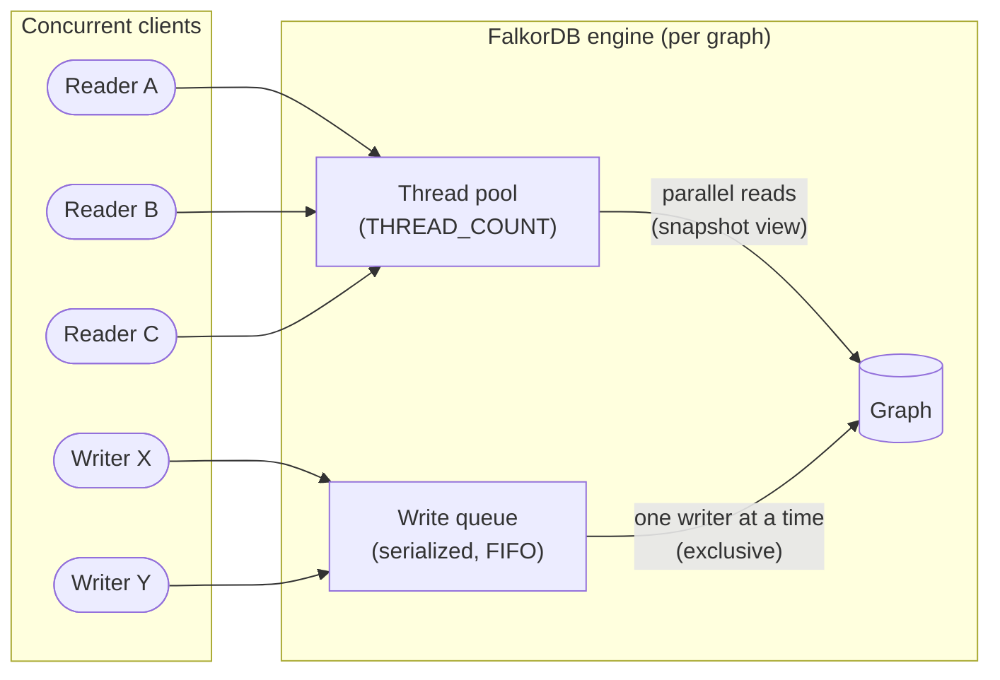

# Atomicity and Concurrency

This page describes how FalkorDB handles atomicity within individual queries and concurrency when multiple clients issue queries simultaneously.

## Concurrency Model at a Glance

FalkorDB uses a per-graph reader-writer model: many read queries can run in parallel against the same graph, while write queries are serialized so that only one write executes at a time on a given graph. Readers always observe a consistent snapshot of the graph as it existed when the read began — they never see partial state from an in-flight write.



In the diagram above, readers A, B and C execute concurrently on threads from the shared pool and observe the graph state as it was when their query started. Writers X and Y are queued and executed one after the other, so concurrent writes to the same graph never interleave.

## Single Query Atomicity

Every query that modifies the graph — using any combination of `CREATE`, `SET`, `DELETE`, or `MERGE` — is **atomic**. The entire query either succeeds completely or fails without applying any partial changes. There is no scenario where a failed query leaves the graph in an intermediate state.

This atomicity also covers **schema changes** such as new node labels or relationship types created during query execution. If a query that creates a new label (e.g., via `CREATE (:NewLabel)`) subsequently fails, that label is rolled back along with all other modifications made by the query. No partial schema state is persisted.

For example, a query that creates several nodes and relationships in one statement either creates all of them or none:

```cypher
CREATE (a:Person {name: 'Alice'})-[:KNOWS]->(b:Person {name: 'Bob'}),
       (b)-[:KNOWS]->(c:Person {name: 'Charlie'})
```

If an error occurs during execution (for example, a constraint violation), none of the nodes or relationships from this query are persisted.

## Compound Clauses

Atomicity extends to queries that use `WITH`, `UNION`, or other compound clauses. A query composed of multiple clauses is executed as a single atomic unit.

For example, the following query is fully atomic — either all changes are applied, or none:

```cypher
MATCH (p:Person {name: 'Alice'})
WITH p
SET p.updated = true
CREATE (p)-[:VISITED]->(c:City {name: 'Portland'})
```

Similarly, a `UNION` query that writes data in multiple branches is treated as one atomic operation.

## Write Ordering and Post-Write Visibility

Within a single query, write operations are applied in the order dictated by the Cypher clauses. Earlier clauses are evaluated before later ones, meaning results produced by a `CREATE` are available to a subsequent `SET` or `MATCH` in the same query:

```cypher
CREATE (p:Person {name: 'Dana'})
WITH p
SET p.created_at = timestamp()
RETURN p
```

In this example, the node is created first, then the property is set, and finally the node is returned.

**Filters after a `WITH` boundary observe the state produced by any preceding write operation.** This means a `WHERE` predicate in the second half of a query will see nodes and relationships as they exist *after* deletions, updates, or creations performed earlier in the same query. For example:

```cypher
// Create a graph with one relationship
CREATE (:A)-[:R]->(:B);

// Delete the relationship, then conditionally delete the orphaned node
MATCH (:A)-[r:R]->(b:B) DELETE r
WITH b WHERE NOT (b)<-[]-() DELETE b
RETURN 'orphan deleted';
```

The `WHERE NOT (b)<-[]-()` predicate is evaluated *after* `DELETE r` has run, so it correctly sees that `b` has no incoming relationships and the node is deleted.

When a single clause produces multiple write operations (for example, `CREATE` creating several nodes), those operations are applied as a batch within that clause.

## Concurrent Queries

FalkorDB uses a **reader-writer concurrency model** per graph. The key guarantees are:

### Multiple Concurrent Readers

Multiple read-only queries can execute in parallel against the same graph. Read queries do not block each other, enabling high throughput for analytics and traversal workloads.

The number of concurrent queries is governed by the [`THREAD_COUNT`](/configuration#thread_count) configuration parameter, which sets the size of the thread pool.

### Serialized Writers

Only **one write query** executes at a time on a given graph. If multiple write queries arrive concurrently, they are queued and executed one at a time in arrival order.

This serialization ensures that:

- Write queries always see the most recent committed state of the graph.
- No two write operations can interleave, preventing race conditions and data corruption.

### Readers and Writers

While a write query is executing, concurrent read queries observe the graph state as it was **before** the write began. Readers are never exposed to partially applied modifications from an in-progress write. Once the write completes, subsequent read queries see the updated state.

This provides an isolation level similar to **snapshot isolation** for readers: each read query sees a consistent view of the graph at the point the query began executing.

## Practical Implications

| Scenario | Behavior |
| :--- | :--- |
| Single write query with multiple clauses | Atomic — all changes apply or none |
| Multiple concurrent read queries | Run in parallel, no blocking |
| Concurrent read + write queries | Readers see the state before the write; no partial reads |
| Multiple concurrent write queries | Serialized — executed one at a time per graph |

### When You Need External Coordination

For most use cases, single-query atomicity combined with write serialization provides sufficient guarantees. However, if your application requires **multi-query transactions** — where several independent queries must all succeed or fail together — you should use Redis `MULTI`/`EXEC` blocks to group them. Note that `MULTI`/`EXEC` serializes all enclosed commands, so concurrent operations on other graphs will also be blocked for the duration of the transaction.

### Performance Considerations

- **Read-heavy workloads** scale well because multiple read queries execute concurrently.
- **Write-heavy workloads** are bottlenecked by write serialization. Consider batching multiple changes into a single query where possible.
- Tune [`THREAD_COUNT`](/configuration#thread_count) to match the parallelism your hardware supports and your workload requires.

{% include faq_accordion.html title="Frequently Asked Questions" q1="Can multiple read queries run at the same time on the same graph?" a1="Yes. FalkorDB uses a **reader-writer concurrency model** where multiple read-only queries execute in parallel against the same graph without blocking each other." q2="What happens if a write query fails midway through execution?" a2="Every write query is **atomic** — it either succeeds completely or fails without applying any partial changes. If an error occurs (e.g., a constraint violation), all modifications from that query are rolled back, including any new labels or schema changes." q3="Do readers see partial state from an in-progress write?" a3="No. Readers always observe the graph state as it existed **before** the write began, providing snapshot isolation. Once the write completes, subsequent read queries see the updated state." q4="How are concurrent write queries handled?" a4="Write queries to the same graph are **serialized** — they are queued and executed one at a time in arrival order (FIFO). This prevents race conditions and ensures each write sees the most recent committed state." q5="How do I implement multi-query transactions in FalkorDB?" a5="FalkorDB does not natively support multi-query transactions. For cases where multiple independent queries must all succeed or fail together, use Redis `MULTI`/`EXEC` blocks. Note that this serializes all enclosed commands across all graphs." %}
