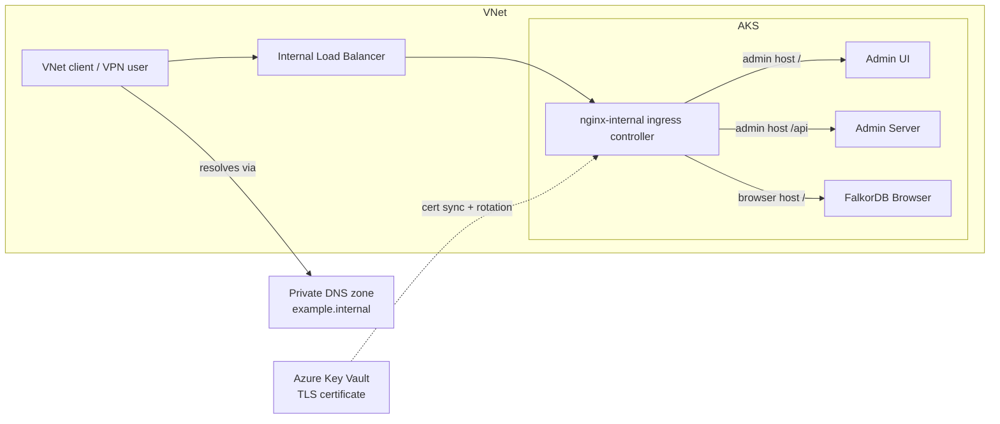

This guide deploys FalkorDB Enterprise on Azure Kubernetes Service (AKS) with **no public exposure**:

- The Admin Dashboard (UI + API) and FalkorDB Browser are served through an **internal Azure Load Balancer** — reachable only from inside the VNet (or peered VNets / VPN / ExpressRoute).
- TLS certificates are managed in **Azure Key Vault** and synced/rotated automatically by the AKS **application routing add-on**.
- Hostnames resolve through an **Azure Private DNS zone** linked to the cluster VNet.

## Architecture



Two hostnames are used, both pointing at the same internal IP:

| Hostname (example)                | Serves                                    |
| --------------------------------- | ----------------------------------------- |
| `falkordb-admin.example.internal`   | Admin Dashboard UI (`/`) and API (`/api`) |
| `falkordb-browser.example.internal` | FalkorDB Browser                          |

## Prerequisites

- An AKS cluster (any supported version) and `az` CLI logged in with permissions to:
  - manage the cluster (`az aks ...`),
  - create Key Vaults and role assignments,
  - create Private DNS zones in the target resource group.
- `kubectl` and cluster credentials (access to run `kubectl` commands in the cluster's context): `az aks get-credentials -g <rg> -n <cluster>`.
- FalkorDB registry credentials (provided by FalkorDB support).
- At least 3 worker nodes with 4 CPU and 16 GB of memory each.
- Outbound access from the cluster to pull images: `registry.falkordb.cloud` (Enterprise images, credentials required), `docker.io`, `apecloud-registry.cn-zhangjiakou.cr.aliyuncs.com`, `registry.k8s.io`, and `ghcr.io` — or `registry.falkordb.cloud` alone, since every image is also mirrored there (see [Private registries](/enterprise/deployment/private-images)).
- The [install script](https://falkordb.github.io/FalkorDB-Enterprise/install.sh) (referenced by URL below).

> **Note on snapshots:** AKS managed CSI drivers ship their own snapshot controller, so the install uses `--skip-snapshot-controller`.

## 0. Set variables

```bash
CLUSTER_NAME="<your-aks-cluster>"
RESOURCE_GROUP="<your-resource-group>"
KV_NAME="<your-keyvault-name>"            # must be globally unique
DNS_ZONE="example.internal"               # private DNS zone
DASHBOARD_HOSTNAME="falkordb-admin.${DNS_ZONE}"
BROWSER_HOSTNAME="falkordb-browser.${DNS_ZONE}"
INSTALL_URL="https://falkordb.github.io/FalkorDB-Enterprise/install.sh"
REGISTRY_USERNAME="<registry-username>"   # provided by FalkorDB
REGISTRY_PASSWORD="<registry-token>"      # provided by FalkorDB
CERT_URI="https://${KV_NAME}.vault.azure.net/certificates/falkordb-admin"
ADMIN_EMAIL="admin@your-org.com"
ADMIN_TEMP_PASSWORD="<temporary-password>"

az aks get-credentials -g $RESOURCE_GROUP -n $CLUSTER_NAME
```

## 1. Key Vault and TLS certificate

Create an RBAC-enabled Key Vault and a self-issued certificate covering **both** hostnames. Azure auto-renews it 30 days before expiry, and the app routing add-on picks up renewals automatically.

> The add-on's Key Vault integration grants access via **RBAC role assignments**, so the vault must be created with `--enable-rbac-authorization true`. Access-policy vaults will not work.

```bash
cat > cert-policy.json <<EOF
{
  "issuerParameters": { "name": "Self" },
  "keyProperties": { "exportable": true, "keySize": 2048, "keyType": "RSA", "reuseKey": true },
  "lifetimeActions": [
    { "action": { "actionType": "AutoRenew" }, "trigger": { "daysBeforeExpiry": 30 } }
  ],
  "secretProperties": { "contentType": "application/x-pkcs12" },
  "x509CertificateProperties": {
    "subject": "CN=$DASHBOARD_HOSTNAME",
    "subjectAlternativeNames": { "dnsNames": ["$DASHBOARD_HOSTNAME", "$BROWSER_HOSTNAME"] },
    "validityInMonths": 12
  }
}
EOF

az keyvault create -g $RESOURCE_GROUP -n $KV_NAME --enable-rbac-authorization true

# Grant yourself permission to create certificates in the vault
az role assignment create --role "Key Vault Certificates Officer" \
  --assignee $(az ad signed-in-user show --query id -o tsv) \
  --scope $(az keyvault show -g $RESOURCE_GROUP -n $KV_NAME --query id -o tsv)

az keyvault certificate create --vault-name $KV_NAME -n falkordb-admin -p @cert-policy.json
rm cert-policy.json
```

> **Certificate trust:** a `Self`-issued certificate is not trusted by browsers out of the box. For internal domains this is usually acceptable (users accept the warning once), or distribute the cert to client trust stores. To avoid warnings entirely, import a certificate from your internal CA into the Key Vault instead — everything else in this guide stays the same.

## 2. Application routing add-on with an internal ingress controller

Enable the add-on with Key Vault integration, then create a **second** NGINX ingress controller that provisions an internal load balancer. (The add-on's default controller, `webapprouting.kubernetes.azure.com`, is always public — do not use it for internal-only deployments.)

```bash
KV_ID=$(az keyvault show -g $RESOURCE_GROUP -n $KV_NAME --query id -o tsv)
az aks approuting enable -g $RESOURCE_GROUP -n $CLUSTER_NAME --enable-kv --attach-kv $KV_ID

kubectl apply -f - <<'EOF'
apiVersion: approuting.kubernetes.azure.com/v1alpha1
kind: NginxIngressController
metadata:
  name: nginx-internal
spec:
  ingressClassName: nginx-internal
  controllerNamePrefix: nginx-internal
  loadBalancerAnnotations:
    service.beta.kubernetes.io/azure-load-balancer-internal: "true"
EOF

# Wait for the controller to provision (takes a few minutes)
kubectl wait nginxingresscontroller nginx-internal --for=condition=Available --timeout=5m

# The EXTERNAL-IP of the nginx-internal service is a private VNet IP
kubectl get svc -n app-routing-system
```

## 3. Install FalkorDB Enterprise

The install script creates the namespace, registry pull secret, KubeBlocks, and the Helm release. Only values that differ from chart defaults are set on the command line.

> The chart is pulled from `oci://registry.falkordb.cloud`. The script logs your local Helm client in to the registry automatically using `--registry-username`/`--registry-password`. If you hit an `unauthorized` error fetching the chart (older script versions), log in manually first: `helm registry login registry.falkordb.cloud -u "$REGISTRY_USERNAME" -p "$REGISTRY_PASSWORD"`.

```bash
curl -sSL $INSTALL_URL | bash -s -- \
  --skip-snapshot-controller \
  --registry-username "$REGISTRY_USERNAME" \
  --registry-password "$REGISTRY_PASSWORD" \
  --jwt-secret "$(openssl rand -hex 32)" \
  --set gateway.ingress.enabled=true \
  --set-string "gateway.ingress.className=nginx-internal" \
  --set-string "gateway.ingress.hosts[0].host=$DASHBOARD_HOSTNAME" \
  --set-string "gateway.ingress.annotations.kubernetes\.azure\.com/tls-cert-keyvault-uri=$CERT_URI" \
  --set-string "gateway.ingress.tls[0].secretName=keyvault-falkordb-enterprise-gateway" \
  --set-string "gateway.ingress.tls[0].hosts[0]=$DASHBOARD_HOSTNAME" \
  --set-string "adminServer.env.corsOrigin=https://$DASHBOARD_HOSTNAME" \
  --set-string "adminServer.persistence.storageClassName=managed-csi" \
  --set-string "adminServer.bootstrap.adminUser.email=$ADMIN_EMAIL" \
  --set-string "adminServer.bootstrap.adminUser.password=$ADMIN_TEMP_PASSWORD" \
  --set adminServer.bootstrap.adminUser.mustChangePassword=true \
  --set falkordb-browser.ingress.enabled=true \
  --set-string "falkordb-browser.ingress.className=nginx-internal" \
  --set-string "falkordb-browser.ingress.hosts[0].host=$BROWSER_HOSTNAME" \
  --set-string "falkordb-browser.ingress.hosts[0].paths[0].path=/" \
  --set-string "falkordb-browser.ingress.hosts[0].paths[0].pathType=Prefix" \
  --set-string "falkordb-browser.ingress.annotations.kubernetes\.azure\.com/tls-cert-keyvault-uri=$CERT_URI" \
  --set-string "falkordb-browser.ingress.tls[0].secretName=keyvault-falkordb-enterprise-falkordb-browser" \
  --set-string "falkordb-browser.ingress.tls[0].hosts[0]=$BROWSER_HOSTNAME" \
  --set-string "falkordb-browser.env.nextauthUrl=https://$BROWSER_HOSTNAME/" \
  --set-string "adminUi.env.viteBrowserUrl=https://$BROWSER_HOSTNAME" \
  --yes
```

Key points:

- **TLS secret names** follow the add-on convention `keyvault-<ingress-name>`. With the default release name the ingresses are `falkordb-enterprise-gateway` and `falkordb-enterprise-falkordb-browser`. If you use `--release-name`, adjust both `tls[0].secretName` values accordingly.
- **Same-origin routing**: the gateway ingress serves the UI at `/` and the API at `/api` on the dashboard host, so the UI reaches the API with relative URLs — no separate API hostname is needed.
- **`falkordb-browser.env.nextauthUrl`** must be the public Browser URL, otherwise Browser auth redirects break.
- **`adminUi.env.viteBrowserUrl`** points the dashboard's "open in Browser" links at the Browser hostname.

## 4. Private DNS

Create the private zone, link it to the cluster VNet, and add A records for both hostnames pointing at the internal ingress IP.

```bash
INGRESS_IP=$(kubectl get ingress -n falkordb-system \
  -o jsonpath='{.items[0].status.loadBalancer.ingress[0].ip}')
echo "Internal ingress IP: $INGRESS_IP"

az network private-dns zone create -g $RESOURCE_GROUP -n $DNS_ZONE

# Find the cluster VNet.
# BYO-VNet clusters: derive it from the node pool subnet.
SUBNET_ID=$(az aks show -g $RESOURCE_GROUP -n $CLUSTER_NAME \
  --query 'agentPoolProfiles[0].vnetSubnetId' -o tsv)
VNET_ID=${SUBNET_ID%/subnets/*}
# Managed-VNet clusters (SUBNET_ID empty): look in the node resource group instead:
#   NODE_RG=$(az aks show -g $RESOURCE_GROUP -n $CLUSTER_NAME --query nodeResourceGroup -o tsv)
#   VNET_ID=$(az network vnet list -g $NODE_RG --query '[0].id' -o tsv)

az network private-dns link vnet create -g $RESOURCE_GROUP -z $DNS_ZONE \
  -n aks-link --virtual-network $VNET_ID --registration-enabled false

az network private-dns record-set a add-record -g $RESOURCE_GROUP -z $DNS_ZONE \
  -n falkordb-admin -a $INGRESS_IP
az network private-dns record-set a add-record -g $RESOURCE_GROUP -z $DNS_ZONE \
  -n falkordb-browser -a $INGRESS_IP
```

> **Resolution scope:** the private zone only resolves from linked VNets. Clients on VPN/ExpressRoute need their DNS to forward the zone to Azure DNS (`168.63.129.16`), e.g. via an Azure DNS Private Resolver. Link additional (peered) VNets with more `az network private-dns link vnet create` commands.

## 5. Verify

```bash
# Pods healthy
kubectl get pods -n falkordb-system

# Key Vault certs synced into TLS secrets by the add-on
kubectl get secret -n falkordb-system | grep keyvault-

# End-to-end from inside the cluster (DNS + ingress + TLS)
kubectl run curl-test --rm -it --image=curlimages/curl --restart=Never -- \
  curl -vk https://$DASHBOARD_HOSTNAME/api/v1/health
```

To test the full UI from a workstation outside the VNet, port-forward to the internal controller and map the hostnames locally:

```bash
kubectl get svc -n app-routing-system            # find the nginx-internal service name
sudo kubectl port-forward -n app-routing-system svc/nginx-internal-0 443:443
```

Add to `/etc/hosts`:

```
127.0.0.1 falkordb-admin.example.internal falkordb-browser.example.internal
```

Then browse `https://falkordb-admin.example.internal` (accept the self-signed certificate warning). Remove the hosts entry when done.

## 6. First login

1. Open `https://$DASHBOARD_HOSTNAME` and sign in with `$ADMIN_EMAIL` / the temporary password.
2. You will be forced to change the password (`mustChangePassword=true`).
3. Activate your Enterprise license in the dashboard.

## Troubleshooting

| Symptom | Cause / fix |
| --- | --- |
| TLS secret `keyvault-...` never appears | Vault was created in access-policy mode — recreate with `--enable-rbac-authorization true`; or the `tls[0].secretName` doesn't match `keyvault-<ingress-name>` (check `kubectl get ingress -n falkordb-system`). |
| `ParentResourceNotFound` on DNS record create | Private DNS zone doesn't exist in that resource group — create it (step 4) or find the existing zone with `az network private-dns zone list`. |
| Hostname doesn't resolve from a VM/pod | VNet not linked to the private zone; add a `link vnet create` for that VNet. |
| Dashboard "open in Browser" shows the UI 404 page | `falkordb-browser.ingress` not enabled or `adminUi.env.viteBrowserUrl` not set — see step 3. |
| Ingress has no IP | Internal controller still provisioning — re-run the `kubectl wait` from step 2. |
| Browser certificate warning | Expected with a self-issued cert; import an internal-CA cert into Key Vault to avoid it. |

## Cleanup

To uninstall, follow the [uninstall playbook](/enterprise/upgrades/uninstall), then optionally remove the Azure resources:

```bash
az network private-dns zone delete -g $RESOURCE_GROUP -n $DNS_ZONE --yes
az keyvault delete -g $RESOURCE_GROUP -n $KV_NAME
kubectl delete nginxingresscontroller nginx-internal
```
