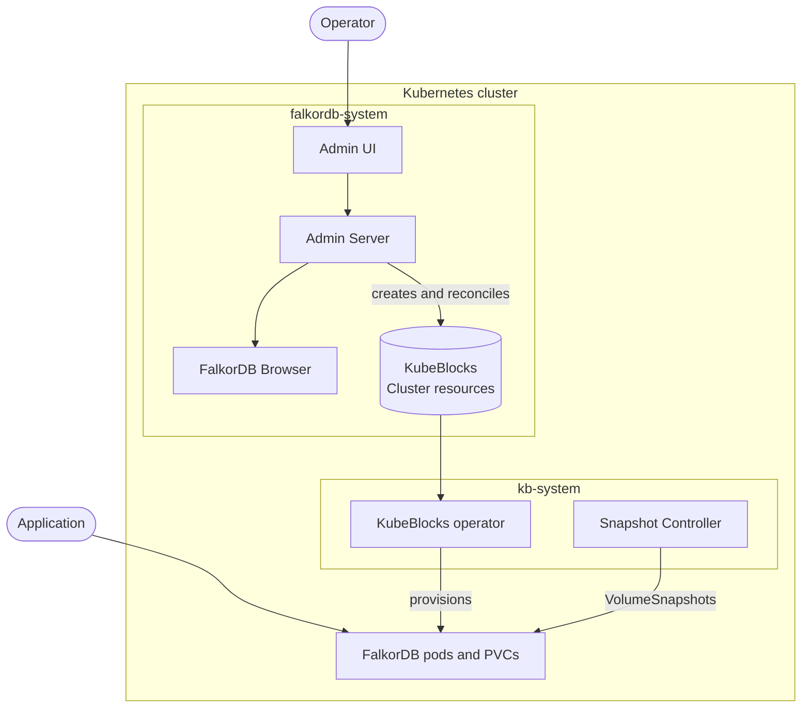

FalkorDB Enterprise is a self-managed distribution of FalkorDB for Kubernetes. It bundles the database, a Kubernetes control plane, and an administration surface into a single Helm release that you run inside your own cluster and network boundary.

## What you get

<CardGroup cols={2}>
  <Card title="Admin UI" icon="browser">
    A web console for creating deployments, running day-2 operations, managing backups, viewing metrics and logs, and administering users and roles.
  </Card>
  <Card title="Admin Server" icon="server">
    The REST API behind the UI. It handles deployments, operations, backup and restore, logs, metrics, users, RBAC, settings, audit logs, licensing, and diagnostics.
  </Card>
  <Card title="FalkorDB KubeBlocks addon" icon="cubes">
    The operator definitions that let KubeBlocks provision and reconcile FalkorDB topologies on Kubernetes.
  </Card>
  <Card title="FalkorDB Browser" icon="magnifying-glass-chart">
    A visual query and graph exploration tool, deployed alongside the platform.
  </Card>
  <Card title="Admin CLI" icon="terminal">
    A command-line client for scripting Admin Server login, deployment operations, and license management.
  </Card>
  <Card title="Installer scripts" icon="wand-magic-sparkles">
    `install.sh` and `uninstall.sh` handle platform dependencies, CRDs, permission preflight checks, and quick-access networking.
  </Card>
</CardGroup>

## Architecture at a glance

Operators interact only with the Admin UI or Admin CLI. The Admin Server translates those actions into KubeBlocks custom resources, and the KubeBlocks operator reconciles them into FalkorDB pods, services, and persistent volumes. Applications connect to the resulting database services directly.

## Supported topologies

| Topology | Description | Guide |
| --- | --- | --- |
| Standalone | A single FalkorDB node. Lowest cost, no failover. | [Standalone](/enterprise/databases/standalone) |
| Replicated | One primary plus replicas, no Sentinel services. | [Replicated](/enterprise/databases/replicated) |
| Replicated with Sentinel | One primary plus replicas with Redis Sentinel automatic failover. | [Sentinel](/enterprise/databases/sentinel) |
| Sharded | Data distributed across multiple shards, each with its own nodes. | [Sharded](/enterprise/databases/sharded) |

<Note>
  In the Admin UI and in these docs, a FalkorDB database instance is called a **deployment**. The word *cluster* is reserved for the Kubernetes cluster itself.
</Note>

## Namespaces and releases

The installer uses these defaults:

| Component | Namespace | Helm release |
| --- | --- | --- |
| FalkorDB Enterprise | `falkordb-system` | `falkordb-enterprise` |
| KubeBlocks | `kb-system` | `kubeblocks` |
| Snapshot Controller | `kb-system` | `snapshot-controller` |

<Warning>
  Only one FalkorDB Enterprise installation is supported per Kubernetes cluster. The chart creates a cluster-scoped install lock named `falkordb-enterprise-install-lock` and blocks installs from any other release or namespace in the same cluster.
</Warning>

## Licensing

The Admin Server activates a signed Enterprise license supplied through Helm values or a Kubernetes Secret. Leaving those fields empty is fine — the admin server starts a 14-day free trial automatically, and you can activate or replace the license at any time from the Admin UI's **License** page, without touching Helm values. If the license expires, is invalid, or a resource limit is exceeded, authenticated write operations are locked and the Admin UI becomes read-only until a valid license is active. See [Helm values](/enterprise/reference/helm-values) for license configuration.

## Next steps

<CardGroup cols={2}>
  <Card title="Check requirements" icon="list-check" href="/enterprise/get-started/requirements" horizontal>
    Cluster size, tooling, and network access.
  </Card>
  <Card title="Install" icon="rocket" href="/enterprise/get-started/quickstart" horizontal>
    Run the quickstart in a scratch cluster.
  </Card>
</CardGroup>
