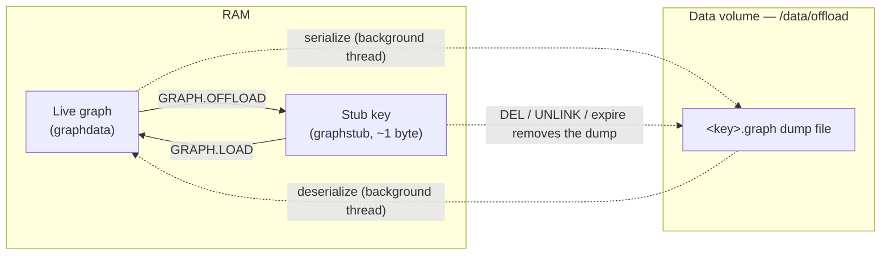

Graph offloading lets a deployment serialize a graph to disk and evict it from memory, leaving a lightweight stub in its place. Offloaded graphs stay addressable in the keyspace and reload on demand or automatically, so you keep large or rarely used graphs on disk instead of paying to hold them in RAM. The capability ships in the FalkorDB Enterprise module and is configured under the `falkordbe.` prefix.

Use it when a deployment holds many graphs but only a working subset is active at any moment — multi-tenant workloads, historical datasets, or graphs with periodic access patterns. An idle graph shrinks to a roughly 1-byte in-memory stub while its data waits on disk.

## How it works

When you offload a graph, the module serializes it to a `.graph` dump file and replaces the live key with a stub of a custom `graphstub` type. Loading reverses the process: the dump is read back into a live graph and the on-disk file is removed.



The design favors safety and availability:

- **Stub-first safety.** The module installs the stub key *before* it writes the dump. If serialization fails — for example the disk fills up — it restores the live graph, so clients never see data loss. An internal lock prevents concurrent offload and load operations on the same key.
- **Non-blocking I/O.** Offload and load both run in background worker threads and release the Redis global lock during disk I/O, so queries against other keys keep running without a latency spike.
- **Automatic disk cleanup.** Removing a stub in any way — `DEL`, `UNLINK`, TTL expiration, or `FLUSHALL` — deletes the matching dump file through the type's `unlink` callback, so offloaded data never leaks disk space.
- **Self-healing.** If a dump file is missing or corrupted, deleting the stub still succeeds and the module logs a warning instead of blocking the keyspace.
- **Version-aware dumps.** Each dump records the FalkorDB graph encoding version in a small header, so the correct decoder is selected on load. A dump written by an incompatible build fails to load cleanly and leaves the stub intact.

## Availability and storage

Graph offloading is part of the FalkorDB Enterprise module, which is bundled into the enterprise database image (`falkordb-enterprise-db`) and loaded next to the core module through `FALKORDB_EXTRA_MODULES_ARGS`. Deployments that run the enterprise image have the commands and configuration available with no extra setup.

Every enterprise deployment writes dumps to `/data/offload` on the data volume:

- The dumps live on the same persistent volume as the graph data, so they survive pod restarts and do not count against the pod's ephemeral-storage limit.
- Each node has its own data volume, so a primary and its replicas never collide on a dump file name.
- The module creates the directory when it is missing.

<Note>
  The offload directory is fixed per deployment and is not one of the runtime parameters. It is set on the `redis-server` command line, so changing it restarts the pods; a reconfigure operation rejects the key. See [Parameters &amp; resources](/enterprise/operations/parameters) for the full explanation.
</Note>

## Configure automatic eviction

A background eviction thread can offload idle graphs for you. On each pass it makes the following decision:

1. If `falkordbe.idle-threshold-ms` is `0`, do nothing — background eviction is disabled.
2. If `falkordbe.memory-pressure` is greater than `0`, check `used_memory / maxmemory`. If the ratio does not exceed the watermark, skip this pass — there is no memory pressure yet.
3. Scan the keyspace for graphs idle longer than `falkordbe.idle-threshold-ms` and offload them.

Setting `falkordbe.memory-pressure` to `0.8` therefore means *"only reclaim graph memory once the instance is already at 80% of its memory budget"*, which turns offloading into a safety valve rather than an always-on process.

| Parameter | Default | Description |
| --- | --- | --- |
| `falkordbe.idle-threshold-ms` | `0` | LRU idle time before a graph is offloaded. `0` disables background eviction. Minimum `1000` when enabled. |
| `falkordbe.evict-interval-ms` | `10000` | How often the eviction thread scans the keyspace. Minimum `1000`. |
| `falkordbe.memory-pressure` | `0` | Watermark in `[0.0, 1.0]`. Only evict when `used_memory / maxmemory` exceeds it. `0` disables the check. |
| `falkordbe.load-evict-budget` | `0` | Graphs the module may offload to make room for a single `GRAPH.LOAD`. `0` disables it, `-1` allows unlimited evictions. |

Set these values from the Admin UI under **Parameters** → **Enterprise Module Parameters** → **Graph Offloading**, then select **Save Enterprise**. The change is applied to the running server without a restart. Fields left at their default are not written to `redis.conf`. For the exact save flow and how values are applied, see [Parameters &amp; resources](/enterprise/operations/parameters#enterprise-module-parameters).

<Warning>
  `falkordbe.memory-pressure` requires Redis `maxmemory` to be set. Without a memory limit, `used_memory / maxmemory` is defined as `0`, so any positive watermark suppresses all eviction.
</Warning>

## Commands

The module registers four commands. Issue them against the FalkorDB deployment endpoint like any other query, using `redis-cli` or a client library.

| Command | Description |
| --- | --- |
| `GRAPH.OFFLOAD <key>` | Serialize the graph to disk and evict it, leaving a stub. Returns `OK`. |
| `GRAPH.LOAD <key> [FORCE]` | Load an offloaded graph back into memory. `FORCE` skips the memory headroom check. Returns `OK`. |
| `GRAPH.STUBS` | Return the keys of all currently offloaded graphs. |
| `GRAPH.STUBINFO <key>` | Return the dump file's `path`, `size`, and `mtime`, `atime`, and `ctime` for one stub. |

`GRAPH.OFFLOAD` fails if the graph does not exist, is already offloaded, or is mid-operation. It writes to a temporary file and atomically renames it into place, so a partial dump is never visible.

### Offload and reload a graph

```sh
# A live graph reports the core graph type
127.0.0.1:6379> TYPE social
graphdata

# Offload it to disk
127.0.0.1:6379> GRAPH.OFFLOAD social
OK

# The key is now a stub
127.0.0.1:6379> TYPE social
graphstub

# Inspect the dump file
127.0.0.1:6379> GRAPH.STUBINFO social
 1) "path"
 2) "/data/offload/social.graph"
 3) "size"
 4) (integer) 2048
 5) "mtime"
 6) (integer) 1718723456
 7) "atime"
 8) (integer) 1718723456
 9) "ctime"
10) (integer) 1718723456

# List every offloaded graph
127.0.0.1:6379> GRAPH.STUBS
1) "social"

# Load it back into memory
127.0.0.1:6379> GRAPH.LOAD social
OK
127.0.0.1:6379> TYPE social
graphdata
```

### Load-time memory safety

Before loading, the module estimates the graph's memory footprint from its on-disk size and compares it against available memory (`maxmemory - used_memory` when `maxmemory` is set, otherwise free system memory). If the graph will not fit, the load is rejected and the stub and dump are left untouched:

```sh
127.0.0.1:6379> GRAPH.LOAD large-graph
(error) GRAPH.LOAD failed, not enough memory to load graph: large-graph, estimated: 157286400 bytes, available: 104857600 bytes, use FORCE to skip memory validation
```

You have two ways to proceed:

- **`FORCE`** skips the headroom check. Use it only when you are certain the graph fits in physical RAM. `FORCE` does not trigger eviction.
- **`falkordbe.load-evict-budget`** lets the load reclaim memory by offloading other live graphs first. For positive budgets, the module scans up to `2 × budget` of the least-recently-used live graphs, offloads a best-fit selection until enough memory is free, then completes the load. With `-1`, the scan is unbounded and eviction can continue until enough memory is reclaimed or no further candidates exist. Evicted graphs become stubs and can be reloaded later. If it still cannot free enough, the same error is returned.

<Tip>
  Prefer `load-evict-budget` over `FORCE` for automated workloads. It reclaims memory instead of overriding the safety check, so a large load cannot push the node into an out-of-memory condition.
</Tip>

## Backups and replication

Offloaded graphs are preserved by backup methods that include the dump payload itself:

- **Datafile (RDB) and volume-snapshot backups** preserve offloaded graphs. During an RDB save the module streams each `.graph` file into the snapshot; on load it reconstructs files under `/data/offload` and re-registers stubs. This behavior applies to the [backups](/enterprise/operations/backups) and [restore](/enterprise/operations/restore-same-database) flows that use datafiles or volume snapshots.
- **AOF schedules are not sufficient** for recovering already-offloaded graphs on their own, because they do not package `/data/offload` dump files into the backup artifact. Use datafile or volume-snapshot backups when offloaded-graph recovery is required.
- **Replication is per node.** `GRAPH.OFFLOAD` and `GRAPH.LOAD` are not propagated to replicas — each node manages its own memory. Both commands mutate the local keyspace, so run them only on a writable node (for example the primary, or a replica explicitly configured/promoted to accept writes).
- **Full sync** carries offloaded data. When a replica performs a full sync, the primary's RDB stream includes the dumps; the replica rebuilds the files in its own `/data/offload` and registers the stubs.

## Operational guidance

<Steps>
  <Step title="Size and monitor the data volume">
    Dumps share the data volume with graph data. Track volume utilization so offloading cannot fill it — a full disk makes `GRAPH.OFFLOAD` fail and restores the graph to RAM. Grow the volume through the [scaling](/enterprise/operations/scaling) flow when needed.
  </Step>
  <Step title="Use fast storage">
    Serialization and deserialization are disk-bound. Back the data volume with an SSD or NVMe StorageClass to keep offload and load times low.
  </Step>
  <Step title="Keep the default offload path">
    `/data/offload` gives each node its own dump directory on its own volume. Do not point it at a shared filesystem (NFS, SMB, EFS): nodes would collide on file names and network latency would slow every operation.
  </Step>
  <Step title="Gate eviction on memory pressure">
    In production, pair `falkordbe.idle-threshold-ms` with `falkordbe.memory-pressure` so graphs are only evicted when the node actually needs the memory, and confirm `maxmemory` is set.
  </Step>
</Steps>

## Monitor offloaded graphs

Use `GRAPH.STUBS` to see which graphs are currently on disk and `GRAPH.STUBINFO` to inspect each dump's path, size, and file timestamps. For deployment-wide memory and disk metrics, see [Monitoring](/enterprise/operations/monitoring).

## Next steps

<CardGroup cols={2}>
  <Card title="Parameters &amp; resources" icon="gear" href="/enterprise/operations/parameters" horizontal>
    Set the offloading parameters and understand how values are applied.
  </Card>
  <Card title="Scaling" icon="arrow-up-right-dots" href="/enterprise/operations/scaling" horizontal>
    Expand the data volume that backs the offload directory.
  </Card>
</CardGroup>
