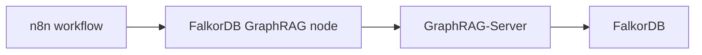
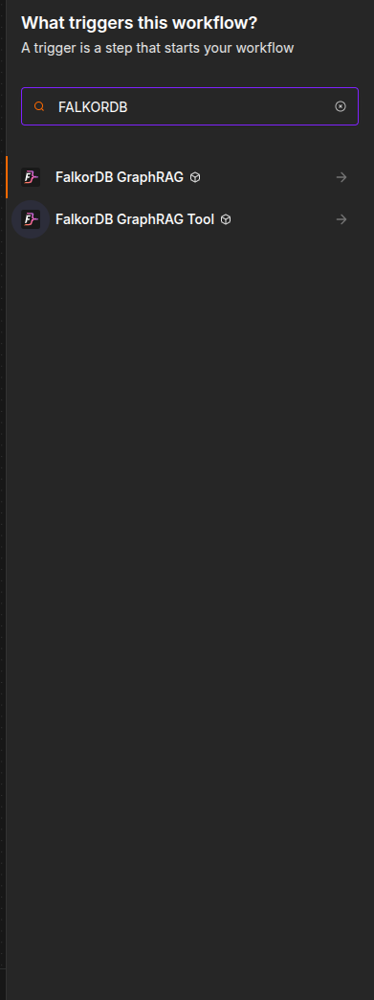
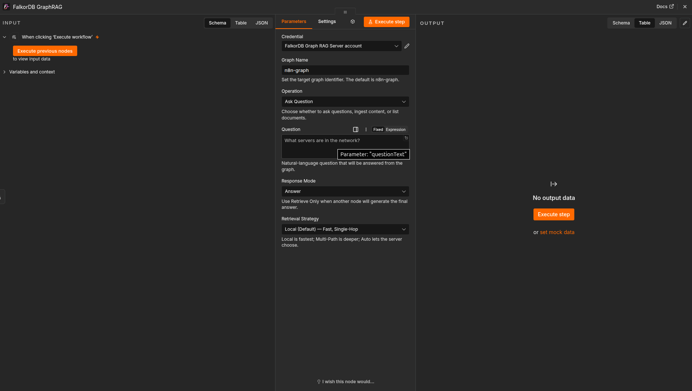
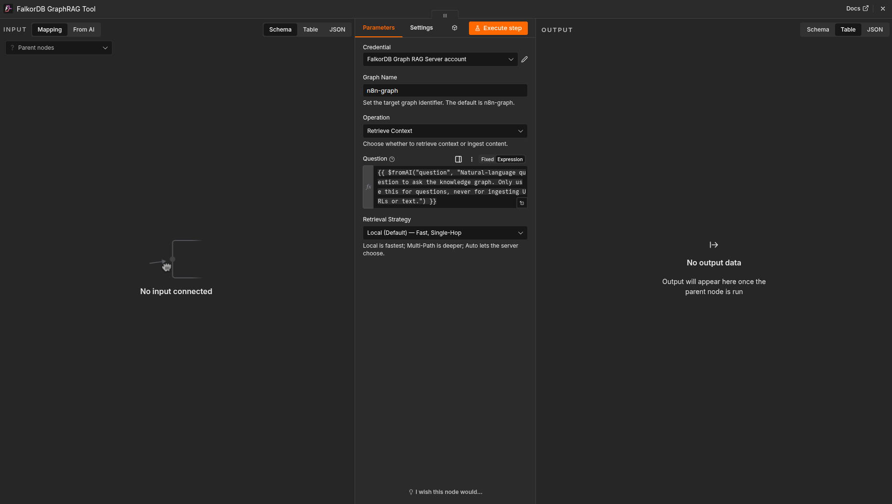
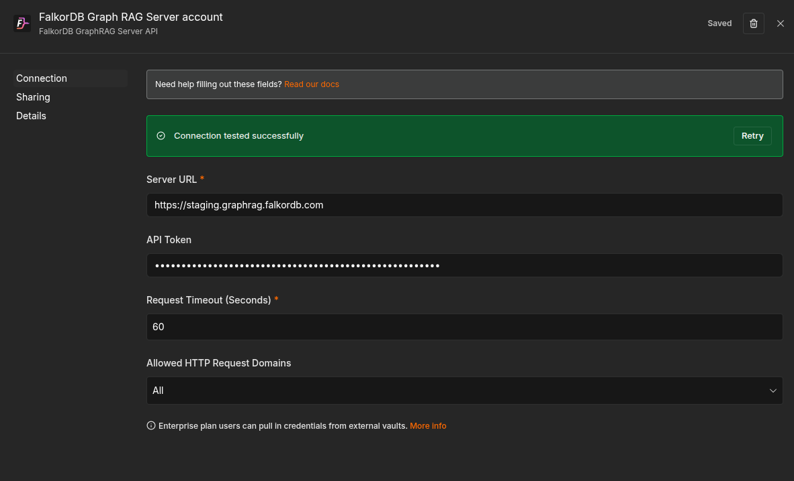
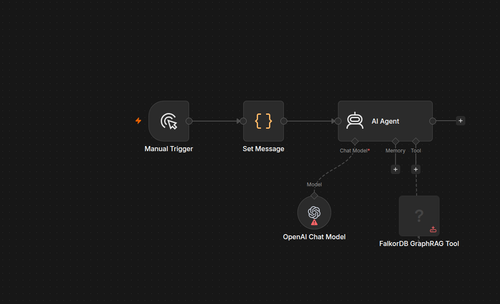
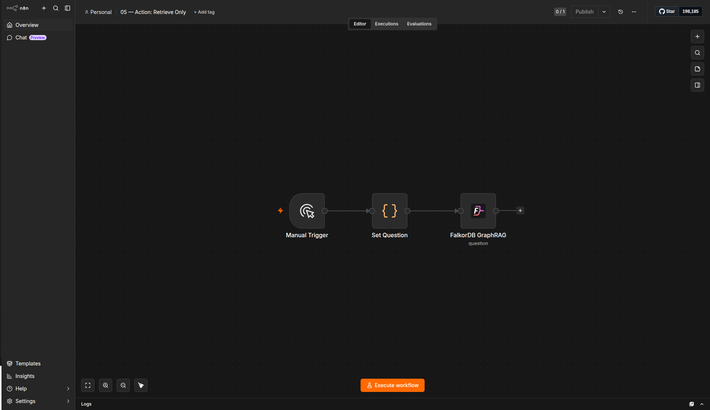

# n8n GraphRAG Nodes

The [FalkorDB GraphRAG n8n community node](https://github.com/FalkorDB/GraphRAG-n8n) connects n8n workflows to a [FalkorDB GraphRAG-Server](https://github.com/FalkorDB/GraphRAG-Server). It does not talk to FalkorDB directly. Instead, it uses the GraphRAG-Server REST API to ingest content into a knowledge graph and answer questions against that graph.

The package ships two nodes and one shared credential:

- `FalkorDB GraphRAG`: a regular pipeline node for ingest and question-answering steps.
- `FalkorDB GraphRAG Tool`: an AI Agent tool node that can be called autonomously.
- `FalkorDB GraphRAG Server API`: the credential that stores the server URL, API token, and request timeout.

## Typical workflow



## Installation

Install `@falkordb/n8n-nodes-graphrag` from the n8n Community Nodes UI, or use npm in a self-hosted n8n instance:

```bash
npm install @falkordb/n8n-nodes-graphrag
```

After installation, the two nodes appear under the FalkorDB category in the node picker.

## Setup

Create one credential under **Credentials -> New -> FalkorDB GraphRAG Server API** and reuse it across both nodes.

| Field | Required | Description |
| --- | --- | --- |
| **Server URL** | yes | Base URL of your GraphRAG-Server instance, for example `http://localhost:8000`. |
| **API Token** | no | Sent as `Authorization: Bearer ...` when the server requires authentication. |
| **Request Timeout (Seconds)** | yes | Per-request timeout for GraphRAG-Server calls. |

## Screenshots

The screenshots below are stored in `images/n8n/`.

### Node picker



### Pipeline node



### AI Agent tool



### Credential



### Tool workflow



### Retrieve only workflow



## When to use it

Use the pipeline node when you want to ingest documents, list documents, or answer questions as part of a workflow. Use the AI Agent tool when you want the agent to decide when to query the knowledge graph and fill the node parameters automatically.