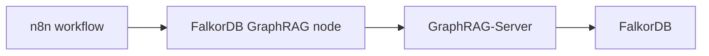

The [FalkorDB GraphRAG n8n community node](https://github.com/FalkorDB/GraphRAG-n8n) connects n8n workflows to a [FalkorDB GraphRAG-Server](https://github.com/FalkorDB/GraphRAG-Server). It does not talk to FalkorDB directly. Instead, it uses the GraphRAG-Server REST API to ingest content into a knowledge graph and answer questions against that graph.

The package ships two nodes and one shared credential:

- `FalkorDB GraphRAG`: a regular pipeline node for ingest and question-answering steps.
- `FalkorDB GraphRAG Tool`: an AI Agent tool node that can be called autonomously.
- `FalkorDB GraphRAG Server API`: the credential that stores the server URL, API token, and request timeout.

## Typical workflow



## Installation

Install `@falkordb/n8n-nodes-graphrag` from the n8n Community Nodes UI, or use npm in a self-hosted n8n instance:

```bash
npm install @falkordb/n8n-nodes-graphrag
```

After installation, the two nodes appear under the FalkorDB category in the node picker.

## Setup

Create one credential under **Credentials -> New -> FalkorDB GraphRAG Server API** and reuse it across both nodes.

| Field | Required | Description |
| --- | --- | --- |
| **Server URL** | yes | Base URL of your GraphRAG-Server instance, for example `http://localhost:8000`. |
| **API Token** | no | Sent as `Authorization: Bearer ...` when the server requires authentication. |
| **Request Timeout (Seconds)** | yes | Per-request timeout for GraphRAG-Server calls. |

## How to get an API token

Use these steps in GraphRAG-Server before configuring the n8n credential.

### 1. Open Settings and API Access

Open your graph in GraphRAG-Server, then go to **Settings** and keep the **API Access** tab selected.


### 2. Add your LLM key

In **Your LLM Keys**, add a provider key if one is not already present. API tokens run on your own LLM key, so this step is required first.


### 3. Generate the client API token

In **API Tokens**, enter a token name (for example, `n8n production`), choose expiration, and click **Generate**. Copy the raw token value when shown and paste it into the n8n credential **API Token** field.


## Screenshots

### Node picker


### Pipeline node


### AI Agent tool


### Credential


### Retrieve only workflow


## When to use it

Use the pipeline node when you want to ingest documents, list documents, or answer questions as part of a workflow. Use the AI Agent tool when you want the agent to decide when to query the knowledge graph and fill the node parameters automatically.

## Frequently Asked Questions

<AccordionGroup>
  <Accordion title="What does the FalkorDB GraphRAG n8n node do?">
    It connects n8n workflows to a [FalkorDB GraphRAG-Server](https://github.com/FalkorDB/GraphRAG-Server) so a workflow can ingest content into a knowledge graph, list documents, and answer questions against that graph.
  </Accordion>
  <Accordion title="Does the n8n node connect to FalkorDB directly?">
    No. The node talks to the **GraphRAG-Server REST API**, and GraphRAG-Server is what talks to FalkorDB. You need a running GraphRAG-Server instance before the n8n nodes can do anything.
  </Accordion>
  <Accordion title="How do I install the FalkorDB GraphRAG node in n8n?">
    Install `@falkordb/n8n-nodes-graphrag` from the n8n Community Nodes UI, or run `npm install @falkordb/n8n-nodes-graphrag` on a self-hosted instance. After installation, both nodes appear under the FalkorDB category in the node picker.
  </Accordion>
  <Accordion title="What is the difference between the FalkorDB GraphRAG node and the FalkorDB GraphRAG Tool node?">
    `FalkorDB GraphRAG` is a regular pipeline node — you place it in the workflow and it runs a step you configured. `FalkorDB GraphRAG Tool` is an AI Agent tool node, so the agent decides when to call it and fills in the parameters itself.
  </Accordion>
  <Accordion title="How do I get an API token for the n8n credential?">
    In GraphRAG-Server, open your graph, go to **Settings** and the **API Access** tab. Add a provider key under **Your LLM Keys** first, then generate a token under **API Tokens**, copy the raw value when it is shown, and paste it into the **API Token** field of the n8n credential.
  </Accordion>
  <Accordion title="Do I need my own LLM key to use the n8n GraphRAG nodes?">
    Yes. API tokens run on your own LLM key, so you must add a provider key in GraphRAG-Server **before** you can generate the token that the n8n credential uses.
  </Accordion>
  <Accordion title="Do I need a separate credential for each node?">
    No. Create one **FalkorDB GraphRAG Server API** credential and reuse it across both the pipeline node and the AI Agent tool node. It stores the server URL, the API token, and the per-request timeout.
  </Accordion>
</AccordionGroup>
