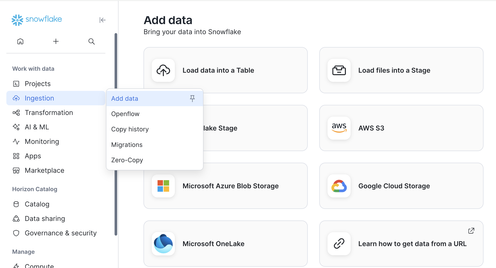
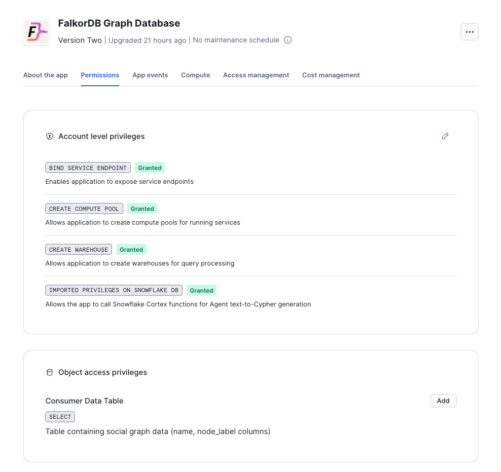
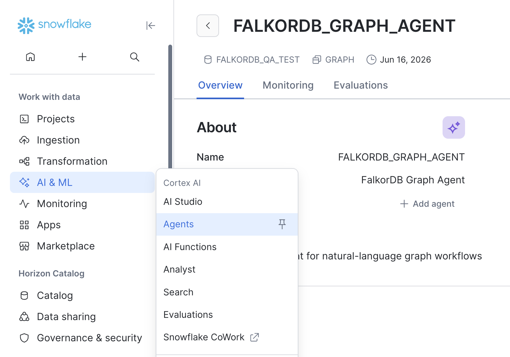

# FalkorDB Snowflake Integration Guide

## Overview

FalkorDB is available as a [Snowflake Native App](https://app.snowflake.com/marketplace/listing/GZT1Z2XCTHL/falkordb-falkordb-graph-database?search=falkordb), allowing you to run graph database operations directly within your Snowflake environment. This integration enables you to:

- Load data from Snowflake tables into graph structures
- Query relationships using Cypher query language
- Analyze connected data without moving it outside Snowflake
- Leverage graph algorithms on your existing data warehouse
- Use FalkorDB Browser to visually explore graphs and run Cypher interactively
- Use a Snowflake Cortex Agent to inspect graphs, generate Cypher, load bound tables, and execute graph queries from natural language

The Native App runs FalkorDB inside Snowpark Container Services (SPCS). Snowflake SQL procedures manage service startup, data staging, graph loading, Cypher execution, write-back to Snowflake tables, and Agent tool setup. Your data remains inside your Snowflake account boundary: source tables are accessed through explicit Native App references, and Cortex text-to-Cypher requires permissions that the customer grants.

## Table of Contents

- [Quick Start](#quick-start)
- [Which interface should I use?](#which-interface-should-i-use)
- [Installation](#installation)
- [Prepare and load Snowflake data](#loading-data-from-snowflake-tables)
- [Querying graphs](#querying-graphs)
- [Writing query results back to Snowflake](#writing-query-results-back-to-snowflake)
- [Air Routes example](#practical-example-air-routes-graph)
- [FalkorDB Browser](#open-the-falkordb-browser)
- [Snowflake Cortex Agent](#snowflake-cortex-agent)
- [Troubleshooting](#troubleshooting)

## Quick Start

Use this path when you want to install FalkorDB, load your first Snowflake table, and run your first graph query.

1. Install **FalkorDB** from Snowflake Marketplace.
2. Grant the requested application privileges.
3. Start the FalkorDB service:

   ```sql
   CALL <app_instance_name>.app_public.start_app('FALKORDB_POOL', 'FALKORDB_WH');
   CALL <app_instance_name>.app_public.get_service_status();
   ```

4. Prepare a Snowflake table. You can use an existing table, create one with SQL, or upload a CSV through Snowflake UI using **Data / Ingestion -> Add Data -> Load data into table**.
5. Bind that table to the Native App reference named `consumer_data_table`.
6. Load the bound table into a graph with `load_csv()`:

   ```sql
   CALL <app_instance_name>.app_public.load_csv(
     'my_graph',
     'LOAD CSV FROM ''file://consumer_data.csv'' AS row
      MERGE (n:Record {id: row[0]})
      SET n.name = row[1]'
   );
   ```

7. Query the graph:

   ```sql
   CALL <app_instance_name>.app_public.graph_query(
     'my_graph',
     'MATCH (n:Record) RETURN n LIMIT 10'
   );
   ```

8. Open FalkorDB Browser or create the Cortex Agent when you want a visual or natural-language workflow.

## Which interface should I use?

FalkorDB exposes the same graph service through several Snowflake-friendly interfaces:

| Interface | Best for | Example |
|---|---|---|
| SQL procedures | Automation, notebooks, scheduled jobs, and reproducible workflows | `CALL app_public.graph_query(...)` |
| FalkorDB Browser | Visual graph exploration and interactive Cypher development | Open the `falkordb-browser` endpoint |
| Snowflake Cortex Agent | Natural-language graph questions and guided loading | "Find the top connected airports" |
| Write-back tables | Persisting graph query results back into Snowflake | `graph_query(..., OBJECT_CONSTRUCT('write', ...))` |

Recommended first workflow:

1. Install the Native App and grant the requested app privileges.
2. Start the service with `start_app()`.
3. Open FalkorDB Browser to confirm the service is reachable.
4. Bind a Snowflake table to `consumer_data_table`.
5. Load nodes with `load_csv()` using `MERGE`.
6. Create indexes for node properties used by relationship loads.
7. Load relationships.
8. Query with `graph_query()` or the Browser.
9. Create the Cortex Agent when you want natural-language graph workflows.

## Installation

### From Snowflake Marketplace

1. Navigate to **Snowflake Marketplace**
2. Search for **"FalkorDB"**
3. Click **Get** to install the app
4. Select your target database and warehouse
5. Click **Get** to complete installation


### Required Application Privileges

The app requests these privileges during installation or upgrade:

| Privilege | Required for |
|---|---|
| `BIND SERVICE ENDPOINT` | Exposing the FalkorDB Browser endpoint and internal SPCS service endpoints |
| `CREATE COMPUTE POOL` | Creating the default compute pool used by the FalkorDB container |
| `CREATE WAREHOUSE` | Creating the default SQL warehouse used by setup and Agent tool execution |
| `IMPORTED PRIVILEGES ON SNOWFLAKE DB` | Allowing the app to resolve Snowflake Cortex functions used by Agent `text_to_cypher` |

For Cortex Agent text-to-Cypher, also grant the Cortex database role directly to the application:

```sql
USE ROLE ACCOUNTADMIN;

GRANT DATABASE ROLE SNOWFLAKE.CORTEX_USER TO APPLICATION <app_instance_name>;
GRANT IMPORTED PRIVILEGES ON DATABASE SNOWFLAKE TO APPLICATION <app_instance_name>;
```

The end-user role that opens the Agent UI also needs Cortex Agent access:

```sql
GRANT DATABASE ROLE SNOWFLAKE.CORTEX_AGENT_USER TO ROLE <consumer_role>;
```

Verify application privilege requests and grants:

```sql
SHOW PRIVILEGES IN APPLICATION <app_instance_name>;
SHOW GRANTS TO APPLICATION <app_instance_name>;
```

### Initial Setup

After installation, start the FalkorDB service:

```sql
-- Start the service (creates compute pool and warehouse)
-- Replace <app_instance_name> with your installed app name
CALL <app_instance_name>.app_public.start_app('FALKORDB_POOL', 'FALKORDB_WH');

-- Check service status
CALL <app_instance_name>.app_public.get_service_status();
```

**Note**: Replace `<app_instance_name>` with the name you chose during installation.

Wait for the service status to show `READY` before proceeding (typically 2-3 minutes).

Default resources use a `CPU_X64_S` compute pool with FalkorDB container resources of 1 CPU / 2GB RAM requested and 2 CPU / 4GB RAM limit. For larger graph loads, start the app with explicit resource options:

```sql
CALL <app_instance_name>.app_public.start_app(
  'FALKORDB_POOL',
  'FALKORDB_WH',
  OBJECT_CONSTRUCT(
    'cpuRequest', 2,
    'memoryRequest', '4G',
    'cpuLimit', 4,
    'memoryLimit', '8G'
  )
);
```

| Option | Meaning | Example |
|---|---|---|
| `cpuRequest` | CPU reserved for scheduling the FalkorDB container | `1`, `1.5`, `500m` |
| `memoryRequest` | Memory reserved for scheduling the FalkorDB container | `2G`, `4Gi` |
| `cpuLimit` | Maximum CPU the FalkorDB container can use | `2`, `4` |
| `memoryLimit` | Maximum memory the FalkorDB container can use before it is constrained by SPCS | `4G`, `8Gi` |

Requests must fit on the selected compute pool node. If the requested CPU/memory is larger than the pool can schedule, Snowflake fails to schedule the service or reports insufficient resources.

`start_app()` also creates or refreshes the SQL wrappers used by the Native App, including Agent tools. After installing a new app patch that adds procedures or tools, run `start_app()` again before recreating the Agent or testing new tools.

### Open the FalkorDB Browser

FalkorDB Browser is a web UI for exploring your graphs visually, inspecting nodes and relationships, and running Cypher queries interactively against the FalkorDB service.

After `get_service_status()` shows the service is ready, get the public browser URL:

```sql
SHOW ENDPOINTS IN SERVICE <app_instance_name>.app_public.st_spcs;

SELECT "ingress_url" AS browser_url
FROM TABLE(RESULT_SCAN(LAST_QUERY_ID()))
WHERE "name" = 'falkordb-browser';
```

Open the returned `browser_url` in your web browser. If the endpoint is not ready yet, wait for the service status to become `READY` and run the endpoint query again.

## Basic Usage

### Creating a Graph from Direct Queries

The simplest way to create a graph is using direct Cypher queries:

```sql
-- Create nodes
CALL <app_instance_name>.app_public.graph_query('my_graph',
  'CREATE (:Person {name: ''Alice'', age: 30}),
          (:Person {name: ''Bob'', age: 25})'
);

-- Create relationships
CALL <app_instance_name>.app_public.graph_query('my_graph',
  'MATCH (a:Person {name: ''Alice''}), (b:Person {name: ''Bob''})
   CREATE (a)-[:KNOWS {since: 2020}]->(b)'
);

-- Query the graph
CALL <app_instance_name>.app_public.graph_query('my_graph',
  'MATCH (p:Person) RETURN p.name, p.age'
);
```

### Loading Data from Snowflake Tables

To load data from your existing Snowflake tables, you need to bind a table reference:

#### Step 0: Prepare a Snowflake Table

FalkorDB loads data from a Snowflake table that is bound to the Native App. Before binding, make sure your source data exists as a table.

You have two common options:

| Option | When to use it | What to do next |
|---|---|---|
| Use an existing Snowflake table | Your data is already in Snowflake, or you created a table with SQL | Bind that table to `consumer_data_table` |
| Upload a CSV into a Snowflake table | You have a local CSV file and are starting from a new Snowflake account | In Snowflake UI, use **Data / Ingestion -> Add Data -> Load data into table**, then bind the created table |



For the standard FalkorDB Native App workflow, choose **Load data into table**, not **Load files into stage**. The app reference points to a Snowflake table. If you load files into a stage, create a table from those staged files first, then bind the table to `consumer_data_table`.

After the table exists, check its column order. `load_csv()` maps values by position, so `row[0]` means the first column in the bound table, `row[1]` means the second column, and so on.

```sql
DESCRIBE TABLE <database.schema.table>;

SELECT *
FROM <database.schema.table>
LIMIT 1;
```

#### Step 1: Bind Your Table

1. In Snowflake UI, go to **Data Products** → **Apps**
2. Find and click on **FalkorDB**
3. Go to **Permissions** and find **Object access privileges**
4. Click **+ Add** next to "Consumer Data Table"
5. Select your database, schema, and table
6. Click **Save**



**Important**: `load_csv()` reads the bound Snowflake table by column position, not by column name. Use `DESCRIBE TABLE <database.schema.table>` or `SELECT * FROM <database.schema.table> LIMIT 1` to confirm column order before writing the `row[0]`, `row[1]`, etc. mapping.

You can verify the active reference from SQL:

```sql
SHOW REFERENCES IN APPLICATION <app_instance_name>;
```

The result shows which Snowflake table is currently bound to `consumer_data_table`. If you rebind the reference to a different table, the next `load_csv()` call reads from the newly bound table.

#### Step 2: Load Data Using CSV

```sql
-- Example: Load customer data (using MERGE to prevent duplicates on reload)
-- Assumes your bound table has columns: ID, NAME, EMAIL, CITY
CALL <app_instance_name>.app_public.load_csv(
  'customer_graph',
  'LOAD CSV FROM ''file://consumer_data.csv'' AS row
   MERGE (c:Customer {id: row[0]})
   ON CREATE SET c.name = row[1], c.email = row[2], c.city = row[3]
   ON MATCH SET c.name = row[1], c.email = row[2], c.city = row[3]'
);
```

**Note**:
- The table is automatically retrieved from your Config UI binding - no need to specify it as a parameter
- The Cypher query must include `LOAD CSV FROM 'file://consumer_data.csv' AS row` to access the CSV data
- Access columns using `row[0]`, `row[1]`, `row[2]`, etc. (0-indexed)
- The file name in the `file://...` clause is a placeholder; the app passes the actual staged CSV filename to the FalkorDB service for each load
- Use MERGE instead of CREATE to safely reload data without duplicates
- Large bound tables can be exported as multiple CSV parts. The app loads each part sequentially, sorted lexicographically by staged file name.
- For large `MERGE` loads, create an index on the matched label/property before loading.

The app does not infer your Cypher mapping automatically from Snowflake column names. You decide how each `row[index]` maps to labels, relationship types, and properties. For example, if an `AIRPORTS` table is bound with columns ordered as `id, ident, type, name, latitude, longitude, ...`, your Cypher should use `row[0]` for `id`, `row[3]` for `name`, etc.

Loading relationships usually requires the referenced nodes to exist first. A common pattern is:

1. Bind and load node tables first, using `MERGE` on stable IDs.
2. Create indexes on node lookup properties used by relationship loads.
3. Rebind `consumer_data_table` to the edge table.
4. Load relationships with `MATCH` for source and destination nodes. Use `CREATE` for distinct source rows, or `MERGE` only when you have a stable relationship identity.

Example relationship load:

```sql
CALL <app_instance_name>.app_public.load_csv(
  'airroutes',
  'LOAD CSV FROM ''file://consumer_data.csv'' AS row
   MATCH (src:Airport {iata_code: row[2]})
   MATCH (dst:Airport {iata_code: row[4]})
   CREATE (src)-[r:ROUTE]->(dst)
   SET
     r.airline = row[0],
     r.airline_id = row[1],
     r.source_airport = row[2],
     r.destination_airport = row[4],
     r.stops = toInteger(row[7]),
     r.equipment = row[8]'
);
```

### Multi-part CSV staging behavior

`load_csv` exports the bound table into a unique folder under `@app_public.staging`. Snowflake may write one CSV file or split a large export into multiple part files. The app lists that folder, validates each generated filename, sorts the names lexicographically for deterministic retries, and copies each part to the stage root before calling the FalkorDB service.

The stage-root copy is intentional. The container mounts `@app_public.staging` at `/var/lib/FalkorDB/import`, and the service expects a flat file name in that import directory. The generated folder path stays internal to the Snowflake wrapper so examples with `LOAD CSV FROM 'file://consumer_data.csv'` continue to work.

Multi-part loads are sequential and are not rolled back as a single transaction. If one part succeeds and a later part fails, graph changes from successful parts remain. Prefer idempotent `MERGE` queries for retry-safe node imports.

### Querying Graphs

Use `graph_query()` to run Cypher queries:

```sql
-- Find all customers
CALL <app_instance_name>.app_public.graph_query('customer_graph',
  'MATCH (c:Customer) RETURN c.name, c.email LIMIT 10'
);

-- Find relationships
CALL <app_instance_name>.app_public.graph_query('social_graph',
  'MATCH (a:Person)-[r:KNOWS]->(b:Person) 
   RETURN a.name, r.since, b.name'
);

-- Pathfinding
CALL <app_instance_name>.app_public.graph_query('social_graph',
  'MATCH path = (a:Person {name: ''Alice''})-[:KNOWS*1..3]-(b:Person {name: ''Eve''})
   RETURN path'
);
```

### Writing Query Results Back to Snowflake

Pass a `write.outputTable` option to `graph_query()` when you want Cypher query results to persist as a Snowflake table:

```sql
CALL <app_instance_name>.app_public.graph_query(
  'social_graph',
  'MATCH (p:Person) RETURN p.name AS name, p.age AS age',
  OBJECT_CONSTRUCT(
    'write', OBJECT_CONSTRUCT(
      'outputTable', 'EXAMPLE_DB.RESULT_SCHEMA.PERSON_RESULTS'
    )
  )
);
```

The application needs permission to resolve the target database/schema and create the output table:

```sql
GRANT USAGE ON DATABASE EXAMPLE_DB TO APPLICATION <app_instance_name>;
GRANT USAGE ON SCHEMA EXAMPLE_DB.RESULT_SCHEMA TO APPLICATION <app_instance_name>;
GRANT CREATE TABLE ON SCHEMA EXAMPLE_DB.RESULT_SCHEMA TO APPLICATION <app_instance_name>;
```

Write-back is explicit and one-time. Updating data inside FalkorDB does not automatically update Snowflake tables. To persist current graph query results, run the write-back query again.

The output table is created or replaced with:

```text
ROW_INDEX NUMBER
ROW_DATA  VARIANT
```

You can inspect the stored result like this:

```sql
SELECT row_index, row_data
FROM EXAMPLE_DB.RESULT_SCHEMA.PERSON_RESULTS
ORDER BY row_index;
```

### Managing Graphs

```sql
-- List all graphs
CALL <app_instance_name>.app_public.graph_list();

-- Delete a graph
CALL <app_instance_name>.app_public.graph_delete('my_graph');
```

## Practical Example: Air Routes Graph

This example shows a realistic graph built from Snowflake tables such as `COUNTRIES`, `AIRPORTS`, and `ROUTES`.

### Load Countries

```sql
CALL <app_instance_name>.app_public.register_callback(
  'consumer_data_table',
  'ADD',
  SYSTEM$REFERENCE(
    'TABLE',
    'FALKORDB_FLIGHTS_DEMO.PUBLIC.COUNTRIES',
    'PERSISTENT',
    'SELECT'
  )
);

CALL <app_instance_name>.app_public.load_csv(
  'airroutes',
  'LOAD CSV FROM ''file://consumer_data.csv'' AS row
   MERGE (c:Country {iso_code: row[1]})
   SET
     c.name = row[0],
     c.iso_code = row[1],
     c.dafif_code = row[2]'
);
```

### Load Airports

Rebind `consumer_data_table` to the airport table, then load airport nodes. This mapping assumes the table column order is:

```text
id, ident, type, name, latitude, longitude, elevation_ft, continent,
iso_country, iso_region, municipality, scheduled_service, icao_code, iata_code
```

```sql
CALL <app_instance_name>.app_public.register_callback(
  'consumer_data_table',
  'ADD',
  SYSTEM$REFERENCE(
    'TABLE',
    'FALKORDB_FLIGHTS_DEMO.PUBLIC.AIRPORTS',
    'PERSISTENT',
    'SELECT'
  )
);

CALL <app_instance_name>.app_public.graph_query(
  'airroutes',
  'CREATE INDEX ON :Airport(iata_code)'
);

CALL <app_instance_name>.app_public.load_csv(
  'airroutes',
  'LOAD CSV FROM ''file://consumer_data.csv'' AS row
   MERGE (a:Airport {id: toInteger(row[0])})
   SET
     a.ident = row[1],
     a.type = row[2],
     a.name = row[3],
     a.latitude = toFloat(row[4]),
     a.longitude = toFloat(row[5]),
     a.elevation_ft = toInteger(row[6]),
     a.continent = row[7],
     a.iso_country = row[8],
     a.iso_region = row[9],
     a.municipality = row[10],
     a.scheduled_service = row[11],
     a.icao_code = row[12],
     a.iata_code = row[13]'
);
```

### Load Routes

```sql
CALL <app_instance_name>.app_public.register_callback(
  'consumer_data_table',
  'ADD',
  SYSTEM$REFERENCE(
    'TABLE',
    'FALKORDB_FLIGHTS_DEMO.PUBLIC.ROUTES',
    'PERSISTENT',
    'SELECT'
  )
);

CALL <app_instance_name>.app_public.load_csv(
  'airroutes',
  'LOAD CSV FROM ''file://consumer_data.csv'' AS row
   MATCH (src:Airport {iata_code: row[2]})
   MATCH (dst:Airport {iata_code: row[4]})
   CREATE (src)-[r:ROUTE]->(dst)
   SET
     r.airline = row[0],
     r.airline_id = row[1],
     r.source_airport = row[2],
     r.destination_airport = row[4],
     r.stops = toInteger(row[7]),
     r.equipment = row[8]'
);
```

### Validate the Graph

```sql
CALL <app_instance_name>.app_public.graph_list();

CALL <app_instance_name>.app_public.graph_query(
  'airroutes',
  'MATCH (a:Airport) RETURN count(a) AS airport_count'
);

CALL <app_instance_name>.app_public.graph_query(
  'airroutes',
  'MATCH ()-[r:ROUTE]->() RETURN count(r) AS route_count'
);

CALL <app_instance_name>.app_public.graph_query(
  'airroutes',
  'MATCH (a:Airport)-[r:ROUTE]->()
   RETURN a.iata_code AS code, a.name AS name, count(r) AS outgoing_routes
   ORDER BY outgoing_routes DESC
   LIMIT 5'
);
```

### Write Air Routes Results Back to Snowflake

```sql
GRANT USAGE ON DATABASE FALKORDB_FLIGHTS_DEMO TO APPLICATION <app_instance_name>;
GRANT USAGE ON SCHEMA FALKORDB_FLIGHTS_DEMO.PUBLIC TO APPLICATION <app_instance_name>;
GRANT CREATE TABLE ON SCHEMA FALKORDB_FLIGHTS_DEMO.PUBLIC TO APPLICATION <app_instance_name>;

CALL <app_instance_name>.app_public.graph_query(
  'airroutes',
  'MATCH (c:Country)
   RETURN c.name AS name, c.iso_code AS iso_code, c.dafif_code AS dafif_code
   LIMIT 10',
  OBJECT_CONSTRUCT(
    'write', OBJECT_CONSTRUCT(
      'outputTable', 'FALKORDB_FLIGHTS_DEMO.PUBLIC.COUNTRY_WRITEBACK_TEST'
    )
  )
);

SELECT row_index, row_data
FROM FALKORDB_FLIGHTS_DEMO.PUBLIC.COUNTRY_WRITEBACK_TEST
ORDER BY row_index;
```

## Complete Example: Social Network

### Step 1: Create Sample Data Table

```sql
-- Create a table with social network data
CREATE OR REPLACE TABLE social_data (
  person_id INT,
  name VARCHAR,
  age INT,
  city VARCHAR,
  knows_id INT,
  knows_since INT
);

-- Insert sample data
INSERT INTO social_data VALUES
  (1, 'Alice', 30, 'New York', 2, 2020),
  (2, 'Bob', 25, 'San Francisco', 3, 2019),
  (3, 'Carol', 35, 'Seattle', 5, 2018),
  (4, 'David', 28, 'Boston', 5, 2022),
  (5, 'Eve', 32, 'Chicago', NULL, NULL);
```

### Step 2: Bind the Table

Follow the UI steps above to bind `social_data` table to FalkorDB.

### Step 3: Load Nodes

```sql
-- Load person nodes using MERGE (prevents duplicates on reload)
CALL <app_instance_name>.app_public.load_csv(
  'social_network',
  'LOAD CSV FROM ''file://consumer_data.csv'' AS row 
   MERGE (p:Person {id: toInteger(row[0])})
   ON CREATE SET 
     p.name = row[1],
     p.age = toInteger(row[2]),
     p.city = row[3],
     p.created = timestamp()
   ON MATCH SET
     p.name = row[1],
     p.age = toInteger(row[2]),
     p.city = row[3],
     p.updated = timestamp()'
);
```

**Note**: 
- Columns are accessed by index: `row[0]` = person_id, `row[1]` = name, `row[2]` = age, `row[3]` = city
- MERGE on `id` ensures no duplicates when reloading data
- Use CREATE instead of MERGE if you want one-time bulk loading

### Step 4: Load Relationships

For relationships, you'll need to bind a table that represents edges:

```sql
-- Create relationships table
CREATE OR REPLACE TABLE social_relationships AS
SELECT person_id, knows_id, knows_since
FROM social_data
WHERE knows_id IS NOT NULL;
```

Bind `social_relationships` and load:

```sql
CALL <app_instance_name>.app_public.load_csv(
  'social_network',
  'LOAD CSV FROM ''file://consumer_data.csv'' AS row 
   MATCH (a:Person {id: toInteger(row[0])})
   MATCH (b:Person {id: toInteger(row[1])})
   MERGE (a)-[r:KNOWS]->(b)
   ON CREATE SET r.since = toInteger(row[2]), r.created = timestamp()
   ON MATCH SET r.since = toInteger(row[2]), r.updated = timestamp()'
);
```

**Note**: For relationships table: `row[0]` = person_id, `row[1]` = knows_id, `row[2]` = knows_since

### Step 5: Query the Graph

```sql
-- Find all friends of Alice
CALL <app_instance_name>.app_public.graph_query('social_network',
  'MATCH (a:Person {name: ''Alice''})-[:KNOWS]->(friend)
   RETURN friend.name, friend.city'
);

-- Find friend-of-friend connections
CALL <app_instance_name>.app_public.graph_query('social_network',
  'MATCH (a:Person {name: ''Alice''})-[:KNOWS*2]-(fof)
   WHERE fof.name <> ''Alice''
   RETURN DISTINCT fof.name, fof.city'
);

-- Find shortest path between two people
CALL <app_instance_name>.app_public.graph_query('social_network',
  'MATCH path = shortestPath(
     (a:Person {name: ''Alice''})-[:KNOWS*]-(b:Person {name: ''Eve''})
   )
   RETURN path'
);
```

## Quick Start with Sample Data

FalkorDB includes a sample data loader for testing:

```sql
-- 1. Make sure the service is running
CALL <app_instance_name>.app_public.get_service_status();

-- 2. Load built-in sample social network (5 people with relationships)
CALL <app_instance_name>.app_public.load_sample_social_network();

-- 3. Query the sample data
CALL <app_instance_name>.app_public.graph_query('demo_social_network',
  'MATCH (p:Person) RETURN p.name, p.age, p.city'
);

-- 4. Find relationships in the sample network
CALL <app_instance_name>.app_public.graph_query('demo_social_network',
  'MATCH (a:Person)-[r:KNOWS]->(b:Person) 
   RETURN a.name, b.name, r.since'
);
```

## Important Notes

### Data Updates and Duplicates

**Using MERGE for Upserts**: FalkorDB supports MERGE with ON CREATE and ON MATCH directives to prevent duplicate nodes when reloading data.

**Recommended Approach**: Use MERGE instead of CREATE for data that may be updated:

```sql
-- Using MERGE to prevent duplicates
CALL <app_instance_name>.app_public.load_csv(
  'my_graph',
  'LOAD CSV FROM ''file://consumer_data.csv'' AS row 
   MERGE (p:Person {id: row[0]})
   ON CREATE SET p.name = row[1], p.email = row[2], p.created = timestamp()
   ON MATCH SET p.name = row[1], p.email = row[2], p.updated = timestamp()'
);

-- Run this multiple times - updates existing nodes, no duplicates!
```

**CREATE vs MERGE**:
- **CREATE**: Always creates new nodes (use for one-time bulk loads)
- **MERGE**: Matches existing or creates new (use for incremental updates)

**Alternative**: If you need to fully replace data, delete and recreate:

```sql
CALL <app_instance_name>.app_public.graph_delete('my_graph');
CALL <app_instance_name>.app_public.load_csv('my_graph', '...');
```

### CSV Data Access

When using `load_csv`, access CSV columns by index using `row[0]`, `row[1]`, `row[2]`, etc.:

```cypher
-- Example: First column is ID, second is NAME, third is EMAIL
LOAD CSV FROM 'file://consumer_data.csv' AS row 
CREATE (:Person {id: row[0], name: row[1], email: row[2]})
```

The CSV data comes from your bound table (configured in the app's Permissions tab).

### Cost Management

FalkorDB runs on Snowflake Compute Pools, which charge based on usage:

- **ACTIVE** pools charge continuously (even when idle)
- **SUSPENDED** pools don't charge

**Always suspend when not in use:**

```sql
-- Outside the app, using ACCOUNTADMIN
USE ROLE ACCOUNTADMIN;
SHOW COMPUTE POOLS;
ALTER COMPUTE POOL falkordb_pool SUSPEND;

-- Resume when needed
ALTER COMPUTE POOL falkordb_pool RESUME;
```

### Service Management

```sql
-- Stop the service (doesn't delete compute pool)
CALL <app_instance_name>.app_public.stop_app();

-- Restart the service
CALL <app_instance_name>.app_public.start_app('FALKORDB_POOL', 'FALKORDB_WH');

-- Check logs (if issues occur)
CALL <app_instance_name>.app_public.get_service_logs('0', 'falkordb-server', 100);

-- List containers
CALL <app_instance_name>.app_public.get_service_containers();
```

## Cypher Query Language Basics

### Creating Nodes

```cypher
-- Simple node
CREATE (:Label {property: 'value'})

-- Multiple properties
CREATE (:Person {name: 'Alice', age: 30, city: 'NYC'})

-- Multiple nodes
CREATE (:Person {name: 'Alice'}), (:Person {name: 'Bob'})
```

### Creating Relationships

```cypher
-- Match existing nodes and create relationship
MATCH (a:Person {name: 'Alice'}), (b:Person {name: 'Bob'})
CREATE (a)-[:KNOWS {since: 2020}]->(b)

-- Bidirectional (two relationships)
MATCH (a:Person {name: 'Alice'}), (b:Person {name: 'Bob'})
CREATE (a)-[:KNOWS]->(b), (b)-[:KNOWS]->(a)
```

### Querying

```cypher
-- Match all nodes with label
MATCH (p:Person) RETURN p

-- Match with filter
MATCH (p:Person {city: 'NYC'}) RETURN p.name, p.age

-- Match relationships
MATCH (a:Person)-[r:KNOWS]->(b:Person) RETURN a.name, b.name

-- Pattern matching
MATCH (a:Person)-[:KNOWS]->(b:Person)-[:KNOWS]->(c:Person)
RETURN a.name, b.name, c.name
```

### Advanced Queries

```cypher
-- Shortest path
MATCH path = shortestPath((a:Person {name: 'Alice'})-[:KNOWS*]-(b:Person {name: 'Eve'}))
RETURN path

-- Variable length paths
MATCH (a:Person)-[:KNOWS*1..3]-(b:Person)
RETURN DISTINCT a.name, b.name

-- Aggregation
MATCH (p:Person)-[:KNOWS]->(friend)
RETURN p.name, COUNT(friend) AS friend_count
ORDER BY friend_count DESC
```

## Snowflake Cortex Agent

The Native App can create a Snowflake Cortex Agent that uses FalkorDB tools. This gives business users and analysts a guided natural-language interface for graph workflows while still executing through app-owned Snowflake procedures.

The Agent can:

| Tool | What it does |
|---|---|
| `list_graphs` | Shows existing FalkorDB graphs |
| `run_cypher` | Runs an explicit Cypher query and returns both the query and result |
| `load_csv` | Loads the currently bound Snowflake table into a graph using `LOAD CSV` Cypher |
| `text_to_cypher` | Uses Snowflake Cortex to generate Cypher from a natural-language question and FalkorDB graph schema. Defaults to `claude-4-sonnet`, with an optional `model_name` override. |

### Agent Setup

Start or refresh the app before creating the Agent:

```sql
CALL <app_instance_name>.app_public.start_app('FALKORDB_POOL', 'FALKORDB_WH');
```

Grant Cortex permissions:

```sql
USE ROLE ACCOUNTADMIN;

GRANT DATABASE ROLE SNOWFLAKE.CORTEX_USER TO APPLICATION <app_instance_name>;
GRANT IMPORTED PRIVILEGES ON DATABASE SNOWFLAKE TO APPLICATION <app_instance_name>;
GRANT DATABASE ROLE SNOWFLAKE.CORTEX_AGENT_USER TO ROLE <consumer_role>;
```

Create the Agent:

```sql
CALL <app_instance_name>.app_public.create_agent('falkordb_agent');
```

After the Agent is created, open Snowflake Cortex Agents and select the generated FalkorDB Agent.



If you install an app patch that changes Agent tools, run `start_app()` again and recreate the Agent so Snowflake receives the updated tool spec.

### Asking Natural-language Graph Questions

Ask the Agent to generate Cypher first, then run it after review:

```text
Generate Cypher for graph airroutes to find the top 10 airports by outgoing route count. Show the Cypher before running it.
```

The Agent should show the generated Cypher and, when it executes a query, the `run_cypher` tool returns the exact `cypher_query` that ran. This is useful for review, debugging, and saving queries for later automation.

`text_to_cypher` builds schema context from the FalkorDB graph, including labels, relationship types, property keys, and basic graph statistics. This schema is the graph schema inside FalkorDB, not the original Snowflake table schema.

By default, `text_to_cypher` uses `claude-4-sonnet`. If you want a different Snowflake Cortex model for one generation, pass the optional `model_name` argument or ask the Agent to use that model:

```sql
CALL <app_instance_name>.agent_tools.text_to_cypher(
  'FALKORDB_GRAPH_AGENT',
  'airroutes',
  'Find the top 10 airports by outgoing route count',
  'claude-4-sonnet'
);
```

If `model_name` is omitted, `NULL`, or empty, the tool falls back to `claude-4-sonnet`.

### Agent Loading Example

The Agent can help build `load_csv()` statements, but the table must still be bound to `consumer_data_table` first. A good prompt includes the graph name and column order:

```text
The bound table is AIRPORTS with columns id, ident, type, name, latitude, longitude,
elevation_ft, continent, iso_country, iso_region, municipality, scheduled_service,
icao_code, iata_code. Load it into graph airroutes as Airport nodes. Use MERGE on id.
Show the Cypher before calling load_csv.
```

For relationship tables, tell the Agent whether duplicates are expected. Use `CREATE` when every source row should produce a relationship. Use `MERGE` only when duplicate relationships should collapse or when you have a stable relationship key.

### Agent Limits and Permissions

Snowflake procedure tools have a maximum timeout of 600 seconds. The `load_csv` Agent tool uses this maximum. If a load exceeds the timeout, reduce the source table size, create indexes before loading relationships, or load the data in smaller batches.

If direct worksheet calls to `SNOWFLAKE.CORTEX.COMPLETE(...)` work but Agent `text_to_cypher` fails, verify that Cortex privileges were granted to the application, not only to your user role:

```sql
SHOW GRANTS TO APPLICATION <app_instance_name>;
```

## Public Procedure Reference

| Procedure | Purpose |
|---|---|
| `start_app(pool_name, warehouse_name)` | Creates or refreshes the FalkorDB service, compute pool, warehouse, SQL wrappers, and Agent tool objects |
| `start_app(pool_name, warehouse_name, options)` | Starts the app with custom container CPU/memory resource options |
| `stop_app()` | Stops the FalkorDB service |
| `get_service_status()` | Returns Snowflake service status |
| `get_service_containers()` | Returns container status details |
| `get_service_logs(instance_id, container_name, line_count)` | Reads recent service logs |
| `graph_list()` | Lists FalkorDB graphs |
| `graph_delete(graph_name)` | Deletes a FalkorDB graph |
| `graph_query(graph_name, cypher)` | Runs Cypher against a graph |
| `graph_query(graph_name, cypher, options)` | Runs Cypher and optionally writes results to a Snowflake table |
| `load_csv(graph_name, cypher)` | Loads the currently bound Snowflake table into FalkorDB using `LOAD CSV` Cypher |
| `create_agent(agent_name)` | Creates or refreshes the Cortex Agent definition |
| `register_callback(ref_name, operation, ref_or_alias)` | Handles Native App reference binding callbacks |

## Troubleshooting

### "Reference NOT bound" Error

**Problem**: `load_csv()` fails with reference error.

**Solution**: Ensure you've bound a table via the UI (Apps → FalkorDB → Security → References → Add).

### Service Not Starting or Returning 503

**Problem**: `get_service_status()` shows an error state, or a query briefly returns `503 Connection refused`.

**Solution**: Check container status and logs. A container can become `READY` before the internal API is fully accepting requests, so retry once after a short wait if status is otherwise healthy.

```sql
CALL <app_instance_name>.app_public.get_service_status();
CALL <app_instance_name>.app_public.get_service_containers();
CALL <app_instance_name>.app_public.get_service_logs('0', 'falkordb-server', 200);

-- Restart service
CALL <app_instance_name>.app_public.stop_app();
CALL <app_instance_name>.app_public.start_app('FALKORDB_POOL', 'FALKORDB_WH');
```

### Column Not Found in CSV

**Problem**: Cypher query can't access CSV columns.

**Solution**: Use index-based access: `row[0]`, `row[1]`, `row[2]`, etc. (not `row.COLUMNNAME`)

```cypher
-- Correct
LOAD CSV FROM 'file://consumer_data.csv' AS row MERGE (p:Person {id: row[0]}) ON CREATE SET p.name = row[1]

-- Incorrect
MERGE (p:Person {id: row.ID}) ON CREATE SET p.name = row.NAME
```

### `Unknown user-defined function SNOWFLAKE.CORTEX.COMPLETE`

**Problem**: Agent `text_to_cypher` fails when trying to call Snowflake Cortex.

**Solution**: Grant both Cortex role access and imported privileges to the application, then rerun `start_app()` and recreate the Agent.

```sql
GRANT DATABASE ROLE SNOWFLAKE.CORTEX_USER TO APPLICATION <app_instance_name>;
GRANT IMPORTED PRIVILEGES ON DATABASE SNOWFLAKE TO APPLICATION <app_instance_name>;

CALL <app_instance_name>.app_public.start_app('FALKORDB_POOL', 'FALKORDB_WH');
CALL <app_instance_name>.app_public.create_agent('falkordb_agent');
```

### Agent Tool Does Not Exist

**Problem**: The Agent lists a tool such as `text_to_cypher`, but calls fail because the underlying procedure does not exist.

**Solution**: Run `start_app()` after installing or upgrading the app patch. `start_app()` creates and refreshes the app-owned tool procedures. Then recreate the Agent.

### Write-back Permission Error

**Problem**: `graph_query(..., OBJECT_CONSTRUCT('write', ...))` fails when creating the output table.

**Solution**: Grant the application `USAGE` on the target database/schema and `CREATE TABLE` on the target schema.

```sql
GRANT USAGE ON DATABASE <db> TO APPLICATION <app_instance_name>;
GRANT USAGE ON SCHEMA <db>.<schema> TO APPLICATION <app_instance_name>;
GRANT CREATE TABLE ON SCHEMA <db>.<schema> TO APPLICATION <app_instance_name>;
```

## Performance Tips

1. **Create indexes** before large `MERGE` loads and before relationship loads that match nodes by ID.
2. **Use specific labels** in `MATCH` clauses to reduce search space.
3. **Limit result sets** for exploration: `RETURN ... LIMIT 100`.
4. **Use idempotent loads** so retries are safe after a failed multi-part import.
5. **Load nodes before relationships** and validate counts between stages.
6. **Choose relationship semantics deliberately**: `CREATE` preserves one edge per source row, while `MERGE` can collapse duplicates.
7. **Scale resources for large graphs** by passing `cpuRequest`, `memoryRequest`, `cpuLimit`, and `memoryLimit` to `start_app()`.

## Additional Resources

- **Cypher Query Language**: [OpenCypher Documentation](https://opencypher.org/)
- **FalkorDB GitHub**: [github.com/FalkorDB/FalkorDB](https://github.com/FalkorDB/FalkorDB)
- **Snowflake Native Apps**: [Snowflake Documentation](https://docs.snowflake.com/en/developer-guide/native-apps/native-apps-about)

## Support

For issues, questions, or feature requests:
- **GitHub Issues**: [FalkorDB Snowflake Integration](https://github.com/FalkorDB/snowflake-integration/issues)
- **Community**: FalkorDB Discord/Slack (check GitHub README for links)

{% include faq_accordion.html
  title="Frequently Asked Questions"
  q1="How do I install FalkorDB in Snowflake?"
  a1="Install it as a **Snowflake Native App** from the Snowflake Marketplace. Search for 'FalkorDB', click Get, select your target database and warehouse, and complete the installation."
  q2="Does data leave Snowflake when using FalkorDB?"
  a2="No, FalkorDB runs **directly within your Snowflake environment** as a Native App. Your data stays within Snowflake's security perimeter - no external data movement is required."
  q3="How long does the initial setup take?"
  a3="After installation, call the `start_app` procedure to create the compute pool and warehouse. The service typically reaches `READY` status within **2-3 minutes**."
  q4="What query language does FalkorDB use in Snowflake?"
  a4="FalkorDB uses the **Cypher** query language for all graph operations, including creating nodes and relationships, querying patterns, and running graph algorithms."
  q5="How can I optimize query performance in the Snowflake integration?"
  a5="Create **indexes** on frequently matched properties, load nodes before relationships, use specific labels in MATCH clauses, limit exploratory result sets, make CSV loads idempotent, and scale the FalkorDB container resources for larger graphs."
%}