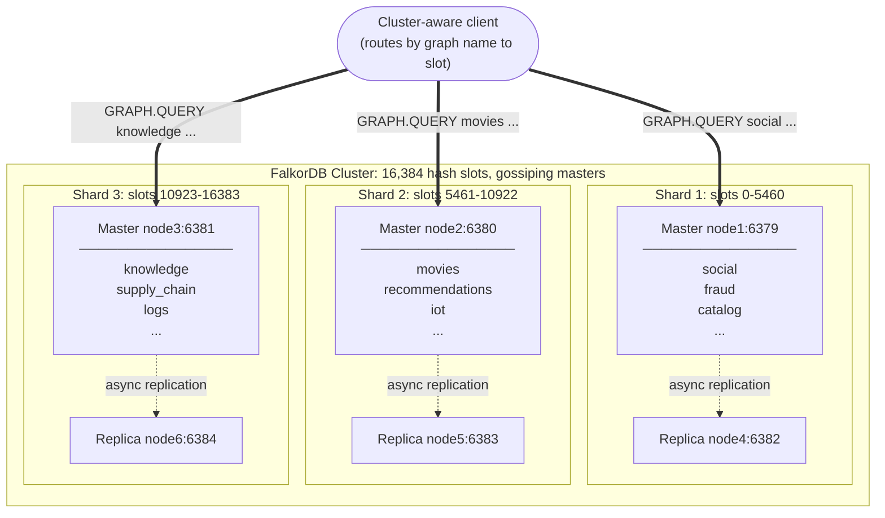

# Setting Up a FalkorDB Cluster

Setting up a FalkorDB cluster enables you to distribute your data across multiple nodes, providing horizontal scalability and improved fault tolerance. This guide will walk you through the steps to configure a FalkorDB cluster with 3 masters and 1 replica for each, using Docker.

## Cluster Architecture Overview

A FalkorDB cluster shards the keyspace across multiple master nodes using Redis Cluster's hash-slot mechanism (16,384 slots distributed across the masters). Each graph is a single Redis key, so it lives entirely on the shard whose slot range covers the hash of its name — different graphs typically land on different shards, and each shard ends up hosting many graphs. A cluster-aware client computes the slot for the target graph and routes the command directly to the master that owns it (or follows a `MOVED` redirect if it guesses wrong). Each master can have one or more replicas that asynchronously copy its data for failover and read scaling.



The diagram shows the deployment built in this guide: three master shards laid out side by side, each owning a slice of the slot range and hosting many graph keys. The client sends each query to the shard that owns the graph being queried — `social` lives on shard 1, `movies` on shard 2, `knowledge` on shard 3 — while every master also asynchronously replicates its data to one replica for failover and read scaling.

## Prerequisites

Before you begin, ensure you have the following:

* Docker installed on your machine.
* A working FalkorDB Docker image. You can pull it from Docker Hub.
* Basic knowledge of Docker networking and commands.

## Step 1: Network Configuration

First, create a Docker network to allow communication between the FalkorDB nodes.

```bash
docker network create falkordb-cluster-network
```

This network will enable the containers to communicate with each other.

## Step 2: Launching FalkorDB Nodes

Next, you need to launch multiple FalkorDB instances that will form the cluster. For example, you can start six nodes:

### 2.1 Start the nodes

```bash
for i in {1..6}; do
  docker run -d \
    --name node$i \
    --hostname node$i \
    --network falkordb-cluster-network \
    -p $((6379 + i - 1)):$((6379 + i - 1)) \
    -e BROWSER=0 \
    -e "FALKORDB_ARGS=--port $((6379 + i - 1)) --cluster-enabled yes --cluster-announce-ip node$i --cluster-announce-port $((6379 + i - 1))" \
    falkordb/falkordb
done
```

### 2.2 Edit the /etc/hosts file and add the node container hostnames

For the host to be able to connect to the nodes using the container names, please update your `/etc/hosts` file using the following command.

```bash
for i in {1..6};do
  sudo echo "127.0.0.1 node$i" | sudo tee -a /etc/hosts
done
```


## Step 3: Configuring the Cluster

Once all nodes are up, you need to connect them to form a cluster. Use the `redis-cli` tool inside one of the nodes to initiate the cluster setup.

### 3.1 Initiate the Cluster

This command will join node1-node6 into a cluster.

```bash
docker exec -it node1 redis-cli --cluster create node1:6379 node2:6380 node3:6381 node4:6382 node5:6383 node6:6384 --cluster-replicas 1 --cluster-yes
```

### 3.2 Verify Cluster Status

You can verify the status of the cluster with:

```bash
docker exec -it node1 redis-cli --cluster check node1:6379
```
This command will display the status of each node and their roles (master/replica).

### 3.3 Create a Graph to test deployment

The following query will create a graph named "network" within your cluster.

```bash
redis-cli -c GRAPH.QUERY network "UNWIND range(1, 100) AS id CREATE (n:Person {id: id, name: 'Person ' + toString(id), age: 20 + id % 50})"
```

## Step 4: Scaling the Cluster

You can scale the cluster by adding more nodes as needed. Simply launch additional FalkorDB instances and add them to the cluster using the falkordb-cli tool.

For example, to add a new node:

### 4.1 Start a New Node

```bash
docker run -d \
    --name node7 \
    --hostname node7 \
    --network falkordb-cluster-network \
    -p 6385:6385 \
    -e BROWSER=0 \
    -e "FALKORDB_ARGS=--port 6385 --cluster-enabled yes --cluster-announce-ip node7 --cluster-announce-port 6385" \
    falkordb/falkordb
```

### 4.2 Add the Node to the Cluster

```bash
docker exec -it node1 redis-cli --cluster add-node node7:6385 node1:6379
```
This will add node7 into the existing cluster.

### 4.3 Add the new node to the /etc/hosts file

```bash
sudo echo "127.0.0.1 node7" | sudo tee -a /etc/hosts
```

## Conclusion

With your FalkorDB cluster set up, you now have a scalable, distributed environment that can handle increased loads and provide higher availability.

{% include faq_accordion.html
  title="Frequently Asked Questions"
  q1="Does a FalkorDB cluster split a single graph across multiple shards?"
  a1="No. Each graph is a single Redis key and resides entirely on the shard whose hash-slot range covers the hash of its name. Clustering distributes *different* graphs across shards, not a single graph."
  q2="How many master nodes should I use?"
  a2="A minimum of 3 master nodes is recommended for fault tolerance. The 16,384 hash slots are distributed evenly across masters. Add more masters to scale throughput across many graphs."
  q3="Do I need a cluster-aware client?"
  a3="Yes. A cluster-aware client computes the hash slot for the target graph and routes commands to the correct master. If it guesses wrong, the cluster returns a `MOVED` redirect. Use `redis-cli -c` or a cluster-enabled SDK."
  q4="How do I add a new node to an existing cluster?"
  a4="Start a new FalkorDB container with `--cluster-enabled yes`, then run `redis-cli --cluster add-node <new-node> <existing-node>`. The cluster will begin rebalancing hash slots to include the new node."
  q5="What happens if a master node goes down?"
  a5="Its replica is automatically promoted to master by the cluster. The failover is handled by Redis Cluster consensus. Ensure each master has at least one replica configured for this to work."
%}
