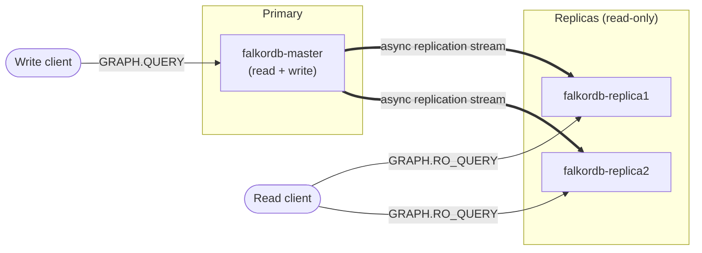

# Configuring FalkorDB Docker for Replication

FalkorDB supports advanced configurations to enable replication, ensuring that your data is available and synchronized across multiple instances. This guide will walk you through setting up FalkorDB in Docker with replication enabled, providing high availability and data redundancy.

## Replication Architecture Overview

FalkorDB replication follows a single-primary model: one master instance accepts all writes and asynchronously streams its changes to one or more replicas. Replicas serve read-only traffic, allowing read workloads to scale horizontally and providing a hot standby in case the master fails.



Writes always flow through the master, while replicas mirror the master's state and absorb read traffic. Because replication is asynchronous, replicas may lag the master slightly under heavy write load — see the [Best Practices](#best-practices) section for tips on monitoring lag.

## Prerequisites

Before you begin, ensure you have the following:

* Docker installed on your machine.
* A working FalkorDB Docker image. You can pull it from Docker Hub.
* Basic knowledge of Docker commands and configurations.

## Step 1: Configuring Replication

Replication ensures that your data is available across multiple FalkorDB instances. You configure one instance as the primary (master) and others as replicas.

To enable communication between FalkorDB containers, we first need to set up a Docker network.

### 1.1 Creating a Network

First, create a Docker network to allow communication between the FalkorDB nodes.

```bash
docker network create falkordb-network
```

### 1.2 Setting up the Master Instance

Start the master FalkorDB instance:

```bash
docker run -d \
  --name falkordb-master \
  -v falkordb_data:/data \
  -p 6379:6379 \
  --network falkordb-network \
  falkordb/falkordb
```

This instance runs in standalone mode and will serve as the primary (master) node.

### 1.3 Setting up the Replica Instance

Next, start the replica instance:

```bash
docker run -d \
  --name falkordb-replica1 \
  -p 6380:6379 \
  --network falkordb-network \
  falkordb/falkordb
```

### 1.4 Configuring Replication

Connect to the replica instance and configure it to replicate data from the master:

```bash
docker exec -it falkordb-replica1 /bin/bash 
redis-cli replicaof falkordb-master 6379
```

This command tells the replica to replicate data from the master instance.

## Step 2: Verifying the Setup

To verify that replication is working correctly:

### 2.1 Insert Data on Master

```bash
# Connect to the master
docker exec -it falkordb-master redis-cli
GRAPH.QUERY mygraph "CREATE (:Database {name:'falkordb'})"
exit
```

### 2.2 Verify Data on Replica

```bash
# Connect to the replica
docker exec -it falkordb-replica1 redis-cli
GRAPH.RO_QUERY mygraph "MATCH (n) RETURN n"
# Output should be:
# 1) 1) "n"
# 2) 1) 1) 1) 1) "id"
#             2) (integer) 0
#          2) 1) "labels"
#             2) 1) "Database"
#          3) 1) "properties"
#             2) 1) 1) "name"
#                   2) "falkordb"
# 3) 1) "Cached execution: 1"
#    2) "Query internal execution time: 0.122645 milliseconds"
```

**Expected output:** The data created on the master should be available on the replica.

## Best Practices

- **Read-Only Queries on Replicas:** Use `GRAPH.RO_QUERY` for read operations on replicas to prevent accidental writes
- **Monitor Replication Lag:** Check replication status regularly using Redis `INFO replication` command
- **Multiple Replicas:** Configure multiple replicas for better read scalability and redundancy
- **Network Latency:** Place master and replicas in the same network or region for optimal performance

## Troubleshooting

If replication is not working:

1. Verify network connectivity between containers
2. Check that the master is accessible from the replica
3. Review logs for errors: `docker logs falkordb-replica1`

## Next Steps

With replication configured, FalkorDB provides high availability and data redundancy. Your data is now synchronized across multiple instances, creating a robust and fault-tolerant environment.

For horizontal scalability and distributed graph operations, explore [Clustering](/operations/cluster).

{% include faq_accordion.html title="Frequently Asked Questions" q1="Can I write to a replica node?" a1="No. Replicas are read-only. All write operations must go through the master. Use `GRAPH.RO_QUERY` for read operations on replicas to prevent accidental write attempts." q2="How much replication lag should I expect?" a2="Under normal load, replication lag is typically sub-millisecond. Under heavy write load, replicas may lag slightly. Monitor lag with the `INFO replication` command on the master." q3="How many replicas can I configure?" a3="There is no hard limit. You can add multiple replicas for better read scalability and redundancy. Each replica maintains a full copy of the master data." q4="What happens if the master goes down?" a4="Without a Sentinel or cluster setup, replicas will not automatically promote. Consider using Redis Sentinel or a cluster configuration for automatic failover in production." q5="Do replicas increase write performance?" a5="No. Replicas only serve read traffic. All writes still go through the single master. To scale writes, consider using a [cluster setup](/operations/cluster) to distribute graphs across multiple masters." %}
